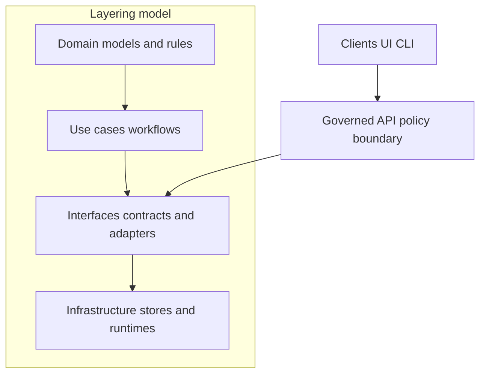

<!-- [KFM_META_BLOCK_V2]
doc_id: kfm://doc/fd4c73e0-c3e1-422b-a986-4d281d4acb80
title: docs/diagrams/out/interfaces
type: standard
version: v1
status: draft
owners: KFM Maintainers (TODO: confirm CODEOWNERS)
created: 2026-03-01
updated: 2026-03-01
policy_label: internal
related:
  - docs/diagrams/README.md (TODO: add if exists)
  - docs/architecture/diagrams/ (TODO: verify canonical diagram sources)
  - contracts/ (OpenAPI/JSON Schemas)
  - policy/ (OPA/Rego policies + tests)
tags: [kfm, diagrams, interfaces, contracts, governance]
notes:
  - This folder is treated as a generated “output” surface for interface-layer diagrams.
  - If your repo treats `docs/diagrams/out/` as build artifacts, prefer regenerating over hand-editing.
[/KFM_META_BLOCK_V2] -->

# docs/diagrams/out/interfaces
Interface-layer diagrams (rendered outputs) for the Kansas Frontier Matrix (KFM).


> **Rule of thumb:** If this is under `out/`, treat it as **generated**. Update the **source diagrams** and regenerate outputs (don’t “fix” SVG/PNG by hand) unless your repo explicitly says otherwise.

---

## Navigation
- [Purpose](#purpose)
- [Where this fits](#where-this-fits)
- [What belongs here](#what-belongs-here)
- [Directory layout](#directory-layout)
- [Diagram requirements](#diagram-requirements)
- [How to regenerate](#how-to-regenerate)
- [Contribution checklist](#contribution-checklist)
- [Appendix](#appendix)

---

## Purpose
This directory stores **rendered diagrams** that document KFM **interfaces**—the boundary layer between:
- **Use cases** (workflows) and
- **Infrastructure** (databases, object storage, indexes, external services).

These diagrams exist to make interface boundaries:
- easy to understand,
- hard to bypass,
- and easy to review in governance + CI.

---

## Where this fits
KFM uses a layered architecture (Domain → Use cases → Interfaces → Infrastructure). “Interfaces” is the layer that defines *how* domain/use-case logic reaches the outside world without directly coupling to infrastructure.



**In practice**, interface diagrams here typically cover:
- Governed API surfaces (request/response contracts)
- Policy enforcement points (PEP) and obligations (redaction, notices)
- Evidence resolution boundaries (EvidenceRef → EvidenceBundle)
- Repository interfaces (domain/use-cases talking to storage through adapters)

---

## What belongs here

### ✅ Acceptable inputs
Rendered artifacts that are clearly interface-scoped, such as:
- `*.svg`, `*.png`, `*.pdf` outputs from Mermaid / PlantUML / Graphviz / draw.io exports
- “Interface map” diagrams (C4-style context/container, but focused on *contracts/adapters*)
- Sequence diagrams for cross-boundary calls (Client → API → Policy → Evidence → Storage)
- API surface snapshots (sanitized) used for review or governance diffs

### ❌ Exclusions
Do **not** put these in `out/interfaces/`:
- Source-of-truth diagrams (e.g., `.mmd`, `.puml`, `.drawio`) **unless** your repo explicitly treats them as generated outputs  
  - Put sources in the canonical “source diagrams” location instead (see [How to regenerate](#how-to-regenerate)).
- Anything containing **secrets** (tokens, internal hostnames, private URLs, credentials)
- Anything containing **sensitive location detail** when policy requires redaction  
  - Prefer coarse geography and/or anonymized examples.
- Non-interface diagrams (data lifecycle flows, storage schemas, UI wireframes)  
  - Those belong in their respective diagram directories.

---

## Directory layout

> This is the **recommended** layout for interface diagram outputs.  
> If your repo already has a different structure, **keep the existing structure** and update this README to match.

```text
docs/diagrams/out/interfaces/
├── README.md
├── api/                  # API surface diagrams or rendered summaries (OpenAPI/GraphQL oriented)
├── policy/               # PEP/PDP flows, obligations, redaction and audit surfaces
├── evidence/             # Evidence resolution boundary diagrams
├── repositories/         # Repository-interface boundary diagrams (domain → adapter → store)
├── sequences/            # Sequence diagrams for important interface calls
└── _manifest/            # Optional build manifest, checksums, provenance of diagram builds
```

---

## Diagram requirements

### Minimum expectations (per interface)
For each interface surface you introduce or change, you should have **at least one** diagram that answers:

1. **What is the boundary?**  
   Where does the interface start/end, and what internal modules does it protect?

2. **What is the contract?**  
   What requests/inputs are accepted, and what outputs/errors are returned?

3. **Where is policy enforced?**  
   Identify the policy boundary point(s) and any obligations (redaction, audit logging, notices).

4. **How is evidence attached?**  
   If the interface returns claims, where are EvidenceRefs/EvidenceBundles attached or resolved?

### Naming conventions
Use filenames that are:
- stable,
- grep-friendly,
- and sortable.

Recommended pattern:
- `interface__<surface>__<topic>__v<major>.svg`

Examples:
- `interface__api__dataset_query__v1.svg`
- `interface__policy__obligations_pipeline__v1.svg`
- `interface__evidence__resolve_bundle__v1.svg`

---

## How to regenerate

Because this folder is under `out/`, regeneration is preferred.

### Step 1 — Find the source diagram(s)
Search the repo for diagram sources, e.g.:
- Mermaid: `*.mmd`, `*.mermaid`, fenced ` ```mermaid `
- PlantUML: `*.puml`
- Graphviz: `*.dot`
- draw.io: `*.drawio`

### Step 2 — Find the diagram build entrypoint
Look for any of:
- `Makefile` targets containing `diagram`
- `package.json` scripts containing `diagram`
- `scripts/` or `tools/` entries like `build-diagrams.*`
- CI workflows that render docs artifacts

### Step 3 — Regenerate and verify
When regenerated:
- Ensure outputs are deterministic enough to diff meaningfully.
- Ensure diagrams do not introduce sensitive details.
- If a manifest exists, update it (or regenerate it) with build provenance.

---

## Contribution checklist

### When adding or changing interface diagrams
- [ ] Diagram names follow the naming convention (or follow the repo’s established convention).
- [ ] Diagram makes the **policy boundary** obvious.
- [ ] Diagram clearly marks **who calls what** (client vs API vs policy vs evidence vs storage).
- [ ] If diagrams reference contracts, they point to the **source of truth** (OpenAPI/JSON schema/policy modules).
- [ ] No sensitive data or secrets in the rendered output.
- [ ] If this repo enforces a docs/diagram gate, CI passes.

---

## Appendix

<details>
  <summary>Suggested “Interface Diagram Registry” template</summary>

Use this table to track coverage and review status.

| Interface surface | Diagram file | Source of truth (contract/policy) | Last verified | Notes |
|---|---|---|---|---|
| Governed API | TODO | `contracts/` + API implementation | TODO | PEP boundary must be explicit |
| Policy obligations | TODO | `policy/` | TODO | Include redaction + audit obligations |
| Evidence resolver | TODO | Evidence module | TODO | Show EvidenceRef → EvidenceBundle |

</details>

<details>
  <summary>Reminder: “out/” folders are usually build artifacts</summary>

If you find yourself editing SVG/PNG output by hand:
1. Stop and locate the source diagram.
2. Fix the source.
3. Regenerate outputs.

If that’s not possible, document the exception and add a TODO to migrate to a source-driven flow.

</details>

---

<a id="back-to-top"></a>
**Back to top:** [docs/diagrams/out/interfaces](#docsdiagramsoutinterfaces)
