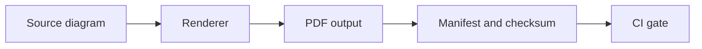

<!-- [KFM_META_BLOCK_V2]
doc_id: kfm://doc/9a0c9b0f-acde-4a1f-a8ff-0ce60f6c1c9e
title: PDF Interface Diagrams (Generated Outputs)
type: standard
version: v1
status: draft
owners: TODO
created: 2026-03-01
updated: 2026-03-01
policy_label: TODO
related:
  - ../../../../../README.md   # TODO: verify path
tags: [kfm, diagrams, interfaces, pdf, generated]
notes:
  - This directory is intended for *generated* PDF renderings of interface diagrams.
  - Source diagrams should live elsewhere; do not treat PDFs as the source of truth.
[/KFM_META_BLOCK_V2] -->

# PDF Interface Diagrams (Generated)

Generated, shareable **PDF exports** of KFM *interface* diagrams (API boundaries, policy boundaries, pipeline interfaces, etc.).


---

## Quick navigation

- [Purpose](#purpose)
- [Directory contract](#directory-contract)
- [Diagram pipeline](#diagram-pipeline)
- [How to regenerate](#how-to-regenerate)
- [Governance and traceability](#governance-and-traceability)
- [Quality gates](#quality-gates)
- [Registry](#registry)
- [FAQ](#faq)

---

## Purpose

This folder exists to make it easy to:
- **Review** interface diagrams without needing diagram tooling installed
- **Embed** diagrams into PRs, tickets, and design reviews
- **Publish** stable, versioned visuals that correspond to governed contracts

> [!WARNING]
> Treat everything in this directory (except this README) as **build output**.  
> If you need to change a diagram, update the *source* diagram and re-render the PDF.

---

## Directory contract

### What belongs here

| Category | Examples | Notes |
|---|---|---|
| Rendered PDFs | `*.pdf` | Must be reproducible from a source diagram. |
| Optional manifest | `manifest.yaml` / `manifest.json` | Strongly recommended for traceability (see [Registry](#registry)). |
| Checksums | `*.sha256` | Optional but recommended for integrity and cacheability. |
| This README | `README.md` | Human guidance + conventions. |

### What must NOT go here

- Source diagram files (`.drawio`, `.mmd`, `.puml`, `.excalidraw`, etc.)
- Screenshots, hand-edited PDFs, or “one-off” exports without a source file
- Any secrets, tokens, credentials, or non-public configuration
- Sensitive location details (use policy-aware redaction; never publish what policy forbids)

---

## Diagram pipeline



**Key principle:** source diagrams are the *authoritative* editable artifacts; PDFs are *derivative* artifacts for distribution and review.

---

## How to regenerate

Because this directory is an output target, **do not** regenerate PDFs by editing them directly.

Instead:

1. Locate the corresponding **source diagram** (expected outside this folder).
2. Render/export to PDF.
3. Update `manifest.*` (if present).
4. Commit the updated PDF(s) + manifest/checksum(s) together.

### Renderer examples (choose what matches repo tooling)

> [!NOTE]
> The exact commands below are examples. If this repo provides a standard script/Make target, use that and keep this section updated.

#### Mermaid CLI example

```bash
# Example only:
npx @mermaid-js/mermaid-cli \
  --input docs/diagrams/src/interfaces/<diagram>.mmd \
  --output docs/diagrams/out/interfaces/pdf/<diagram>.pdf
```

#### draw.io CLI example

```bash
# Example only:
drawio \
  --export \
  --format pdf \
  --output docs/diagrams/out/interfaces/pdf/<diagram>.pdf \
  docs/diagrams/src/interfaces/<diagram>.drawio
```

#### PlantUML example

```bash
# Example only:
plantuml \
  -tpdf \
  -o ../../out/interfaces/pdf \
  docs/diagrams/src/interfaces/<diagram>.puml
```

---

## Governance and traceability

These PDFs often describe **interfaces** that are subject to governance constraints (e.g., policy enforcement at the API boundary, evidence-first UX, and time-aware data lifecycles).

When adding or updating a diagram PDF:

- **Trace claims to contracts:** If a diagram shows endpoints, schemas, or responses, it should point to the governing contract (e.g., OpenAPI/JSON Schema) *by path + version/tag/commit*.
- **Respect the trust membrane:** Diagrams should reflect that clients access data via governed interfaces (policy boundary), not by direct storage access.
- **Time-aware semantics:** If a diagram involves “as-of” behavior, event time, valid time, or transaction time, call it out explicitly.
- **Redaction-aware outputs:** If any interface touches sensitive entities, ensure the PDF is safe to publish at the directory’s policy label.

---

## Quality gates

Minimum bar for merging PDF updates:

- [ ] Each PDF has a corresponding source diagram (same stem name) **outside** this folder.
- [ ] PDF is referenced in the [Registry](#registry) (or registry is explicitly marked “N/A”).
- [ ] Any API/schema references include **versioned** pointers (path + version or commit).
- [ ] Output is reproducible (no manual edits post-render).
- [ ] File size is reasonable for repo health (if not, consider tiling/splitting).

Optional (recommended) gates:

- [ ] `sha256` checksum file exists per PDF (or per manifest entry).
- [ ] CI checks for “stale outputs” (diff source vs output) and fails closed.
- [ ] Links embedded in diagrams (if any) are validated.

---

## Registry

If you maintain a manifest file (recommended), use it as the **single index** of PDFs in this directory.

### Suggested `manifest.yaml` shape

```yaml
# docs/diagrams/out/interfaces/pdf/manifest.yaml
version: v1
generated_at: "2026-03-01T00:00:00Z"   # update on render
generator:
  name: "TODO"
  version: "TODO"
artifacts:
  - id: "interfaces-api-pep-boundary"
    title: "Governed API (PEP) Boundary"
    pdf_path: "./interfaces-api-pep-boundary.pdf"
    source_path: "../../src/interfaces/interfaces-api-pep-boundary.mmd"   # TODO: verify
    contract_refs:
      - "contracts/openapi/<...>.yaml#<...>"  # TODO
    evidence_refs:
      - "kfm://evidence/<...>"                # TODO
    sha256: "TODO"
```

> [!TIP]
> Keep `pdf_path` relative (so the manifest remains portable) and store integrity metadata (`sha256`) to support deterministic builds and caching.

---

## FAQ

### Why keep generated PDFs in git?

- Fast review (no tooling required)
- Stable references in issues/docs
- Allows lightweight distribution in environments that block interactive tooling

### Should I edit a PDF to “fix” a label?

No. Edit the **source diagram** and regenerate.

### Where do source diagrams live?

**Unknown in this repo snapshot.**  
Search under `docs/diagrams/` for likely `src/` or authoring directories, or consult the repo’s diagram tooling docs.

---

<a id="back-to-top"></a>
**Back to top:** [Quick navigation](#quick-navigation)
