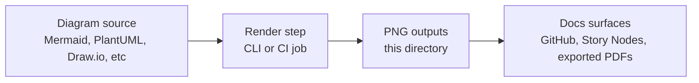

<!-- [KFM_META_BLOCK_V2]
doc_id: kfm://doc/14f5ed51-caf0-4b61-a659-beda81ed6cec
title: Interfaces PNG Diagram Outputs
type: standard
version: v1
status: draft
owners: TBD
created: 2026-03-01
updated: 2026-03-01
policy_label: public
related:
  - ../../../../architecture/diagrams/
  - ../../../../MASTER_GUIDE_v13.md
tags: [kfm, diagrams, interfaces, png]
notes:
  - This directory is intended to hold PNG renderings of interface diagrams for documentation use.
  - If you change conventions here, record the decision in an ADR and update any diagram build tooling.
[/KFM_META_BLOCK_V2] -->

# Interfaces PNG Diagram Outputs
**One-line purpose:** PNG renderings of KFM *interface* diagrams for docs and downstream publishing surfaces.


> **NOTE**
> This folder is designed for **rendered (raster) outputs**. If you need to change a diagram, update the *source diagram* (e.g., Mermaid/PlantUML/Draw.io) and re-render.

## Quick navigation
- [Purpose](#purpose)
- [Where this fits](#where-this-fits)
- [Directory contract](#directory-contract)
- [How to reference a PNG in docs](#how-to-reference-a-png-in-docs)
- [How to update diagrams](#how-to-update-diagrams)
- [Governance and safety](#governance-and-safety)
- [Appendix: suggested naming](#appendix-suggested-naming)

---

## Purpose
This directory holds **PNG** exports of diagrams that describe **interfaces** in the Kansas Frontier Matrix (KFM) system—i.e., the boundaries and interactions between major subsystems such as ingestion/pipelines, catalogs/provenance, governed APIs, policy enforcement, and UI surfaces.

Why keep PNGs?
- **Compatibility:** PNGs embed cleanly in Markdown renderers and other downstream builds.
- **Stability:** raster outputs are deterministic build artifacts when generated from stable sources.
- **Portability:** easy to attach to Story Nodes / reports and other publishing targets.

[Back to top](#interfaces-png-diagram-outputs)

---

## Where this fits
KFM documentation is organized under `docs/`, with architecture diagrams living in a dedicated home. This folder is a **subfolder for rendered outputs**.

**Expected neighborhood (illustrative):**
```
docs/
  diagrams/
    out/
      interfaces/
        png/           # <-- you are here (rendered raster assets)
```

> **TIP**
> If you can’t find the diagram source files, search the repo for the PNG filename stem (without `.png`) to locate the upstream source and/or the render script.

### Diagram lifecycle


[Back to top](#interfaces-png-diagram-outputs)

---

## Directory contract

### Acceptable inputs
| Item | Allowed | Notes |
|---|---:|---|
| File format | ✅ `.png` | Raster exports only (interface diagrams) |
| Content | ✅ Interface diagrams | Architecture boundaries, sequence flows, API/policy boundaries |
| Size | ✅ “Reasonable” | Keep files small to avoid repo bloat (prefer < 1–2 MB when possible) |
| Attribution | ✅ When required | If the diagram includes third-party material, add a caption in the referencing doc |

### Exclusions
| Do **not** put here | Why |
|---|---|
| Source diagrams (`.mmd`, `.puml`, `.drawio`, etc.) | Sources should live in their canonical “source” location so they remain diffable |
| Photos / screenshots of UIs | These belong under the relevant doc’s `assets/` folder (or another UI-specific assets directory) |
| Sensitive diagrams (secrets, internal endpoints, restricted data flows) | This directory is **public-labeled**; keep restricted materials in restricted zones/paths |
| Random images (“image1.png”) | Makes provenance and reuse impossible |

### File hygiene
- Prefer **vector** (SVG) for the *source-of-truth* diagram when possible; keep PNG as a convenience export.
- Use clear, stable, lowercase filenames (kebab-case).

[Back to top](#interfaces-png-diagram-outputs)

---

## How to reference a PNG in docs
Use a relative link so Markdown renders correctly in GitHub and in local builds.

```md

```

Optional caption convention (recommended):
```md
*Figure: PEP trust membrane boundary (KFM interface diagram).*
```

[Back to top](#interfaces-png-diagram-outputs)

---

## How to update diagrams

### The rule
**Do not edit PNGs by hand.** Update the upstream diagram source and re-render.

### Minimum steps
1. Locate the diagram source (search for the filename stem).
2. Update the source diagram.
3. Re-render to PNG.
4. Commit both:
   - the updated source diagram, and
   - the regenerated PNG(s).

### Render tooling
The exact command depends on what the repo has standardized on (**verify in-repo tooling before adding new dependencies**). Common options:
- Mermaid CLI (`mmdc`)
- PlantUML CLI
- draw.io exporter (CLI)

> **TODO (repo wiring):**
> Link to the canonical render script / Make target / npm task once confirmed.

[Back to top](#interfaces-png-diagram-outputs)

---

## Governance and safety
Interface diagrams can unintentionally leak sensitive implementation details. Before committing:
- **No secrets:** never include credentials, private keys, tokens, internal hostnames, or private endpoints.
- **Policy alignment:** if a diagram documents restricted workflows or data, store it in the appropriate restricted location and reference it via governed mechanisms.
- **Trust membrane consistency:** diagrams should not imply UI clients can access storage directly—interfaces should reflect governed API access with policy enforcement.

[Back to top](#interfaces-png-diagram-outputs)

---

## Appendix: suggested naming
This repo may already have naming conventions—**follow existing patterns first**. If none exist, a simple convention is:

```
<boundary>--<diagram-slug>--<yyyy-mm-dd>.png
```

Examples:
- `api--evidence-resolver-sequence--2026-03-01.png`
- `policy--pep-trust-membrane--2026-03-01.png`
- `catalog--dcat-stac-prov-links--2026-03-01.png`

<details>
<summary>Why include the date?</summary>

Dates make it easier to:
- correlate diagrams with ADRs/PRs,
- avoid silent overwrites, and
- communicate the “freshness” of architectural assumptions.

If you adopt semantic versioning instead (e.g., `v1`, `v2`), keep it consistent and document it here.
</details>

[Back to top](#interfaces-png-diagram-outputs)
