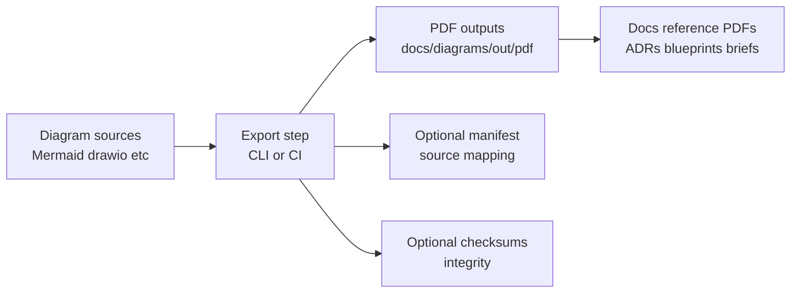

<!-- [KFM_META_BLOCK_V2]
doc_id: kfm://doc/0f6a9f5f-17d6-4a4a-8a52-6c3b550a5c2a
title: docs/diagrams/out/pdf — PDF exports of diagrams
type: standard
version: v1
status: draft
owners: TBD
created: 2026-03-01
updated: 2026-03-01
policy_label: public
related:
  - docs/architecture/diagrams/
  - docs/diagrams/
tags: [kfm, diagrams, pdf, rebuildable]
notes:
  - This directory is intended for *generated* PDF exports of diagrams (rebuildable artifacts).
  - Update owners + policy_label if this repo is private or if diagram exports can include restricted content.
[/KFM_META_BLOCK_V2] -->

# docs/diagrams/out/pdf
**Purpose:** Rebuildable **PDF exports** of KFM diagrams for offline reading, reviews, and inclusion in design docs.


> **NOTE**
> This folder holds **outputs**, not sources. Treat everything here as **reproducible build artifacts**.

---

## Quick navigation
- [What belongs here](#what-belongs-here)
- [Where this fits in the repo](#where-this-fits-in-the-repo)
- [Directory contract](#directory-contract)
- [Naming conventions](#naming-conventions)
- [How exports are generated](#how-exports-are-generated)
- [Quality checks](#quality-checks)
- [Governance and safety](#governance-and-safety)
- [Troubleshooting](#troubleshooting)
- [Appendix: Suggested manifest schema](#appendix-suggested-manifest-schema)

---

## What belongs here

This directory contains **PDF renderings** of diagrams that originate elsewhere (e.g., Mermaid source, draw.io, Excalidraw, Figma exports, PlantUML, etc.).

Typical uses:
- Architecture reviews (easy printing / sharing)
- Attachments to ADRs and governance documents
- “Snapshot” exports for release notes or briefings
- Offline-friendly docs bundles

Back to top: [↑](#docsdiagramsoutpdf)

---

## Where this fits in the repo

**Expected relationship (recommended pattern):**
- **Source diagrams live elsewhere** (e.g., `docs/architecture/diagrams/` or a `docs/diagrams/src/` folder).
- This folder holds only **exported PDFs** produced from those sources.

> **Unknown (needs verification):** the canonical diagram source directory and the actual build command(s) used in this repo.
>
> If you can’t find a source folder, search for diagram tooling in `tools/`, `scripts/`, or CI workflows.

Back to top: [↑](#docsdiagramsoutpdf)

---

## Directory contract

### ✅ Acceptable inputs (what belongs here)
- `*.pdf` exported diagrams (one diagram per file)
- Optional metadata files (recommended):
  - `manifest.json` (maps PDF → source + generation details)
  - `checksums.txt` or `checksums.sha256` (integrity for reviewers/CI)

### ❌ Exclusions (what must not go here)
- Source diagram files (e.g., `.mmd`, `.drawio`, `.excalidraw`, `.fig`, `.puml`)
- Images meant for the web UI (prefer `docs/diagrams/out/svg/` or similar)
- Sensitive exports that violate the repo’s policy label (see [Governance and safety](#governance-and-safety))
- Large binary dumps (keep PDFs tight; split big diagrams into multiple views)

Back to top: [↑](#docsdiagramsoutpdf)

---

## Naming conventions

Use a stable, grep-friendly, diff-friendly naming scheme.

### Recommended filename format
```
<diagram_slug>__<scope>__<yyyy-mm-dd>__<gitshort>.pdf
```

Examples:
- `system_overview__architecture__2026-03-01__a1b2c3d.pdf`
- `truth_path__governance__2026-03-01__a1b2c3d.pdf`
- `evidence_resolver__api__2026-03-01__a1b2c3d.pdf`

### Diagram slug rules
- lowercase
- words separated by `_`
- no spaces
- avoid “final”, “v2”, “latest” (encode time/commit instead)

Back to top: [↑](#docsdiagramsoutpdf)

---

## How exports are generated

### Conceptual workflow



### Recommended export behavior
- Exports are **deterministic** (same inputs → same outputs)
- Exports are **rebuildable** (never the only copy of a diagram)
- Exports optionally produce:
  - a **manifest** (what created what)
  - **checksums** (what reviewers verify)

> **TIP**
> If you’re unsure whether PDFs should be committed:
> - Commit PDFs when they are *review artifacts* (e.g., governance briefings).
> - Otherwise, prefer CI-generated artifacts and keep the folder empty except this README + `.gitkeep`.

Back to top: [↑](#docsdiagramsoutpdf)

---

## Quality checks

Before adding/updating a PDF export:

- [ ] PDF opens and renders correctly in common viewers
- [ ] Text is readable at 100% zoom (no tiny fonts / clipped labels)
- [ ] Diagram title and date (or commit) are present somewhere in the diagram
- [ ] No secrets or restricted details embedded (tokens, internal hostnames, precise sensitive locations)
- [ ] Filename follows the naming convention
- [ ] (If used) `manifest.json` updated
- [ ] (If used) checksum file updated

Back to top: [↑](#docsdiagramsoutpdf)

---

## Governance and safety

Even “just a diagram” can leak restricted info.

**Minimum rules:**
- If content sensitivity is unclear, **default-deny** exporting it to a public folder.
- If a diagram includes restricted site locations or operational details, export a **generalized** version for public docs and keep the detailed version in a restricted area (or omit entirely).

> **WARNING**
> Do not export diagrams that disclose:
> - secrets (API keys, credentials)
> - security-sensitive topology (unredacted internal attack surface)
> - precise locations of vulnerable sites (e.g., archaeology/species) unless policy allows

Back to top: [↑](#docsdiagramsoutpdf)

---

## Troubleshooting

**“My PDF export is huge”**
- Simplify the diagram (split into multiple pages/diagrams)
- Prefer vector-only elements; avoid embedded rasters
- Remove unnecessary backgrounds and drop-shadows

**“Text is blurry”**
- Ensure export is vector-based (not rasterized)
- Avoid screenshotting diagrams into PDFs

**“I don’t know what tool generated this”**
- Add/update `manifest.json` with:
  - source path
  - command/tool and version
  - commit hash
  - export timestamp

Back to top: [↑](#docsdiagramsoutpdf)

---

## Appendix: Suggested manifest schema

If you choose to maintain a manifest, use a minimal structure like:

```json
{
  "generated_at": "2026-03-01T00:00:00Z",
  "entries": [
    {
      "pdf": "system_overview__architecture__2026-03-01__a1b2c3d.pdf",
      "source": "docs/architecture/diagrams/system_overview.mmd",
      "tool": "TBD",
      "tool_version": "TBD",
      "command": "TBD",
      "git_commit": "a1b2c3d",
      "notes": ""
    }
  ]
}
```

> **NOTE**
> Treat the manifest as a lightweight “receipt” for documentation outputs: it should tell a reviewer how to reproduce the PDF.

Back to top: [↑](#docsdiagramsoutpdf)

---

## Directory tree (this folder)

```text
docs/diagrams/out/pdf/
├── README.md
└── (exported PDFs live here)
```
