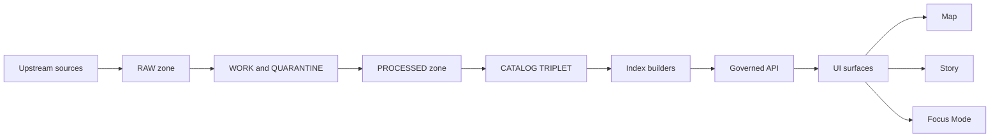
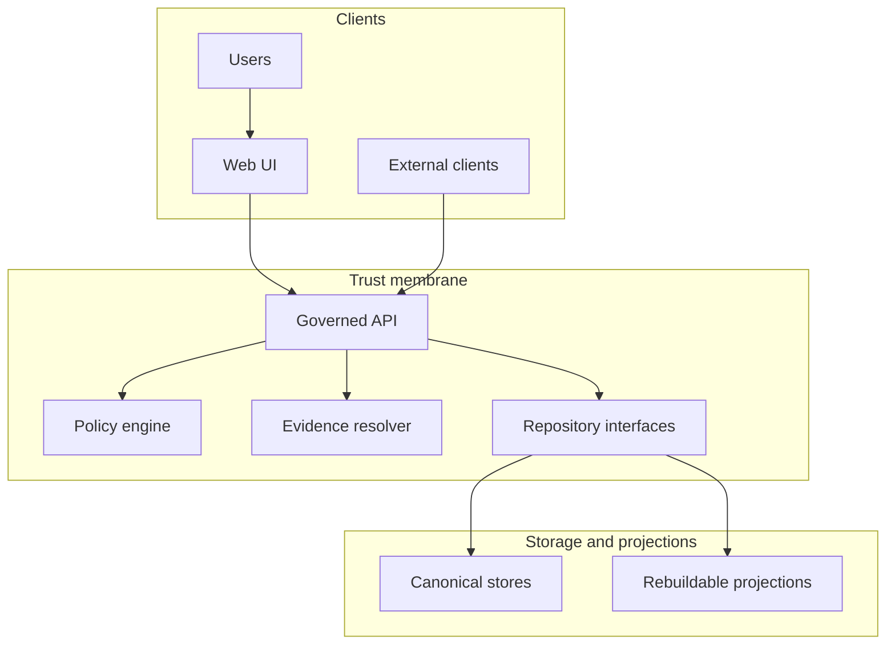

<!-- [KFM_META_BLOCK_V2]
doc_id: kfm://doc/3513d2ed-6f47-447c-9f26-d1488c3b6344
title: Pipeline diagram outputs
type: standard
version: v1
status: draft
owners: KFM Platform Team (TBD)
created: 2026-03-01
updated: 2026-03-01
policy_label: public
related:
  - docs/diagrams/src/pipelines/README.md  # TODO: confirm source-diagrams location in repo
  - docs/governance/REVIEW_GATES.md        # TODO: confirm governing-gates doc path in repo
tags: [kfm, diagrams, pipelines, generated]
notes:
  - This directory is intended for generated artifacts. Prefer editing pipeline specs and re-generating.
[/KFM_META_BLOCK_V2] -->

# Pipelines diagram output

Generated diagrams that visualize **KFM truth-path pipelines** and **Promotion Contract gates** for review, troubleshooting, and release readiness.

[](#)
[](#)
[](#)
[](#)
[](#)

---

## Quick navigation

- [What is in this folder](#what-is-in-this-folder)
- [How to read the diagrams](#how-to-read-the-diagrams)
- [Promotion Contract gates shown in diagrams](#promotion-contract-gates-shown-in-diagrams)
- [File and naming conventions](#file-and-naming-conventions)
- [Regenerating outputs](#regenerating-outputs)
- [What must NOT go here](#what-must-not-go-here)
- [Directory tree](#directory-tree)

---

## What is in this folder

This folder is the **output** location for pipeline diagrams.

Typical diagram audiences:

- **Stewards**: verify promotion gates are satisfied (fail closed).
- **Engineers**: debug where a dataset version failed (e.g., licensing, QA thresholds, EvidenceRef linking).
- **UI/Story/Focus Mode reviewers**: confirm the trust membrane is respected (clients never bypass policy).

**Editing rule:** treat files here as *generated*. If you need to change a diagram, change the *inputs* (pipeline specs / dataset registry / diagram templates) and re-run the generator.

---

## How to read the diagrams

### Truth path (conceptual)



### Trust membrane (conceptual)



**Interpretation hints**

- **Zones** (RAW → WORK/QUARANTINE → PROCESSED → CATALOG/TRIPLET → PUBLISHED) are *storage states* plus *validation gates*.
- **Canonical stores** are the “source of truth” (object store + catalogs + provenance). Projections (DB/search/graph/tiles) are rebuildable.
- Any path that shows “client → storage” is a **red flag**.

---

## Promotion Contract gates shown in diagrams

Diagrams that include a **gate overlay** should use the same minimum gate labels (A–G) so reviewers can scan quickly.

| Gate | Purpose (human) | Typical diagram cue |
|---|---|---|
| A | Identity & deterministic versioning | dataset_id / dataset_version_id / spec_hash are pinned |
| B | Licensing & rights metadata | license/rights + upstream terms snapshot present |
| C | Sensitivity classification + obligations | policy_label + redaction/generalization obligations |
| D | Catalog triplet validation | DCAT + STAC + PROV validate and cross-link; EvidenceRefs resolve |
| E | QA & thresholds | QA report exists; thresholds met or quarantined |
| F | Run receipt & audit record | inputs/outputs + digests + policy decisions recorded (append-only) |
| G | Release manifest and production posture | release manifest references promoted digests; optional posture checks |

> **NOTE:** Gate **G** is optional in early iterations, but recommended before broader release (supply chain + posture checks). Keep it visible in diagrams so the work is trackable.

---

## File and naming conventions

> **Rule of thumb:** *one pipeline = one stable prefix*.

| Pattern | Type | When used |
|---|---|---|
| `<pipeline_id>.mmd` | Mermaid source | Primary editable source for a pipeline diagram (if you store sources here) |
| `<pipeline_id>.svg` | Rendered vector | Preferred for docs sites and zoomable review |
| `<pipeline_id>.png` | Rendered bitmap | Fallback for platforms without Mermaid support |
| `<pipeline_id>__gates.mmd` | Mermaid source | Overlay view focusing on Promotion Contract gates |
| `_index.md` | Markdown | Optional index page linking all pipeline diagrams |

**Recommended `pipeline_id` format**

- `snake_case`, deterministic, and stable across time (avoid dates in the ID).
- Prefer IDs that correspond to `dataset_id` or a named pipeline spec.

---

## Regenerating outputs

Because this directory is for **outputs**, regeneration should be automated (CI preferred).

### Proposed CLI shape (adjust to repo reality)

```bash
# from repo root (example)
make diagrams-pipelines

# or (example)
python -m tools.kfm_diagrams pipelines \
  --in  docs/diagrams/src/pipelines \
  --out docs/diagrams/out/pipelines
```

### Minimum verification steps (to make this README “true in repo”)

- Locate the diagram generator (search in `tools/` or `scripts/` for “diagram”, “mermaid”, or “graph”).
- Confirm whether `docs/diagrams/src/pipelines/` exists (or where the inputs live).
- Identify the CI workflow that generates/validates diagram outputs and link the badge above.

---

## What must NOT go here

This folder is documentation output. Keep it clean.

- ❌ Raw data, exports, or any upstream payloads
- ❌ Secrets or tokens
- ❌ Logs containing sensitive details (receipts/audit records may be sensitive; store them in governed locations)
- ❌ Any diagram that embeds restricted coordinates, restricted identifiers, or “ghost metadata” that reveals restricted existence

---

## Directory tree

> **Example layout** (actual contents are generator-dependent):

```text
docs/diagrams/out/pipelines/                              # Rendered pipeline diagrams (exports for PRs/docs; generated if possible)
├── README.md                                             # How pipeline exports are produced, naming rules, and commit policy
├── _index.md                                             # OPTIONAL: human-friendly index of pipeline diagrams (can be generated)
├── truth_path.mmd                                        # OPTIONAL: shared reference Mermaid (truth path context for pipelines)
├── trust_membrane.mmd                                    # OPTIONAL: shared reference Mermaid (trust membrane context for pipelines)
├── <pipeline_id>.mmd                                     # Pipeline diagram source (Mermaid) used to render exports
├── <pipeline_id>.svg                                     # Rendered pipeline diagram export (SVG; generated; policy-safe)
└── <pipeline_id>__gates.svg                               # Rendered gates overlay/export (shows gate checkpoints; generated; policy-safe)
```

---

<a id="back-to-top"></a>
**Back to top:** [Quick navigation](#quick-navigation)
