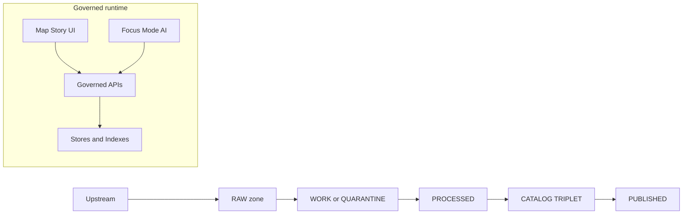
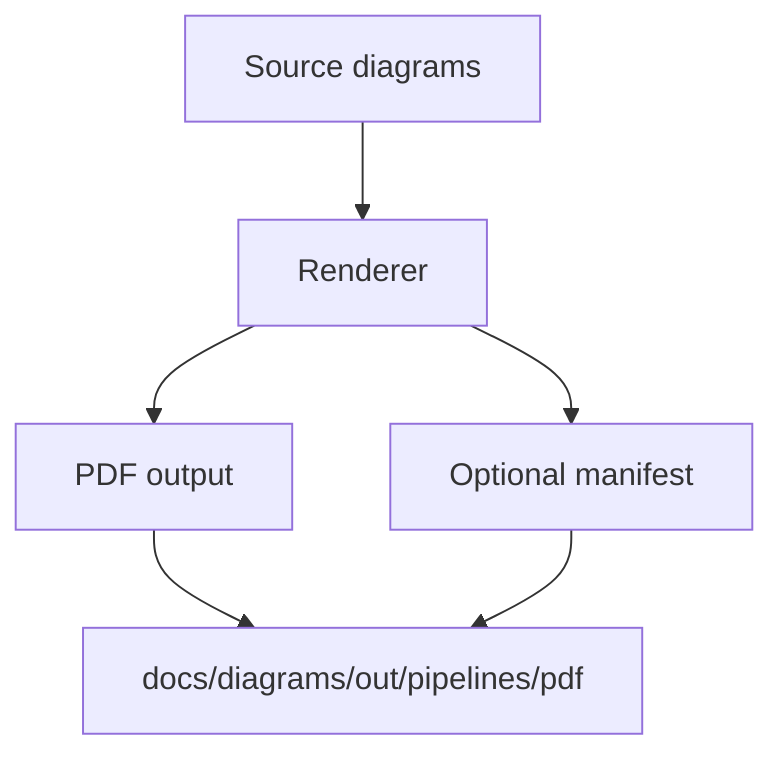

<!-- [KFM_META_BLOCK_V2]
doc_id: kfm://doc/9a3f7a6f-8a35-4c9f-a2fe-cedb0f3c2b4d
title: Pipeline Diagrams (PDF)
type: standard
version: v1
status: draft
owners: TODO
created: 2026-03-01
updated: 2026-03-01
policy_label: restricted
related:
  - kfm://doc/TODO-kfm-blueprint
  - kfm://doc/TODO-pipeline-tooling
  - docs/diagrams/src/pipelines/README.md (if present)
tags: [kfm, diagrams, pipelines, pdf]
notes:
  - This directory is intended for rendered (output) pipeline diagrams in PDF form.
  - Update owners/policy_label once the repo’s governance registry is confirmed.
[/KFM_META_BLOCK_V2] -->

<a id="top"></a>

# Pipeline Diagrams (PDF)

Publication-ready **PDF exports** of KFM **pipeline diagrams** (truth path, promotion gates, and governed runtime access).


> **NOTE**
> This folder is for **rendered outputs**. If you need to change a diagram, update the **source diagram** (Mermaid/Draw.io/etc.) and re-render.

## Quick navigation

- [Purpose](#purpose)
- [Where this fits](#where-this-fits)
- [What belongs here](#what-belongs-here)
- [Naming & versioning](#naming--versioning)
- [Diagram index](#diagram-index)
- [How to regenerate PDFs](#how-to-regenerate-pdfs)
- [Quality gates](#quality-gates)
- [Security & redaction](#security--redaction)
- [Assumptions, risks, tradeoffs, verification](#assumptions-risks-tradeoffs-verification)
- [Related docs](#related-docs)

---

## Purpose

These PDFs exist to provide **stable, shareable, offline-friendly** pipeline visuals for:

- Architecture and governance docs
- PR discussions and ADRs
- Stakeholder reviews (non-technical audiences)
- Release notes and “what changed?” diffs

**Design goal:** a reader should be able to understand *what flows where*, *what gates apply*, and *where policy is enforced* without reading code.

[Back to top](#top)

---

## Where this fits

This directory is under:

- `docs/diagrams/out/` → *rendered outputs (build artifacts)*
- `docs/diagrams/out/pipelines/` → outputs specifically about *pipelines*
- `docs/diagrams/out/pipelines/pdf/` → the **PDF** rendition set

**Source diagrams** are intentionally **not** stored here.

> **TODO (repo verification):** Identify the authoritative source folder(s) for pipeline diagrams.
> Common patterns are:
> - `docs/diagrams/src/pipelines/`
> - `docs/architecture/diagrams/pipelines/`
> - `docs/diagrams/pipelines/`

[Back to top](#top)

---

## What belongs here

### Acceptable inputs

Only **rendered outputs** that meet these criteria:

- File format: `*.pdf`
- Content: pipeline diagrams (data lifecycle, promotion contract/gates, catalog build, index rebuild, API governance boundaries)
- Deterministic: re-rendering without content change should not create large diffs (see [Quality gates](#quality-gates))
- Safe for the directory’s **policy_label** (default: `restricted` until confirmed)

### Exclusions

Do **not** put these here:

- Source diagram formats: `*.mmd`, `*.drawio`, `*.excalidraw`, `*.pptx`, `*.svg`, etc.
- Screenshots of dashboards (keep those with the dashboard runbooks)
- Anything containing secrets, internal tokens, private endpoints, or sensitive locations
- Data extracts (CSV/GeoJSON/tiles/raster)

[Back to top](#top)

---

## Naming & versioning

Because PDFs are binary and hard to diff, consistent naming is how we keep history readable.

### Recommended filename convention (PROPOSED)

```
<prefix>__<diagram>__<level>__<yyyy-mm-dd>__<shortHash>.pdf

# example
kfm__pipeline-truth-path__L1__2026-03-01__a1b2c3d4.pdf
```

**Fields**

- `diagram`: kebab-case identifier (e.g., `pipeline-truth-path`, `promotion-contract`, `catalog-triplet-build`)
- `level`: scope level (suggested)
  - `L0` = concept-only
  - `L1` = system overview
  - `L2` = subsystem / package
  - `L3` = implementation detail
- `shortHash`: first 8 chars of a stable content hash of the *source* diagram (preferred) or the *rendered* PDF

> **TIP**
> If the repo already has a naming convention, follow it and update this README to match.

[Back to top](#top)

---

## Diagram index

Keep this table updated as diagrams are added/removed.

| PDF (relative) | Scope | Source (relative) | Regeneration command | Notes |
|---|---:|---|---|---|
| `kfm__pipeline-truth-path__L1__YYYY-MM-DD__HASH.pdf` | L1 | `docs/diagrams/src/pipelines/truth-path.mmd` *(example)* | `make diagrams-pipelines-pdf` *(example)* | Shows lifecycle zones + trust membrane |
| `kfm__promotion-contract__L2__YYYY-MM-DD__HASH.pdf` | L2 | `docs/diagrams/src/pipelines/promotion-contract.mmd` *(example)* | `make diagrams-pipelines-pdf` *(example)* | Shows gates A–G + required receipts |

> **NOTE**
> The `Source` and `Regeneration command` columns are placeholders until confirmed in-repo.

[Back to top](#top)

---

## Reference model (what these diagrams should usually cover)

### KFM truth path and governed access



### Render pipeline for this folder



[Back to top](#top)

---

## How to regenerate PDFs

This repo may already have an established diagram toolchain. Until confirmed, treat the steps below as **PROPOSED**.

### 1) Edit the source diagram (not here)

- Locate the source diagram for the PDF you want to change.
- Make the change in the source format (Mermaid/Draw.io/etc.).

### 2) Run the diagram build target

Try one of the following patterns (replace with the repo’s real command once confirmed):

```bash
# from repo root
# TODO: replace with the repo's actual build target
make diagrams-pipelines-pdf

# or (node-based)
npm run diagrams:pipelines:pdf

# or (python-based)
python -m tools.diagrams.render_pipelines --format pdf
```

### 3) Verify determinism + update index

- Confirm PDFs render correctly (open locally; ensure text remains selectable when possible).
- Update the [Diagram index](#diagram-index) row (source path, regeneration command, notes).

### 4) Commit strategy

- Prefer committing **source + output** together in the same PR.
- If PDFs are large or frequently changing:
  - consider Git LFS **if already used in the repo** (do not introduce without a governance decision)
  - or commit PDFs only for releases (and keep sources in normal Git)

### How to find the real build command (minimum verification)

```bash
# from repo root
rg -n "diagrams" docs tools scripts package.json Makefile .github -S
rg -n "mermaid|drawio|excalidraw|pandoc|pdf" docs tools scripts -S
```

[Back to top](#top)

---

## Quality gates

These are the minimum standards for PDFs in this folder.

### Content gates

- [ ] The diagram is **layered** (L0/L1/L2/L3) and matches its filename level.
- [ ] The diagram explicitly shows **zone transitions** (RAW → WORK → PROCESSED → CATALOG → PUBLISHED) when relevant.
- [ ] The diagram shows **where policy is enforced** (the “trust membrane”: clients → governed API → stores).
- [ ] The diagram includes **failure paths** or “what happens when validation fails” where that matters.
- [ ] Any box that represents a contract/gate is named and traceable (e.g., “Gate A: Identity + versioning”).

### Rendering gates

- [ ] PDF is readable at 100% zoom (no tiny fonts).
- [ ] Prefer vector text (selectable/searchable) over raster screenshots.
- [ ] No embedded timestamps in the content unless they are part of the diagram’s version stamp.
- [ ] Page size and margins are consistent across diagrams.

### Repo hygiene gates

- [ ] No secrets, internal tokens, or credentials.
- [ ] No sensitive or targetable location details (use generalized locations when needed).
- [ ] The [Diagram index](#diagram-index) is updated.

[Back to top](#top)

---

## Security & redaction

Diagrams can accidentally leak:

- Internal hostnames / endpoints
- Credential flows
- Sensitive site locations (especially when mapping culturally restricted or vulnerable locations)

Minimum rules:

- If in doubt, **generalize** (e.g., “Upstream Provider API” vs. a specific internal URL).
- Treat any diagram that includes sensitive locations as **restricted** and avoid exact coordinates.
- If a diagram needs sensitive detail for engineering, consider storing it in a separate restricted location and linking to it from an internal-only doc.

[Back to top](#top)

---

## Assumptions, risks, tradeoffs, verification

### Assumptions

- The repo has (or will have) a **single source-of-truth** location for pipeline diagram sources.
- PDF outputs are kept to support review/communication needs.

### Risks

- PDF diffs are noisy; without determinism, reviews become “binary blob churn.”
- PDFs may accidentally embed sensitive information.

### Tradeoffs

- **Committing PDFs** improves accessibility and stable referencing, but increases repo size.
- **Not committing PDFs** reduces repo size, but makes docs less portable and can break links in issues/PRs.

### Minimum verification steps (to convert TODO → CONFIRMED)

1. Find the source directory for pipeline diagrams:
   - search for `pipelines` under `docs/diagrams/` or `docs/architecture/`
2. Identify the render toolchain:
   - locate scripts in `tools/` / `scripts/` / `package.json` / `Makefile`
3. Confirm whether PDFs are expected to be committed:
   - check CONTRIBUTING / docs standards / CI checks (linkcheckers, diagram render tests)
4. Update this README:
   - replace placeholders in [Diagram index](#diagram-index) with confirmed paths/commands

[Back to top](#top)

---

## Related docs

- KFM architecture & governance blueprint (truth path, trust membrane, policy labels)
- Pipeline tooling and promotion workflow docs
- Repository documentation standards (if present)

> **TODO:** Replace these bullets with real relative links once the authoritative docs paths are confirmed.
