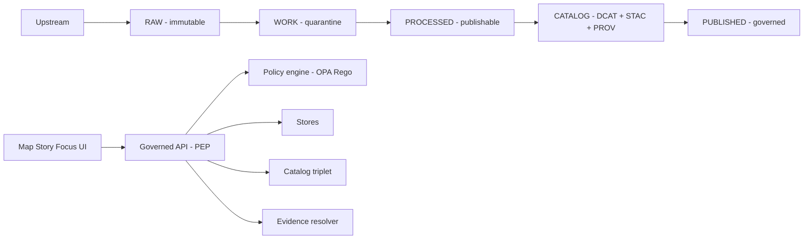

<!-- [KFM_META_BLOCK_V2]
doc_id: kfm://doc/9f6f4d6e-9c1a-4e06-9b8a-56b0d3a1c7e2
title: Pipeline diagrams (PNG) — generated outputs
type: standard
version: v1
status: draft
owners: TBD
created: 2026-03-01
updated: 2026-03-01
policy_label: public
related:
  - docs/diagrams/
  - docs/diagrams/out/pipelines/
tags: [kfm, diagrams, pipelines, generated, png]
notes:
  - This directory contains generated (derived) PNG artifacts for pipeline diagrams.
  - Source-of-truth diagrams live elsewhere; do not edit PNGs by hand.
[/KFM_META_BLOCK_V2] -->

# docs/diagrams/out/pipelines/png — Pipeline diagrams (PNG)

Portable, view-anywhere **PNG renderings** of KFM **pipeline diagrams** for use in docs, PRs, and slide decks.


<!-- TODO: Replace/augment with repo-specific badges once workflow names/paths are confirmed. -->

## Quick navigation

- [Purpose](#purpose)
- [Where this fits](#where-this-fits)
- [What belongs here](#what-belongs-here)
- [What must not go here](#what-must-not-go-here)
- [Canonical pipeline diagram](#canonical-pipeline-diagram)
- [How to regenerate PNGs](#how-to-regenerate-pngs)
- [Naming & quality conventions](#naming--quality-conventions)
- [Governance & safety checklist](#governance--safety-checklist)
- [Troubleshooting](#troubleshooting)

---

## Purpose

This folder exists to provide **stable, diffable binary exports** of pipeline diagrams so:

- humans can view diagrams without special renderers
- downstream docs (including non-Mermaid renderers) can embed images reliably
- reviewers can see “what changed” when pipeline docs evolve

> NOTE: These PNGs are **derived artifacts**. The **source diagrams** (Mermaid/PlantUML/Draw.io/etc.) are the “source of truth.”

[Back to top](#docsdiagramsoutpipelinespng--pipeline-diagrams-png)

---

## Where this fits

Directory context (conceptual):

```text
docs/
└─ diagrams/
   └─ out/
      └─ pipelines/
         └─ png/
            ├─ README.md  (this file)
            └─ *.png      (generated diagram renders)
```

This is an **output/cache-like location** under `docs/diagrams/out/…`.

[Back to top](#docsdiagramsoutpipelinespng--pipeline-diagrams-png)

---

## What belongs here

✅ **Allowed**

- `*.png` files that are **rendered outputs** of pipeline diagrams (architecture, ingestion, promotion, indexing, policy flow, etc.)
- this `README.md` (human guidance)

Recommended subtypes of diagrams:

- lifecycle (“truth path”) diagrams
- trust membrane diagrams (UI → PEP → policy → stores)
- promotion/validation gate diagrams
- run receipt / evidence resolution flow diagrams (high-level only)

[Back to top](#docsdiagramsoutpipelinespng--pipeline-diagrams-png)

---

## What must not go here

🚫 **Not allowed**

- Source diagram definitions (`*.mmd`, `*.mermaid`, `*.puml`, `*.drawio`, etc.)  
  → keep those in the **diagram source** area (search the repo for existing conventions)
- screenshots of dashboards/UIs (use a UI assets folder instead)
- PDFs (use a `pdf/` output folder if needed)
- anything containing **restricted details** (see governance checklist below)

[Back to top](#docsdiagramsoutpipelinespng--pipeline-diagrams-png)

---

## Canonical pipeline diagram

This Mermaid diagram encodes the **conceptual contract** pipeline diagrams SHOULD reflect.



[Back to top](#docsdiagramsoutpipelinespng--pipeline-diagrams-png)

---

## How to regenerate PNGs

Because generator tooling varies by repo, **do not guess**. Use the steps below to locate the actual diagram build pipeline.

### Minimum steps to find the renderer

```bash
# 1) Find references to this output path
git grep -n "docs/diagrams/out/pipelines/png" -- .github scripts tools docs || true

# 2) Find common diagram renderers / CLIs
git grep -n "mmdc\|mermaid\|plantuml\|drawio\|graphviz\|dot" -- .github scripts tools docs || true

# 3) List candidate diagram source files
git ls-files | grep -E "\.(mmd|mermaid|puml|drawio|dot)$" || true
```

### Regeneration contract (expected behavior)

When you do find the official render command:

- it SHOULD write PNG outputs into this folder (or its parent)
- it SHOULD be deterministic (same inputs → same outputs)
- it SHOULD run in CI (preferred), or at least be runnable locally

> TIP: If the renderer supports it, prefer emitting **SVG** for scalable docs, and use PNG here as the compatibility fallback.

[Back to top](#docsdiagramsoutpipelinespng--pipeline-diagrams-png)

---

## Naming & quality conventions

### File naming

Use **kebab-case**, no spaces:

- `kfm-truth-path.png`
- `kfm-trust-membrane.png`
- `kfm-promotion-contract-gates.png`

If multiple variants exist, suffix with a stable discriminator:

- `kfm-truth-path--overview.png`
- `kfm-truth-path--detailed.png`

### Quality targets

- Prefer “diagram-sized” images (not screenshots)
- Ensure text is readable at typical GitHub widths
- Avoid tiny fonts and excessive detail (split into multiple diagrams instead)

[Back to top](#docsdiagramsoutpipelinespng--pipeline-diagrams-png)

---

## Governance & safety checklist

Before committing or publishing a new PNG:

- [ ] **No direct storage access paths implied** (diagrams should show UI → governed API/PEP, not UI → DB/object store).
- [ ] **No restricted dataset leakage** (avoid naming restricted datasets, endpoints, bucket paths, or “existence proofs”).
- [ ] **No sensitive coordinates or vulnerable site locations** in docs-level diagrams (generalize).
- [ ] If a diagram is derived from third-party material, confirm rights/attribution requirements are satisfied.

> WARNING: If you are unsure whether a diagram is policy-safe, treat it as **restricted** and route it through governance review instead of committing it here.

[Back to top](#docsdiagramsoutpipelinespng--pipeline-diagrams-png)

---

## Troubleshooting

### “My PNG didn’t update in PR”

- Confirm you regenerated PNGs **after** editing the source diagram.
- Confirm you’re writing outputs to the correct directory.
- Check that `.gitattributes` or LFS settings aren’t blocking diffs.

### “Text is blurry / unreadable”

- Increase render scale (2× or 3×) in the renderer settings.
- Prefer vector (SVG) upstream, then export PNG at target size.

### “Mermaid renders differently in GitHub vs PNG”

- Ensure the renderer uses a GitHub-compatible Mermaid version.
- Consider pinning renderer versions in the pipeline/toolchain.

[Back to top](#docsdiagramsoutpipelinespng--pipeline-diagrams-png)
