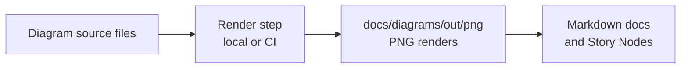

<!-- [KFM_META_BLOCK_V2]
doc_id: kfm://doc/5245c0c5-fef0-48af-8dbb-7ac000e4cb7d
title: docs/diagrams/out/png — README
type: standard
version: v1
status: draft
owners: docs-maintainers  # TODO: align with CODEOWNERS
created: 2026-03-01
updated: 2026-03-01
policy_label: public
related:
  - docs/diagrams/README.md  # TODO: add if/when it exists
tags: [kfm, docs, diagrams, renders, png]
notes:
  - Output folder for generated PNG renders of documentation diagrams.
[/KFM_META_BLOCK_V2] -->

# docs/diagrams/out/png — PNG diagram renders (generated)

**Purpose:** This directory holds **committed PNG exports** of documentation diagrams so they can be embedded in Markdown (and other renderers) that don’t support Mermaid or SVG consistently.

> [!WARNING]
> **Do not hand-edit PNGs here.** Update the diagram *source* and re-render.
> This folder is an **output artifact**, not an authoring surface.


**Status:** draft (add/adjust once the diagram render pipeline is confirmed)

---

## Quick links

- [Purpose](#purpose)
- [Where this fits](#where-this-fits)
- [Directory contents](#directory-contents)
- [What goes here](#what-goes-here)
- [What must NOT go here](#what-must-not-go-here)
- [How renders are produced](#how-renders-are-produced)
- [Naming conventions](#naming-conventions)
- [Governance and safety notes](#governance-and-safety-notes)
- [Checklist](#checklist)
- [Appendix](#appendix)

---

## Purpose

- Provide **stable, linkable** image assets for docs.
- Keep diagram sources **diffable** elsewhere (Mermaid / Draw.io / etc.), while PNGs remain easy to view in any renderer.
- Enable consistent embedding in Markdown docs and Story Nodes.

## Where this fits

KFM’s repo layout treats `docs/` as the home for human-readable documentation, including standards and **architecture diagrams**. This folder is the *rendered output* slice of that documentation surface.

## Directory contents

Expected contents are strictly:

- `README.md` (this file)
- `*.png` (diagram renders)
- *(optional)* subfolders by domain or subsystem, if the number of diagrams grows

```text
docs/
  diagrams/
    out/
      png/
        README.md
        *.png
        (optional)/<subsystem>/*.png
```

> [!NOTE]
> The **authoritative source diagram files** are intentionally *not stored here*.

## What goes here

✅ Acceptable inputs (committed artifacts)

- PNG renders of diagrams used by:
  - architecture docs
  - runbooks
  - Story Nodes / narratives
  - API/design docs (when a diagram is required)

✅ Characteristics

- Produced from a source file (Mermaid, Draw.io, etc.)
- Deterministic naming (see below)
- Reasonable size for repo browsing

## What must NOT go here

🚫 Exclusions

- Diagram sources (e.g., `.mmd`, `.drawio`, `.puml`, `.excalidraw`, `.svg` source-of-truth)
- Screenshots with sensitive material (tokens, secrets, private URLs, personal data)
- “Random” images not referenced by a doc
- Binary blobs with unclear provenance / license

> [!WARNING]
> If a diagram includes **restricted** information (sensitive locations, rights-limited media, internal-only architecture),
> it must not be stored in a public docs path. Use the repo’s restricted docs approach (if present) and apply policy labeling.

## How renders are produced

This is the intended flow (tooling may vary):



### Render pipeline contract (proposed)

- **Inputs:** diagram sources (stored outside this folder)
- **Outputs:** PNG files in this folder, with stable names
- **Rule:** changes to PNGs should be explainable by a change to a source file or render settings

> [!TIP]
> If your repo has a `scripts/` or `tools/` render command, link it here once confirmed:
> - `scripts/render-diagrams` (TODO)
> - `tools/diagrams/render` (TODO)
> - `make diagrams` (TODO)

## Naming conventions

Use **kebab-case** and include **scope**:

- `<subsystem>--<diagram-name>--v<major>.png`
- Examples:
  - `catalog--dcat-stac-prov-linking--v1.png`
  - `policy--trust-membrane-boundary--v1.png`
  - `pipeline--truth-path-zones--v2.png`

Guidelines:

- Prefer **stable filenames**; bump `v#` only on meaningfully incompatible changes.
- Avoid spaces and uppercase.
- Keep names descriptive enough that links don’t need a caption to be understood.

## Governance and safety notes

- Diagrams are documentation, but they can still leak sensitive info.
- Treat every diagram as potentially publishable unless explicitly labeled otherwise.

Minimum safety rules for diagram content:

1. **No secrets**: never include tokens, API keys, private endpoints.
2. **No targeting**: avoid precise coordinates for vulnerable or restricted sites.
3. **Rights clarity**: if a diagram includes third-party imagery/icons, ensure license compatibility and attribution as needed.
4. **Policy awareness**: if served through governed docs later, policy labels determine who can view content.

## Checklist

Use this before committing a new/updated PNG:

- [ ] Source diagram updated (not in this folder)
- [ ] PNG re-rendered from source (no manual edits)
- [ ] Filename follows naming convention
- [ ] Diagram referenced somewhere (docs/story) or queued to be referenced in the same PR
- [ ] No secrets / sensitive coordinates / restricted details
- [ ] File size is reasonable (consider SVG where appropriate; consider Git LFS only if policy allows)
- [ ] README links/registry updated if you maintain one

---

## Appendix

<details>
<summary>Optional: lightweight registry pattern (if the folder grows)</summary>

If this folder gets large, add a short registry table here:

| PNG file | Used by | Source-of-truth | Notes |
|---|---|---|---|
| `pipeline--truth-path-zones--v2.png` | `docs/.../PIPELINE.md` | `docs/diagrams/src/pipeline--truth-path-zones.mmd` | keep filenames stable |

</details>

---

[Back to top](#docsdiagramsoutpng--png-diagram-renders-generated)
