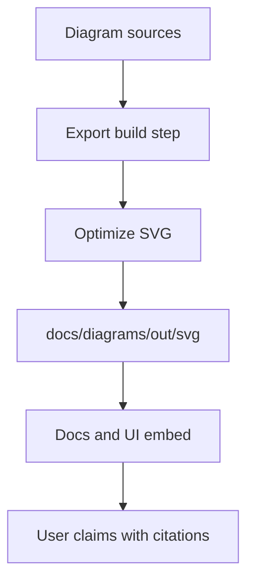

<!-- [KFM_META_BLOCK_V2]
doc_id: kfm://doc/2f6d54e2-9b0a-4a34-a4fe-3f63d76f0c2a
title: docs/diagrams/out/svg — README
type: standard
version: v1
status: draft
owners: KFM Maintainers (TODO: set CODEOWNERS)
created: 2026-03-01
updated: 2026-03-01
policy_label: public
related:
  - docs/diagrams/README.md
  - docs/diagrams/src/
  - docs/diagrams/out/
tags: [kfm, diagrams, svg, build-output]
notes:
  - This directory is intended to contain generated SVG exports of architecture and data-flow diagrams.
  - Treat as rebuildable output; do not hand-edit.
[/KFM_META_BLOCK_V2] -->

# SVG diagram outputs

> Rebuildable SVG exports of KFM diagrams for docs and UI embedding.


**Owners:** _KFM Maintainers_ (TODO: set CODEOWNERS)  
**Source of truth:** diagram *sources* live outside this folder (see “Where this fits” below).

## Quick nav

- [What this directory is](#what-this-directory-is)
- [Where this fits in KFM](#where-this-fits-in-kfm)
- [What belongs here](#what-belongs-here)
- [What must not go here](#what-must-not-go-here)
- [Generation contract](#generation-contract)
- [Review gates](#review-gates)
- [Troubleshooting](#troubleshooting)
- [Appendix](#appendix)

---

## What this directory is

This folder contains **exported `.svg` files** used by:

- Markdown docs (GitHub renders SVG reliably)
- the docs site/static bundling pipeline (if present)
- story/map UI embedding (if it references repo-hosted images)

> **WARNING**
> Treat everything here as **build output**. If you need to change a diagram, edit the **source** and re-export.

## Where this fits in KFM

KFM is designed as an **evidence-first, governed system** with a strict “truth path” lifecycle and a
**trust membrane** that enforces policy at access boundaries. This directory sits in the
**documentation layer** as a *rebuildable artifact store* for visualizations that explain:

- the truth path and promotion gates
- pipeline and catalog flows (DCAT, STAC, PROV)
- policy enforcement boundaries (PEP/PDP)
- UI information architecture and Focus Mode evidence handling



## What belongs here

Allowed contents (MUST be text-based, reviewable):

- `*.svg` — exported diagrams (optimized where feasible)
- `README.md` — this contract
- Optional: `manifest.json` / `index.json` (if the repo uses one) mapping diagram IDs to sources and owners

Recommended SVG minimums (SHOULD):

- `<title>` and/or `<desc>` for accessibility
- stable `viewBox` (avoid huge canvases)
- no embedded raster images unless unavoidable (prefer vector-only)

## What must not go here

This is a *generated output* folder. Do **not** commit:

- editable sources: `*.drawio`, editor-working `*.svg`, `*.fig`, `*.sketch`, etc.
- non-SVG formats: `*.png`, `*.jpg`, `*.pdf` (store those in sibling output folders if the repo defines them)
- sensitive diagrams that reveal:
  - exact coordinates or routes to vulnerable sites
  - credentials, tokens, internal hostnames, private endpoints
  - security-sensitive architecture details that violate the repo’s policy label

> **NOTE**
> If a diagram needs both a “public” and “restricted” variant, split them into policy-labeled folders
> (example: `out/svg/public/` vs `out/svg/restricted/`) and wire governance checks accordingly.

## Generation contract

### Source location

Sources are expected to live in a sibling “source” area (commonly `docs/diagrams/src/` or similar).
This folder stores **only exports**.

### Determinism

Exports SHOULD be reproducible:

- same source + same toolchain version ⇒ identical SVG bytes (or at least stable semantic output)
- apply an SVG optimizer (for example SVGO) consistently

### Naming

Use stable, grep-friendly names.

Recommended pattern (PROPOSED):

- `<diagram_id>--<short_slug>.svg`

Examples:

- `kfm-arch--trust-membrane.svg`
- `kfm-data--truth-path.svg`
- `kfm-api--pep-pdp-flow.svg`

### Provenance header

Each SVG SHOULD include a lightweight provenance comment near the top:

```xml
<!--
source: docs/diagrams/src/kfm-arch--trust-membrane.mmd
toolchain: mermaid-cli@X.Y.Z + svgo@A.B.C
generated: 2026-03-01T00:00:00Z
-->
```

If the source format does not support stable provenance embedding, add/maintain a `manifest.json`.

## Review gates

A PR that changes files in `docs/diagrams/out/svg/` SHOULD include:

- the corresponding source change (or a pointer to where the source lives)
- a short human-readable “why” in the PR description
- confirmation that the diagram does not leak sensitive info

Suggested automated checks (PROPOSED):

- `svg-lint`: reject embedded scripts, external hrefs, or unsafe tags
- `svg-size`: warn/fail above a size threshold
- `accessibility`: ensure `<title>` exists
- `diff-friendly`: run optimizer to keep diffs small

## Troubleshooting

### GitHub renders my SVG weirdly

Common fixes:

- ensure the SVG has a `viewBox`
- avoid CSS that depends on external assets
- convert text to paths only if font substitution causes unacceptable drift

### Diffs are noisy

- run the optimizer consistently
- ensure the exporter uses deterministic IDs (some tools randomize node IDs)

## Appendix

### Directory tree

```text
docs/
  diagrams/
    out/
      svg/
        README.md
        *.svg
```

### Diagram registry template

If you add a manifest, keep it small and boring:

| diagram_id | title | output | source | owner | policy_label |
|---|---|---|---|---|---|
| kfm-data--truth-path | Truth path lifecycle | out/svg/kfm-data--truth-path.svg | src/kfm-data--truth-path.mmd | TODO | public |

---

Back to top: [↑](#svg-diagram-outputs)
