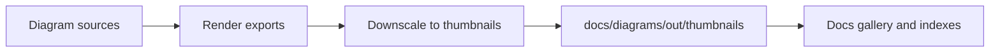

<!-- [KFM_META_BLOCK_V2]
doc_id: kfm://doc/8b0b8baf-2a6c-4b16-9adf-7f6e2f5b1c2c
title: Thumbnails (Derived Diagram Previews)
type: standard
version: v1
status: draft
owners: TBD
created: 2026-03-01
updated: 2026-03-01
policy_label: public
related:
  - docs/diagrams/
  - docs/diagrams/out/
tags: [kfm, diagrams, docs, rebuildable]
notes:
  - This directory is intended for rebuildable thumbnail images derived from diagram sources.
  - TODO: verify owners + any repo-specific generation commands.
[/KFM_META_BLOCK_V2] -->

<a id="top"></a>

# docs/diagrams/out/thumbnails
Small, rebuildable preview images for documentation diagrams (for galleries, indexes, and quick scanning).


---

## Navigation
- [Directory layout](#directory-layout)
- [What belongs here](#what-belongs-here)
- [What must not go here](#what-must-not-go-here)
- [How this fits in KFM](#how-this-fits-in-kfm)
- [Naming and format](#naming-and-format)
- [Automation and CI expectations](#automation-and-ci-expectations)
- [Troubleshooting](#troubleshooting)
- [Repo verification checklist](#repo-verification-checklist)

---

## Directory layout

> NOTE: This is the **intended** layout. Confirm actual repo structure before relying on it.

```text
docs/
└─ diagrams/
   └─ out/
      └─ thumbnails/
         ├─ README.md
         ├─ *.png            # generated thumbnails (recommended default)
         ├─ *.webp           # optional generated thumbnails (smaller)
         └─ index.json       # optional manifest mapping sources -> thumbnails
```

[Back to top](#top)

---

## What belongs here

**Acceptable inputs (generated artifacts):**
- Thumbnail images (typically `.png` or `.webp`) derived from diagram sources.
- Optional lightweight manifests (e.g. `index.json`) that map a thumbnail filename to a source diagram path.

**Typical consumers:**
- Diagram gallery pages in docs
- Auto-generated README indexes in parent diagram folders
- Any UI that needs a fast preview image rather than the full diagram

> TIP: Treat thumbnails as **derived outputs**. If the source diagram changes, regenerate the thumbnail—do not “hand edit” the PNG/WebP.

[Back to top](#top)

---

## What must not go here

**Exclusions (default-deny):**
- ❌ Source diagrams (`.mmd`, `.puml`, `.drawio`, `.svg` originals, etc.)
- ❌ Full-size exports (keep those in the appropriate *non-thumbnail* output directory)
- ❌ Screenshots containing secrets, credentials, tokens, private URLs, internal hostnames, or personal data
- ❌ Location-sensitive imagery when policy requires generalization/redaction
- ❌ Third-party copyrighted images without a license note in the upstream diagram source

> WARNING: Thumbnails are easy to overlook in reviews. Assume they are **high risk** for accidentally leaking sensitive content and keep them tightly governed.

[Back to top](#top)

---

## How this fits in KFM

This folder is **documentation output**. In KFM terms, treat it as a **rebuildable projection** (similar to other derived artifacts that can be regenerated from canonical sources).

**Design intent:**
- Canonical truth lives in *source artifacts* and governed stores.
- Thumbnails are convenience outputs to improve docs UX (faster browsing, easier scanning).



[Back to top](#top)

---

## Naming and format

These conventions are **RECOMMENDED** unless a repo-standard already exists.

| Concern | Recommended default | Rationale |
|---|---|---|
| File naming | same basename as source diagram | stable linking and grep-ability |
| Thumbnail width | 320–512px (keep aspect) | readable preview without bloat |
| Format | `.png` for compatibility; `.webp` for smaller size | trade-off between compatibility and size |
| Background | solid white or transparent (be consistent) | predictable in docs UIs |
| Determinism | generator must be deterministic | reduces noisy diffs |

[Back to top](#top)

---

## Automation and CI expectations

### Minimum “Definition of Done” for this directory
- [ ] Thumbnails are generated by an automated script/tool (not manual edits)
- [ ] Every thumbnail maps to a known source diagram (no “mystery images”)
- [ ] Orphans are removed (thumbnail without a source)
- [ ] Total output size is reasonable (avoid multi‑MB thumbnails)
- [ ] A link-check or manifest-check can be run in CI (fail closed)

### Proposed checks
- **Size check:** fail if any thumbnail exceeds a configured byte threshold.
- **Orphan check:** fail if a thumbnail does not have a corresponding source diagram.
- **Staleness check:** warn/fail if the thumbnail timestamp is older than its source.

> NOTE: Exact commands are intentionally omitted here because repo tooling is **unknown** until verified.

[Back to top](#top)

---

## Troubleshooting

- **Thumbnail missing in docs UI**
  - Confirm the file exists here.
  - Confirm the consumer (gallery/index) is pointing at the correct relative path.
- **Thumbnails look blurry**
  - Increase thumbnail width (e.g. 512px) or generate from vector exports.
- **Large diffs in PRs**
  - Confirm deterministic rendering (fonts, DPI, antialiasing settings).
  - Prefer pinned tool versions.

[Back to top](#top)

---

## Repo verification checklist

Because repo state/tooling can vary, verify these items before “locking in” conventions:

**Assumptions (to verify):**
1. Where the diagram **sources** live (expected: somewhere under `docs/diagrams/`).
2. Which diagram formats are used (Mermaid, PlantUML, Draw.io, etc.).
3. How docs are built/published (static site generator? GitHub Pages?).

**Minimum verification steps**
- [ ] Locate the diagram source directory and confirm naming conventions.
- [ ] Find any existing scripts/tools that produce diagram outputs.
- [ ] Confirm whether thumbnails are committed to git or generated in CI.
- [ ] Confirm policy_label handling for docs assets.

**Risks**
- Accidentally committing sensitive content as an image.
- Non-deterministic rendering causing noisy PR diffs.
- Broken links if naming conventions drift.

**Tradeoffs**
- Committing thumbnails improves docs UX and offline browsing, but increases repo size.
- Generating in CI keeps repo smaller, but requires build artifacts hosting for previews.

[Back to top](#top)
