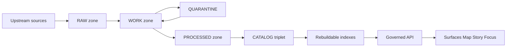
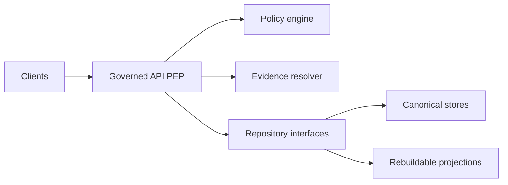

<!-- [KFM_META_BLOCK_V2]
doc_id: kfm://doc/9c0a6b51-9d93-48d4-88d2-60667e2e4dbe
title: Truth Path Diagrams (Rendered Outputs)
type: standard
version: v1
status: draft
owners: KFM Maintainers
created: 2026-03-01
updated: 2026-03-01
policy_label: public
related:
  - docs/diagrams/README.md
  - docs/architecture/README.md
tags: [kfm, diagrams, truth-path, governance, trust-membrane]
notes:
  - This directory is intended to hold rendered exports of the Truth Path / Trust Membrane diagrams.
  - Edit diagram sources upstream, then regenerate outputs here.
[/KFM_META_BLOCK_V2] -->

# Truth Path diagrams (rendered outputs)

Rendered exports of the **KFM Truth Path lifecycle** and **Trust Membrane** diagrams for embedding in architecture docs, onboarding guides, and design reviews.

 <!-- TODO: replace with repo standard -->
 <!-- TODO -->
 <!-- TODO -->

---

## Quick links

- [What the diagrams assert](#what-the-diagrams-assert)
- [Truth Path lifecycle diagram](#truth-path-lifecycle-diagram)
- [Trust Membrane diagram](#trust-membrane-diagram)
- [Promotion Contract gates](#promotion-contract-gates)
- [Directory contract](#directory-contract)
- [How to update](#how-to-update)
- [PR checklist](#pr-checklist)

---

## What the diagrams assert

The Truth Path is **not a metaphor**: it is a concrete, auditable lifecycle of zones and gates that controls what can become visible in governed runtime surfaces.

Core assertions:

- Data moves through the lifecycle **Upstream → RAW → WORK/QUARANTINE → PROCESSED → CATALOG/TRIPLET → PUBLISHED**.
- **RAW is immutable** (append-only). If something changes upstream, we create a new acquisition; we do not edit RAW.
- **QUARANTINE blocks promotion** (failed validation, unclear licensing, sensitivity concerns, or non-reproducible acquisition).
- **CATALOG/TRIPLET is the interoperability + evidence surface** (DCAT + STAC + PROV) and must cross-link identifiers so evidence can resolve deterministically.
- **PUBLISHED is governed runtime** (API + UI). Nothing is “published” unless the Promotion Contract gates pass.
- The **Trust Membrane** prevents policy bypass: clients must not access storage directly; access is policy-evaluated at the governed API (PEP) and evidence is resolved through governed interfaces.

> [!WARNING]
> These diagrams are governance-critical. If you change them, ensure the update remains consistent with the KFM invariants and Promotion Contract.
>
> If you are not sure, fail closed: keep the diagram conservative and add TODO notes until verified.

---

## Truth Path lifecycle diagram



### Zone definitions used by the diagram

| Zone | Purpose | Mutability | Typical artifacts |
|---|---|---|---|
| Upstream | External source systems | N/A | API endpoints, files, sensor feeds |
| RAW | Immutable acquisition copy + checksums | Append-only | Fetch manifests, raw payloads, license or terms snapshot |
| WORK | Intermediate transforms + QA + candidate redactions | Rewritable | Normalized formats, reprojections, QA reports |
| QUARANTINE | Isolated failures or unresolved governance | Blocked | Failed validation outputs, licensing or sensitivity holds |
| PROCESSED | Publishable standardized artifacts + stable IDs | Immutable per version | GeoParquet, COG, PMTiles, derived metadata, final QA |
| CATALOG (Triplet) | Cross-linked metadata + lineage surface | Versioned | DCAT dataset metadata, STAC collections and items, PROV lineage, run receipts |
| Indexes | Rebuildable projections from canonical truth | Rebuildable | DB indexes, search indexes, tiles, graphs |
| PUBLISHED | Governed runtime surfaces | Governed | API responses, UI layers, story pages, Focus answers |

---

## Trust Membrane diagram



**Interpretation:**
- The governed API acts as the **Policy Enforcement Point (PEP)**.
- Clients (including UI) **must not** access canonical storage or projections directly.
- Policy evaluation and evidence resolution happen at the boundary (PEP + policy + evidence).
- Storage is split conceptually into **canonical stores** (object store + catalogs + provenance) and **rebuildable projections** (DB/search/tiles/graph).

---

## Promotion Contract gates

Promotion is the act of moving from RAW/WORK into **PROCESSED + CATALOG/LINEAGE**, and therefore into governed runtime surfaces.

Minimum gate set (fail closed):

- **Gate A — Identity and versioning**
- **Gate B — Licensing and rights metadata**
- **Gate C — Sensitivity classification and redaction plan**
- **Gate D — Catalog triplet validation**
- **Gate E — QA and thresholds**
- **Gate F — Run receipt and audit record**
- **Gate G — Release manifest**

> [!NOTE]
> The diagram assumes gates apply at every transition that would otherwise allow unsafe drift into PUBLISHED.

---

## Directory contract

### Where this fits

This directory is part of the `docs/` documentation surface and is meant to hold **exported diagram artifacts** that are embedded elsewhere (architecture docs, runbooks, onboarding).

### What belongs here

✅ Acceptable inputs:
- Rendered diagram exports (recommended: **SVG** for docs, **PNG** for slide decks)
- A small generation manifest (recommended) describing how outputs were produced
- Checksums (optional) if you want tamper-evidence for the exports

❌ Exclusions:
- Source diagram authoring files (keep those in a `docs/diagrams/src/...` location or equivalent)
- Dataset artifacts (RAW/WORK/PROCESSED files do not belong in docs)
- Secrets, credentials, tokens, private URLs
- Any sensitive coordinates or restricted location detail

### Expected contents

> This is the *intended* shape of the directory. Filenames may vary depending on your diagram build tooling.

```text
docs/diagrams/out/truth-path/
  README.md
  truth-path.svg                 # rendered export
  trust-membrane.svg             # rendered export
  truth-path.png                 # optional raster export
  manifest.json                  # optional build metadata (tool, version, inputs)
  checksums.sha256               # optional integrity file
```

---

## How to update

1. **Edit the source diagram** (not in this directory).
2. **Regenerate exports** into this folder (SVG preferred).
3. Ensure the diagrams still match the KFM invariants:
   - Truth Path zone sequence
   - Trust Membrane boundary
   - Promotion Contract gating posture
4. Update `manifest.json` (if used) with tool version + input references.

> [!TIP]
> Keep diagram edits small and reversible. If changing semantics, pair the update with the corresponding governance/architecture doc change.

---

## PR checklist

- [ ] Diagram exports were regenerated from source (not edited by hand).
- [ ] Truth Path sequence remains consistent with the lifecycle zones.
- [ ] Trust Membrane still prevents any direct client-to-storage access claim.
- [ ] Promotion gates are not weakened (fail-closed posture preserved).
- [ ] Any “PROPOSED” elements are labeled as such (no ungrounded claims).
- [ ] Downstream docs that embed these images still render correctly.

---

## Sources of truth

- KFM blueprint snapshots (governance + invariants)
- KFM pipeline tooling guide (truth path, trust membrane, promotion gates)

_Back to top_: [↑](#truth-path-diagrams-rendered-outputs)
