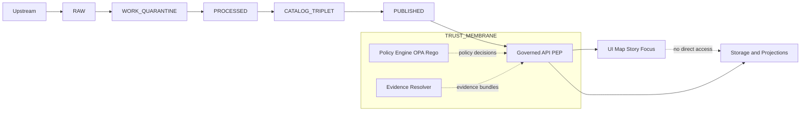

<!-- [KFM_META_BLOCK_V2]
doc_id: kfm://doc/8b7085e6-6b9b-4a4d-9f08-7fb65a5f1cf9
title: Truth Path Diagram PDF Exports
type: standard
version: v1
status: draft
owners: KFM maintainers (TBD)
created: 2026-03-01
updated: 2026-03-01
policy_label: restricted
related:
  - ../../../../README.md  # TODO: fix link to the diagrams index (if present)
  - ../../../../src/truth-path/  # TODO: fix link to the diagram source directory
tags: [kfm, diagrams, truth-path, pdf, out]
notes:
  - This directory holds generated PDF exports of the KFM Truth Path diagram.
  - Do not hand-edit PDFs; regenerate from source + commit outputs deterministically.
[/KFM_META_BLOCK_V2] -->

# Truth Path PDF Exports
Rendered **PDF diagram(s)** of the KFM **Truth Path** lifecycle (Upstream → RAW → WORK/QUARANTINE → PROCESSED → CATALOG/TRIPLET → PUBLISHED) plus the **trust membrane** boundary notes.

**Status:** generated outputs • **Editing:** source-only • **Audience:** engineering + governance + review


<!-- TODO: replace/extend badges with repo-real build + owners + CI when known -->

---

## Navigation
- [Purpose](#purpose)
- [What belongs here](#what-belongs-here)
- [Directory layout](#directory-layout)
- [Truth Path diagram](#truth-path-diagram)
- [Promotion Contract snapshot](#promotion-contract-snapshot)
- [How to regenerate](#how-to-regenerate)
- [Change control checklist](#change-control-checklist)
- [Notes](#notes)

---

## Purpose
This folder exists to keep **portable, review-friendly** PDF exports of the Truth Path diagram close to the rest of the system documentation.

Use cases:
- Architecture reviews and governance briefings
- Embedding in docs (Markdown/PDF) and slide decks
- Printing for in-room design sessions

> WARNING  
> Treat everything in `docs/diagrams/out/**` as **build output**. Source-of-truth is the *diagram source* (see “How to regenerate”).

---

## What belongs here
### ✅ Acceptable inputs
Generated artifacts **only**:
- `*.pdf` exports of the Truth Path diagram (screen + print variants are OK)
- This `README.md`

### ❌ Exclusions
Do **not** store:
- Diagram source files (e.g., draw.io, mermaid source, SVG masters)
- One-off screenshots or “final_final_v7.pdf”
- Any dataset-specific or sensitive coordinates/identifiers

If you need to attach a decision record, put it in the repo’s ADR area (verify location).

---

## Directory layout
> NOTE  
> File names vary by export tooling. Keep naming stable and deterministic once established.

Example layout:
```text
docs/diagrams/out/truth-path/pdf/
├─ README.md
├─ truth-path.pdf                 # primary export (example name)
└─ truth-path--print.pdf          # optional print-optimized export (example name)
```

---

## Truth Path diagram
The Truth Path is the **auditable lifecycle** that connects upstream data → artifacts → catalogs/provenance → governed runtime surfaces.



### Zone intent (human meaning)
- **RAW**: immutable acquisition copy (append-only; new fetches supersede by creating *new* artifacts).
- **WORK/QUARANTINE**: transforms + QA + candidate redactions/generalizations; quarantine blocks promotion.
- **PROCESSED**: publishable artifacts in approved formats with stable IDs + checksums.
- **CATALOG/TRIPLET**: cross-linked **DCAT + STAC + PROV** + receipts so EvidenceRefs resolve deterministically.
- **PUBLISHED**: governed runtime surfaces (API + UI), policy enforced at the PEP; clients do not touch storage directly.

---

## Promotion Contract snapshot
Promotion is a *governed event*: **promotion to PUBLISHED must be blocked unless minimum gates are met**.

Use this checklist when reviewing the diagram for correctness (and when explaining it to others):

- [ ] **Gate A — Identity & versioning** (stable dataset + version IDs; deterministic hashing; digests)
- [ ] **Gate B — Licensing & rights** (rights metadata + upstream terms snapshot)
- [ ] **Gate C — Sensitivity & redaction plan** (policy labels + obligations)
- [ ] **Gate D — Catalog triplet validation** (DCAT/STAC/PROV validate + cross-link IDs; EvidenceRefs resolve)
- [ ] **Gate E — QA & thresholds** (dataset-specific checks + pass/fail thresholding)
- [ ] **Gate F — Run receipt & audit record** (inputs, tooling, hashes, policy decisions; append-only audit trail)
- [ ] **Gate G — Release manifest** (promotion recorded + references artifacts/digests)

> TIP  
> The diagram should communicate *why* the gates exist: **prevent silent drift**, **block unsafe/unlicensed data**, and ensure **reproducible + citeable** outputs.

---

## How to regenerate
Because this folder is output-only, regeneration should be the only way PDFs change.

**Proposed (update to match repo tooling):**
1. Edit the Truth Path diagram source (likely under `docs/diagrams/src/...`).
2. Run the diagram export task (PDF).
3. Confirm the exported PDF(s) render correctly (screen + print).
4. Commit source + regenerated PDFs in the same PR.

Example command block (placeholder):
```bash
# TODO: replace with the repo’s real diagram build/export command(s)
# make diagrams truth-path
# npm run diagrams:truth-path
```

---

## Change control checklist
When you update the Truth Path diagram PDF(s):

- [ ] The node order still matches: Upstream → RAW → WORK/QUARANTINE → PROCESSED → CATALOG/TRIPLET → PUBLISHED.
- [ ] Trust membrane message is explicit: **clients never access storage directly; governed API enforces policy**.
- [ ] Promotion Contract gates are still represented (either inline or in a legend).
- [ ] No sensitive or restricted coordinates/identifiers appear in the diagram export.
- [ ] Exports are deterministic (stable filenames, no timestamp watermarks, no machine-local paths).
- [ ] The diagram remains legible when printed.

---

## Notes
- This directory is intentionally **small and stable**: one diagram, a small number of exports.
- If you need additional formats (SVG/PNG), create sibling folders under `docs/diagrams/out/truth-path/` and document them similarly.
- Keep the diagram aligned with the current KFM governance definitions (Truth Path, Trust Membrane, Promotion Contract).
