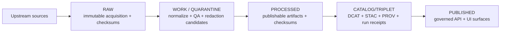
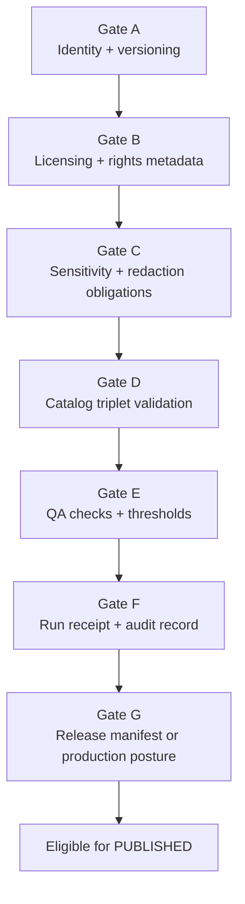

<!-- [KFM_META_BLOCK_V2]
doc_id: kfm://doc/92dd3a59-f17e-46ef-8cf1-b1d27b389306
title: Truth Path SVG Diagrams
type: standard
version: v1
status: draft
owners: KFM Maintainers (verify via CODEOWNERS)
created: 2026-03-01
updated: 2026-03-01
policy_label: public
related:
  - kfm://concept/truth-path
  - kfm://concept/promotion-contract
tags: [kfm, diagrams, truth-path, svg]
notes:
  - Intended for generated diagram outputs; edit source diagrams, not these SVGs.
[/KFM_META_BLOCK_V2] -->

# Truth Path SVG Diagrams
*Generated SVG outputs for the KFM “truth path” lifecycle diagram(s) and promotion gates.*


> **WARNING**
> This directory is intended to contain **generated** artifacts (SVG).  
> Prefer updating the **source diagram** (Mermaid/PlantUML/Draw.io/etc.) and re-running the diagram build, rather than hand-editing SVG output.

---

## Quick navigation
- [Overview](#overview)
- [Directory contents](#directory-contents)
- [How to use these SVGs](#how-to-use-these-svgs)
- [Regenerating and updating](#regenerating-and-updating)
- [Governance notes](#governance-notes)
- [Appendix: Mermaid reference diagram](#appendix-mermaid-reference-diagram)

---

## Overview
KFM’s *truth path* is an auditable lifecycle for data and metadata moving from upstream acquisition into governed runtime surfaces:

**Upstream → RAW → WORK/QUARANTINE → PROCESSED → CATALOG/TRIPLET → PUBLISHED**

This directory holds the **SVG diagrams** that visualize that lifecycle (and usually the **Promotion Contract gates** that block promotion when requirements are missing).

### What the diagram is meant to communicate
- **RAW**: immutable acquisition snapshots + checksums (append-only; supersede with a new acquisition instead of editing).
- **WORK/QUARANTINE**: intermediate transforms and QA; failed/unclear items are isolated and **not promoted**.
- **PROCESSED**: publishable artifacts in approved formats + checksums.
- **CATALOG/TRIPLET**: cross-linked **DCAT + STAC + PROV** plus run receipts/lineage.
- **PUBLISHED**: governed runtime surfaces (API + UI) that only serve promoted versions.

### Promotion Contract (at a glance)
Promotion into **PUBLISHED** is blocked unless the minimum gates are satisfied (identity/versioning, licensing, sensitivity/redaction obligations, catalog validation, QA thresholds, run receipts/audit, etc.). See the gate list in the appendix diagram below.

[Back to top](#truth-path-svg-diagrams)

---

## Directory contents

### Expected tree
```text
docs/diagrams/out/truth-path/
└── svg/
    ├── README.md
    └── *.svg
```

### Acceptable inputs
**This directory should contain only:**
- `README.md` (this file)
- `*.svg` diagram outputs (optimized for embedding in Markdown and web UIs)

### Exclusions
Do **not** place source diagrams or binary editing formats here:
- No `*.mmd`, `*.puml`, `*.drawio`, `*.pptx`, `*.key`
- No raster exports (`*.png`, `*.jpg`) unless explicitly required by a downstream consumer
- No “one-off” diagrams that are not part of the truth-path lifecycle set

[Back to top](#truth-path-svg-diagrams)

---

## How to use these SVGs

### Embed in Markdown
In docs elsewhere in the repo, embed SVGs with clear alt text:

```md

```

Tips:
- Prefer **SVG** over screenshots so diagrams remain crisp at any zoom level.
- Keep filenames **kebab-case** (`truth-path.svg`, `promotion-gates.svg`, etc.).
- If an SVG is interactive (links inside), confirm GitHub rendering preserves the behavior.

### Use in UI / Story surfaces
If the UI needs these diagrams (e.g., “About the truth path”), treat them as **static assets** and ensure any build step copies them into the documentation site bundle or app public assets.

[Back to top](#truth-path-svg-diagrams)

---

## Regenerating and updating
Because this is an output directory, the correct workflow is:

1. Update the **source-of-truth diagram definition** (location depends on the repo’s diagram tooling).
2. Re-run the **diagram build** that emits SVG into this folder.
3. Verify the output is deterministic (minimal diffs aside from intentional changes).
4. Commit SVG updates alongside the source change (or via the repo’s doc build rules).

### Minimum verification steps
If you’re wiring this up for the first time:
- Search the repo for the diagram generator entrypoints (e.g., “diagrams build”, “mermaid”, “plantuml”, “drawio export”).
- Locate the corresponding **source diagram** for truth path (commonly named `truth-path.*`).
- Ensure CI (or local checks) fail when output SVGs are stale, if that’s the desired policy.

[Back to top](#truth-path-svg-diagrams)

---

## Governance notes
- These diagrams are not “nice-to-have visuals”; they are documentation of **non-negotiable lifecycle invariants**.
- If the truth path changes (e.g., zone names, required gates), the change should be treated as a governed decision (ADR/policy update) and the diagrams regenerated in the same PR.

[Back to top](#truth-path-svg-diagrams)

---

## Appendix: Mermaid reference diagram
Even if downstream renderers can’t display embedded SVGs, this Mermaid flowchart provides a text-defined fallback that stays diff-friendly.



### Promotion Contract gates (reference)

