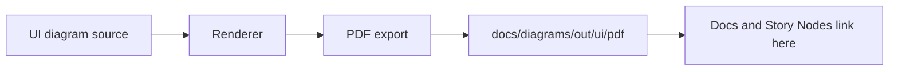

<!-- [KFM_META_BLOCK_V2]
doc_id: kfm://doc/1d45b39f-5d74-40ff-a932-e4e54ba8db3e
title: UI Diagram PDFs (Derived Outputs)
type: standard
version: v1
status: draft
owners: KFM maintainers (TODO: set CODEOWNERS team)
created: 2026-03-01
updated: 2026-03-01
policy_label: restricted
related:
  - docs/diagrams/README.md (TODO: add/confirm)
  - docs/diagrams/src/ui/ (TODO: confirm)
  - tools/ (TODO: confirm render tooling)
tags: [kfm, diagrams, ui, pdf, derived-artifacts]
notes:
  - Default-deny: treat UI PDFs as restricted until governance review.
  - This directory is intended for *derived* PDFs (not source files).
[/KFM_META_BLOCK_V2] -->

# UI Diagram PDFs (Derived Outputs)

**Purpose:** A governed, stable home for **exported PDF** versions of KFM UI diagrams (Map UI, Story UI, Focus Mode UI, flows, wireframes, interaction diagrams).


**Status:** draft • **Owners:** TODO • **Last updated:** 2026-03-01

**Quick nav:**  
[What belongs here](#what-belongs-here) •
[What must not go here](#what-must-not-go-here) •
[Naming and versioning](#naming-and-versioning) •
[How PDFs are produced](#how-pdfs-are-produced) •
[Governance rules](#governance-rules) •
[Diagram registry](#diagram-registry) •
[FAQ](#faq)

---

## What belongs here

✅ **Allowed contents (expected):**
- **PDF exports** of UI diagrams that are referenced by:
  - documentation pages,
  - ADRs/design reviews,
  - Story Nodes / narrative artifacts,
  - governance/UX decision records.
- PDFs that have been **reviewed** (at least lightweight review) and are stable enough to link to.
- PDFs whose *source-of-truth diagram* lives elsewhere (see: [How PDFs are produced](#how-pdfs-are-produced)).

> NOTE  
> This directory is intentionally “boring”: it should contain *rendered outputs* that are safe to link and diff at the binary level, while the editable sources remain in a separate `src/` location (TBD).

[Back to top](#ui-diagram-pdfs-derived-outputs)

---

## What must not go here

❌ **Not allowed:**
- Editable/source diagram files:
  - `.drawio`, `.excalidraw`, `.fig`, `.sketch`, `.psd`, `.ai`
  - `.mmd` / `.puml` (if those are considered “source” in this repo)
- Raw screenshots, recordings, or exports that contain:
  - secrets, tokens, internal hostnames,
  - personal data,
  - sensitive site coordinates,
  - any “restricted” evidence that has not been redacted.
- Unreviewed “scratch” exports.

> WARNING  
> If you’re unsure whether a diagram contains sensitive content, **do not** place the PDF here. Put it in a private scratch location and request a governance review.

[Back to top](#ui-diagram-pdfs-derived-outputs)

---

## Naming and versioning

Use a filename that is:
- **stable**, **descriptive**, and **sortable**
- includes a **scope**, a **topic**, and a **version**
- avoids spaces and avoids ambiguity

### Recommended pattern

```
ui-<surface-or-domain>--<topic>--v<major>.<minor>--<YYYYMMDD>.pdf
```

Examples (illustrative only):
- `ui-map--layer-panel-interactions--v1.0--20260220.pdf`
- `ui-story--evidence-drawer-flow--v1.1--20260301.pdf`
- `ui-focus--ask-to-citation-path--v0.3--20260228.pdf`

**Rules:**
- Bump **minor** for layout/content tweaks that don’t change meaning.
- Bump **major** when the diagram’s semantics change (flow, contract, policy).
- Update the **date** whenever the PDF is re-exported.

[Back to top](#ui-diagram-pdfs-derived-outputs)

---

## How PDFs are produced

This folder holds **outputs**. The *editable sources* should live in a sibling “source” area (path(s) **TBD** in repo).

### Expected pipeline (conceptual)



### Minimum reproducibility expectation

When you export/update a PDF:
1. Ensure the source diagram is committed (or already exists) in the diagram source directory (**TBD**).
2. Export using the repo’s standard tooling (script/CLI) when available.
3. Update the **Diagram registry** entry below (at least: name, source, owner, date, status).
4. If the diagram informs product behavior/policy, link it from an ADR or Story Node.

### Tooling (UNKNOWN until verified)

This README does **not** assume a specific render command exists.

To locate the real command(s), search the repo for:
- `diagrams` / `render` / `export pdf`
- `drawio` / `plantuml` / `mermaid-cli` / `puppeteer`
- `docs/diagrams/src`

Example discovery commands:

```bash
# ripgrep
rg -n "diagrams|render|export" .

# package scripts (if Node)
cat package.json | rg -n "diagram|render|export"

# tooling directories
ls -la tools scripts docs/diagrams
```

[Back to top](#ui-diagram-pdfs-derived-outputs)

---

## Governance rules

These PDF artifacts are part of the **evidence-first** UI documentation surface, so treat them as governed outputs.

### Required checks before adding/updating a PDF

- [ ] **Sensitivity review:** no secrets, personal data, or restricted coordinates.
- [ ] **Policy label:** confirm whether this PDF is `public` or `restricted` and align placement accordingly.
- [ ] **Traceability:** the PDF can be traced back to its editable source (path + commit).
- [ ] **Reversibility:** changes are incremental (avoid replacing many unrelated diagrams at once).
- [ ] **Link integrity:** update inbound references (docs/ADRs/story nodes) if filename changes.

> TIP  
> Prefer *new versioned files* over overwriting older ones when a diagram has been referenced externally. Stable links preserve the “trust membrane” for documentation.

[Back to top](#ui-diagram-pdfs-derived-outputs)

---

## Diagram registry

Maintain a lightweight index of what’s in this folder so humans can find the right PDF quickly.

> NOTE  
> Entries below may start empty. Add rows as PDFs are added.

| PDF file | Surface | Source-of-truth diagram | Owner | Status | Notes |
|---|---|---|---|---|---|
| (add) | map/story/focus | (relative path + commit) | (team) | draft/review/published | (why it exists) |

### Registry conventions
- **Source-of-truth diagram** should be a *relative path* where possible.
- Include a commit SHA when feasible (or link to the specific blob in Git hosting).
- Status meanings:
  - `draft`: in flux, ok for internal iteration
  - `review`: stable enough for design review
  - `published`: safe to reference broadly in docs/UI narratives

[Back to top](#ui-diagram-pdfs-derived-outputs)

---

## Directory tree

> Example only (not authoritative; update once actual PDFs exist):

```text
docs/diagrams/out/ui/pdf/
  README.md
  ui-map--layer-panel-interactions--v1.0--20260220.pdf
  ui-story--evidence-drawer-flow--v1.1--20260301.pdf
  ui-focus--ask-to-citation-path--v0.3--20260228.pdf
```

[Back to top](#ui-diagram-pdfs-derived-outputs)

---

## FAQ

### Why keep PDFs in git at all?
- PDFs are stable for **linking**, design review packets, and long-lived records.
- Storing derived outputs supports evidence-first workflows where readers don’t need diagram tooling installed.

### Can I overwrite an existing PDF?
Prefer **versioned additions**. Only overwrite if:
- the file has **no inbound links**, or
- you are intentionally updating a “rolling” diagram and all references expect that.

### What if I need a non-PDF format?
Put non-PDF formats in the designated output directory for that type (e.g., `.../png/` or `.../svg/`) if it exists, or propose it with a minimal, additive change.

---
