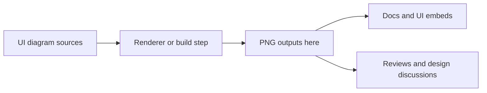

<!-- [KFM_META_BLOCK_V2]
doc_id: kfm://doc/4e1d9e2d-6a8f-4b70-b60d-4b7f68d6c1a8
title: UI Diagram PNG Outputs
type: standard
version: v1
status: draft
owners: TBD
created: 2026-03-01
updated: 2026-03-01
policy_label: restricted
related:
  - docs/diagrams/README.md
  - docs/diagrams/src/ui
  - docs/diagrams/out/ui
tags: [kfm, diagrams, ui, png, generated]
notes:
  - This directory is for generated PNG exports of UI diagrams.
  - Treat outputs as build artifacts; avoid hand edits.
[/KFM_META_BLOCK_V2] -->

# UI diagram PNG outputs

One-line purpose: **Generated PNG exports of UI architecture and UX diagrams for embedding in docs and UI references.**


---

## Quick navigation

- [What belongs here](#what-belongs-here)
- [What must not go here](#what-must-not-go-here)
- [Directory layout](#directory-layout)
- [Naming conventions](#naming-conventions)
- [How to reference PNGs](#how-to-reference-pngs)
- [Generation and provenance](#generation-and-provenance)
- [Quality gates](#quality-gates)
- [Troubleshooting](#troubleshooting)

---

## Where this fits

This folder is a **build output leaf** under:

`docs/diagrams/out/ui/png/`

It exists to hold **rendered, presentation-ready** PNGs that are derived from **source-of-truth UI diagrams** (e.g., editable diagram formats or Markdown/Mermaid sources) and used in:

- Markdown documentation (architecture, UX flows, runbooks)
- Story/Focus Mode explainers (when static images are appropriate)
- Release notes or design reviews (when linking to a stable artifact)

> [!WARNING]
> **Do not treat this folder as source-of-truth.**  
> If you need to change a diagram, update the *source diagram* and regenerate outputs.

## Governance alignment

This folder is part of KFM’s **evidence-first** posture:

- **Cite-or-abstain:** diagrams can support claims, but should not be the only artifact behind a decision.
- **Trust membrane:** treat diagrams as *governed documentation artifacts*; keep provenance so reviewers can trace “what changed” and “why”.

> [!IMPORTANT]
> If a diagram depicts sensitive locations, community-restricted knowledge, or operational security details, **do not publish precise details** in a PNG. Prefer coarse geography and add a policy note explaining the redaction rationale.

---

## Diagram lifecycle



---

## What belongs here

✅ **Acceptable inputs (files):**

- `.png` files that are **exported/generated** from an authoritative UI diagram source
- Optional *machine-readable provenance sidecars* (only if the repo standardizes on one), e.g.:
  - `*.png.prov.json`
  - `*.png.meta.json`

✅ **Acceptable content characteristics:**

- Diagrams that are **legible at 100% scale** in GitHub’s renderer
- UI flows, component diagrams, IA maps, interaction state diagrams
- Sanitized content (no secrets, tokens, or sensitive precise locations)

---

## What must not go here

🚫 **Exclusions:**

- Editable sources (these belong in the diagram *source* directory):
  - `.drawio`, `.pptx`, `.fig`, `.sketch`, `.psd`, `.ai`
  - Raw Mermaid source files if your repo treats them as sources
- Ad-hoc screenshots (especially of admin panels, logs, credentials, or personal data)
- Duplicate “draft exports” that are not referenced anywhere
- Any artifact whose provenance cannot be explained (unknown source)

> [!NOTE]
> If you *must* add an ad-hoc screenshot for debugging, keep it out of `out/` and put it in a quarantined/debug area with a short retention plan.

---

## Directory layout

This directory is intentionally boring: it is a **flat-ish artifact store** to make link paths stable.

```text
docs/diagrams/out/ui/png/
├── README.md
├── (one-or-more) *.png
└── (optional) *.png.prov.json
```

If the number of diagrams grows large, prefer adding **one level of grouping** (not deep nesting), e.g.:

- `flows/` (user journeys, UX state machines)
- `architecture/` (system components, boundaries)
- `wireframes/` (static IA and layout)

---

## Naming conventions

**Goal:** names that are stable, human-scannable, and diff-friendly.

Recommended pattern:

`ui--<topic>--<diagram_kind>--<yyyy-mm-dd>--<shortid>.png`

Examples:

- `ui--focus-mode--sequence--2026-03-01--a1b2c3d4.png`
- `ui--map-ui--component-boundaries--2026-03-01--e5f6g7h8.png`

Where:

- `<topic>`: feature area (e.g. `map-ui`, `focus-mode`, `catalog`)
- `<diagram_kind>`: `flow`, `sequence`, `component`, `state`, `ia`
- `<shortid>`: short stable id (often derived from the source artifact hash or a doc-id)

> [!TIP]
> If you already have a canonical naming convention elsewhere in the repo, **match it**. Consistency beats novelty.

---

## How to reference PNGs

### In Markdown

Use **relative links** so they work in forks and local preview:

```md

```

### In Story Nodes or governed UI content

When the UI is “evidence-first”, images should be treated as **supporting artifacts**, not as the only source of truth.

- Prefer linking to the source diagram *and* the PNG output.
- Include enough context in surrounding text so the meaning survives if the image fails to load.

---

## Generation and provenance

### Expectations

- PNGs in this folder should be **regenerable** from a corresponding source diagram.
- Regeneration should be deterministic enough that diffs are meaningful (to the extent possible for raster output).

### Provenance checklist

When you add or update a PNG, make sure you can answer:

- **Source:** Where is the editable or authoritative diagram?
- **Tooling:** What rendered/exported it (and version, if practical)?
- **When:** When was it generated?
- **Why:** What change prompted the new output?

A lightweight provenance sidecar (if adopted) might include:

```json
{
  "artifact": "ui--focus-mode--sequence--2026-03-01--a1b2c3d4.png",
  "source": "TBD:path/to/source/diagram",
  "generated_at": "2026-03-01T00:00:00Z",
  "generator": "TBD:tool-name-and-version",
  "inputs_hash": "TBD",
  "notes": "Explain what changed and why"
}
```

---

## Quality gates

Before merging changes that touch this directory:

- [ ] PNG renders correctly in GitHub (no missing fonts, no crop issues)
- [ ] Text is readable without zooming to 200%+
- [ ] The diagram does **not** disclose secrets, sensitive credentials, or private locations
- [ ] There is a discoverable link from at least one doc/page to the PNG (no orphan artifacts)
- [ ] Source-of-truth diagram is updated (or referenced) so this folder can be rebuilt

---

## Troubleshooting

- **Text is blurry:** export at a higher DPI, or consider an SVG/PDF output alongside PNG.
- **Fonts differ across machines:** embed fonts or standardize on a known-safe font set.
- **PNG diffs are noisy:** prefer editing at the source and avoid re-exporting unless necessary; consider a vector format for review.

---

<details>
<summary>Appendix: Why PNG (and when not to)</summary>

PNG is convenient for GitHub previews, issue discussions, and embedding in Markdown.

However, if you need:

- Searchable text
- Crisp zoom
- Small diffs

…prefer SVG or a source format that can be rendered in CI.

</details>

---

_Back to top: [Quick navigation](#quick-navigation)_
