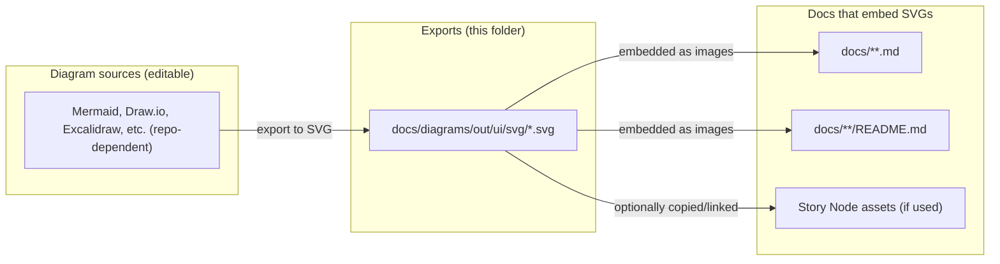

<!-- [KFM_META_BLOCK_V2]
doc_id: kfm://doc/6d2d4f2f-3a4e-4d3c-a3d7-6b2a2f0e9a2a
title: docs/diagrams/out/ui/svg — README
type: standard
version: v1
status: draft
owners: KFM Docs + UI (TBD)
created: 2026-03-01
updated: 2026-03-01
policy_label: public
related:
  - docs/architecture/diagrams/
tags: [kfm, docs, diagrams, ui, svg]
notes:
  - This folder is intended to hold exported SVG diagram assets used by KFM UI documentation.
  - Verify your repo’s diagram source/export workflow; this README includes a proposed workflow section.
[/KFM_META_BLOCK_V2] -->

# `docs/diagrams/out/ui/svg`
Exported **SVG** diagrams for **KFM UI** docs (Map / Story / Focus Mode) — **output assets** meant to be embedded by Markdown.


---

## Navigation
- [Purpose](#purpose)
- [Where this fits](#where-this-fits)
- [Directory contract](#directory-contract)
- [Naming conventions](#naming-conventions)
- [How to reference SVGs in docs](#how-to-reference-svgs-in-docs)
- [Add or update a diagram](#add-or-update-a-diagram)
- [Quality gates](#quality-gates)
- [SVG index](#svg-index)
- [Assumptions and unknowns](#assumptions-and-unknowns)
- [Back to top](#docsdiagramsoutuissvg)

---

## Purpose

This directory contains **SVG exports** of UI-related diagrams that are embedded in Markdown documentation (and potentially other doc renderers).

> [!NOTE]
> Treat files here as **outputs**. Prefer editing the **source diagram** (wherever your repo keeps diagram sources) and re-exporting to SVG.

> [!WARNING]
> Don’t place secrets, sensitive coordinates, or restricted content inside diagrams. Diagrams are documentation artifacts and should follow KFM’s governance posture.

---

## Where this fits

KFM’s documented pipeline emphasizes traceability from raw data through governed APIs into UI experiences (Map UI, Story Nodes, Focus Mode). UI diagrams in SVG form are “explanatory assets” for those downstream stages.



---

## Directory contract

### ✅ Acceptable inputs (what belongs here)
- `*.svg` files that represent **UI diagrams**, such as:
  - Map UI interaction flows
  - Story Node UX flows
  - Focus Mode evidence / provenance UI flows
  - “Trust membrane” / governed API boundary diagrams for UI contexts
- `README.md` (this file)

### ❌ Exclusions (what must *not* go here)
- Editable “source” diagram formats (keep those in the diagram-source location)
  - Examples: `*.drawio`, `*.excalidraw`, `*.fig`, `*.pptx`, etc.
- Raster screenshots (prefer SVG; if raster is unavoidable, place in an appropriate images folder)
- Anything requiring restricted handling (PII, sensitive site locations, credentials, private endpoints)

---

## Naming conventions

Use names that are:
- **kebab-case**
- **scoped** with a stable prefix
- **descriptive** and “diff-friendly”

Recommended pattern:

`kfm-ui--<area>--<diagram-purpose>--v<major>.svg`

Examples:
- `kfm-ui--map--layer-browser-flow--v1.svg`
- `kfm-ui--story--story-node-authoring-flow--v1.svg`
- `kfm-ui--focus--evidence-bundle-drilldown--v1.svg`

> [!TIP]
> Treat version suffixes (`v1`, `v2`) as “meaningful layout changes,” not minor label edits.

---

## How to reference SVGs in docs

### Markdown (preferred)
```md

```

### HTML (useful for sizing on some renderers)
```html

```

Accessibility requirements:
- Always include **alt text**.
- If the diagram is critical, add a **1–2 sentence textual summary** immediately below it.

---

## Add or update a diagram

1. **Locate the source**
   - Find the editable source file (repo-specific).
   - If no source exists, create one and store it in the repo’s diagram-source area (recommended).

2. **Export to SVG**
   - Export with:
     - A `viewBox`
     - Text preserved as text (avoid converting everything to paths unless required)
     - No external font dependencies when possible

3. **Normalize / optimize (recommended)**
   - Keep diffs stable.
   - Remove editor timestamps/metadata if present.
   - Run an SVG optimizer if your tooling supports it (example: `svgo`).

4. **Add/update an entry in the [SVG index](#svg-index)**

5. **Validate rendering**
   - GitHub preview
   - Any docs site build, if applicable

---

## Quality gates

### Required checks (PR checklist)
- [ ] SVG renders correctly in GitHub
- [ ] Has a `viewBox` and scales correctly
- [ ] File name follows naming convention
- [ ] No secrets / sensitive coordinates / restricted content
- [ ] No external network fetches (fonts, images) embedded by reference
- [ ] Added/updated entry in the SVG index table

### Recommended checks
- [ ] Run SVG optimizer (e.g., SVGO) to reduce noise and size
- [ ] Keep diagram text readable at 100% zoom
- [ ] Avoid color-only meaning (use labels/shapes)

<details>
  <summary>Optional: Suggested SVGO config snippet</summary>

```yaml
# .svgo.yml (example — repo may differ)
multipass: true
plugins:
  - name: preset-default
    params:
      overrides:
        # Keep viewBox so diagrams remain responsive
        removeViewBox: false
  - name: removeDimensions
```
</details>

---

## SVG index

Keep this table updated so docs authors can find diagrams quickly.

| File | Area | What it explains | Primary docs that embed it | Owner | Status |
|------|------|------------------|----------------------------|-------|--------|
| _(add file)_ | map / story / focus | _(short description)_ | _(relative doc path)_ | _(team/person)_ | draft/review/published |

---

## Assumptions and unknowns

The following are intentionally **not asserted as facts** until verified in the repo:

- **Where editable diagram sources live** (a `src/` sibling directory is recommended but not guaranteed).
- **Whether SVG optimization is enforced in CI**.
- **Whether Story Nodes copy assets vs. link to shared assets**.

Minimum verification steps:
1. Search the repo for any existing diagram-source directory (e.g., `docs/**/diagrams/**`, `*.drawio`, `*.excalidraw`, `*.mmd`).
2. Check CI workflows for any diagram export / linkcheck / asset validation steps.
3. Confirm the preferred doc embed path conventions used elsewhere in `docs/`.

---

## Back to top
[↑ Back to top](#docsdiagramsoutuissvg)
