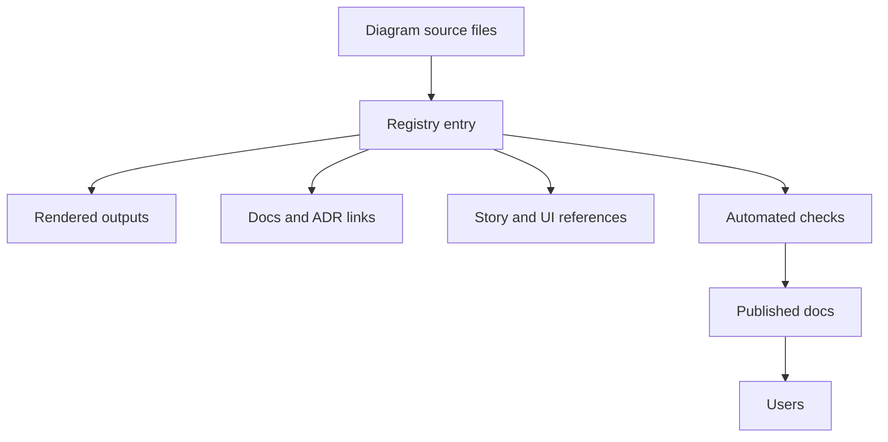

<!-- [KFM_META_BLOCK_V2]
doc_id: kfm://doc/b61cec8d-a636-41be-9814-519c20935b08
title: Diagram Registry
type: standard
version: v1
status: draft
owners: TBD
created: 2026-03-01
updated: 2026-03-01
policy_label: public
related:
  - docs/diagrams/README.md
  - docs/architecture/diagrams/
  - docs/governance/ROOT_GOVERNANCE.md
tags: [kfm, diagrams, registry]
notes:
  - Directory-level README for registry artifacts that index and govern KFM diagrams.
[/KFM_META_BLOCK_V2] -->

<a id="top"></a>

# Diagram Registry
**One-line purpose:** A governed index of KFM diagrams (what they are, where they live, who owns them, and what they must stay consistent with).

**Status:** draft • **Owners:** TBD • **Default policy_label:** `public` (unless explicitly marked otherwise)


> **NOTE**
> This directory is for **registry artifacts** (indexes, schemas, templates, generated lists).
> Put **diagram sources** (Mermaid/PlantUML/Draw.io/etc.) in the diagram folders and reference them here.

## Quick links
- [Why a registry exists](#why-a-registry-exists)
- [What belongs in this folder](#what-belongs-in-this-folder)
- [Registry contract](#registry-contract)
- [Add or update a diagram](#add-or-update-a-diagram)
- [Governance and safety](#governance-and-safety)
- [Directory layout](#directory-layout)
- [Troubleshooting](#troubleshooting)

---

## Why a registry exists

KFM diagrams are **not just pictures** — they become shared references across:
- architecture docs,
- runbooks and ADRs,
- Story/Focus UX explanations,
- onboarding material.

A registry reduces “diagram drift” by making every diagram:
- **discoverable** (one canonical list),
- **owned** (someone is responsible),
- **reviewed** (date + scope),
- **traceable** (links to the contracts/policies/docs it must match),
- **policy-aware** (`policy_label`, sensitivity notes, and redaction expectations).

### Conceptual flow



---

## What belongs in this folder

### ✅ Acceptable inputs
| Kind | Examples | Why it exists |
|---|---|---|
| Registry file(s) | `*.yml`, `*.yaml`, `*.json` | Source-of-truth list of diagrams + metadata |
| Registry schema | `schema/*.schema.json` | Enables lint/validation and consistent fields |
| Templates | `templates/*.yml` | Makes new entries easy + consistent |
| Generated indexes | `index.md`, `generated/*.md` | Human-friendly browse view generated from registry |
| Docs for process | `README.md` (this file) | Directory contract + governance rules |

### ❌ Exclusions (do not put these here)
- **Raw data** (belongs in data zones, not docs).
- **Large binary exports** unless explicitly approved (prefer text-first diagrams and/or generated assets).
- **Sensitive coordinates / vulnerable site locations** in a way that would enable targeting.
- **Diagrams that imply behavior contradictory to the trust membrane** (if the implementation differs, fix the code/docs — don’t “paper over” it here).

> **WARNING**
> If a diagram includes sensitive content, it must be explicitly labeled and handled with a policy-aware approach (e.g., generalized geometry, redacted callouts, restricted distribution).

---

## Registry contract

This folder defines a **small contract**: what every diagram must declare so it can be governed.

### Required fields (minimum viable)
| Field | Type | Required | Meaning |
|---|---:|:---:|---|
| `diagram_id` | string | ✅ | Stable identifier (recommended: `kfm://diagram/<uuid-or-slug>`) |
| `title` | string | ✅ | Human title used in indexes |
| `status` | enum | ✅ | `draft` \| `review` \| `published` \| `deprecated` |
| `owners` | list | ✅ | Responsible maintainer(s) / team |
| `policy_label` | enum/string | ✅ | `public` / `restricted` / etc. |
| `source.paths` | list | ✅ | Diagram source file paths |
| `rendered.paths` | list | ⚠️ | Optional: generated assets (SVG/PNG/PDF) |
| `last_reviewed` | date | ✅ | Last governance/accuracy review |
| `references` | object | ⚠️ | Links to docs/contracts/policies that must match |

### Recommended fields (strongly suggested)
| Field | Type | Why it helps |
|---|---|---|
| `scope` | string | Quickly tells readers where the diagram applies |
| `change_notes` | string | Explains what changed and why |
| `tags` | list | Enables filtering in a generated index |
| `risk_notes` | string | Flags sensitivity, deprecation risk, or common misreads |
| `evidence_refs` | list | If the diagram is used to justify claims, point to EvidenceRefs or canonical docs |

### Example entry (adjust paths to the repo)
```yaml
- diagram_id: kfm://diagram/9f2d0c2b-truth-path
  title: Truth path and trust membrane overview
  status: draft
  owners:
    - "@kfm-architecture"
    - "@kfm-docs"
  policy_label: public
  scope: Cross-cutting architecture
  source:
    format: mermaid
    paths:
      - docs/diagrams/truth_path_and_trust_membrane.mmd
  rendered:
    paths:
      - docs/diagrams/truth_path_and_trust_membrane.svg
  references:
    docs:
      - docs/architecture/KFM_VISION_FULL_ARCHITECTURE.md
      - docs/governance/ROOT_GOVERNANCE.md
    contracts:
      - contracts/api/openapi.yaml
    policy:
      - policy/opa/
  last_reviewed: 2026-03-01
  change_notes: "Initial registry entry."
  tags: ["architecture", "governance", "trust"]
```

---

## Add or update a diagram

### Workflow (human steps)
1. **Create/update the diagram source**
   - Prefer text-first formats where possible (Mermaid/PlantUML/Graphviz).
   - If a binary editor is required (e.g., Draw.io), ensure the source file is committed (not just an export).

2. **Register it**
   - Add/update the entry in the registry file.
   - Ensure `owners`, `policy_label`, and `last_reviewed` are filled.

3. **Render outputs (optional, if used elsewhere)**
   - If other docs embed images, provide the rendered output(s) and keep them in sync.

4. **Review**
   - Treat changes to “core invariants” diagrams as review-required (architecture/governance owners).

### Definition of Done (checklist)
- [ ] `diagram_id` is stable and unique
- [ ] Source path(s) exist and are correct
- [ ] `owners` set (a real person/team, not “someone”)
- [ ] `policy_label` set appropriately
- [ ] `last_reviewed` updated
- [ ] References point to the canonical contract/doc/policy surfaces
- [ ] No sensitive location leakage (or the diagram is labeled + generalized/redacted)
- [ ] If rendered assets exist, they match the source (no stale exports)

---

## Governance and safety

### Policy & sensitivity
- If a diagram touches **restricted datasets, sensitive locations, or governance tooling**, assume **default-deny** until a steward/owner reviews.
- Prefer generalized representations:
  - “County-level” instead of precise coordinates
  - “Redacted site cluster” instead of site pins
  - “Example payload” with fake identifiers instead of real secrets or internal IDs

### Rights & attribution
- If a diagram incorporates content from an external source, store attribution notes in the registry entry and verify license compatibility.

---

## Directory layout

> **TIP**
> The tree below is the **recommended** shape for this directory. If the repo differs, update this README to match reality.

```text
docs/diagrams/registry/                               # Diagram registry (machine-checkable inventory + generated index)
├─ README.md                                          # You are here: purpose, how registry is used, DoD, and CI validation rules
├─ diagram-registry.yaml                              # Canonical diagram registry (ids, titles, owners, sources, exports, policy labels)
├─ schema/                                            # Registry validation schemas
│  └─ diagram-registry.schema.json                    # Schema for diagram-registry.yaml (fail-closed validation)
├─ templates/                                         # Copy/paste starters for consistent entries
│  └─ diagram-entry.template.yaml                     # Diagram registry entry template (required fields + examples)
└─ generated/                                         # OPTIONAL: generated artifacts (never hand-edited)
   └─ index.md                                        # Optional generated human-friendly index (from registry scan)
```

---

## Troubleshooting

### Mermaid diagrams aren’t rendering
- GitHub renders Mermaid in Markdown code blocks, but some viewers do not.
- If you need a portable artifact, commit a rendered SVG/PNG and reference it in docs.

### The diagram looks out-of-date
- Check the registry entry’s `last_reviewed` and `references`.
- Update either:
  - the diagram (preferred), or
  - the linked contract/doc if the diagram is accurate and the linked doc is stale.

### A diagram includes something sensitive
- Stop and label it.
- Change `policy_label` and/or replace sensitive elements with generalized/redacted equivalents.

---

<a href="#top">Back to top</a>
