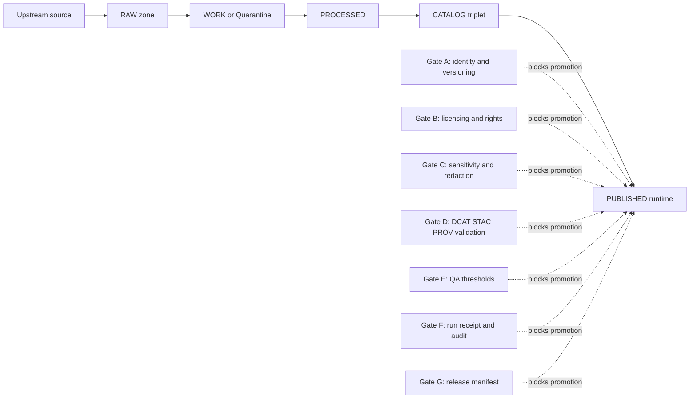
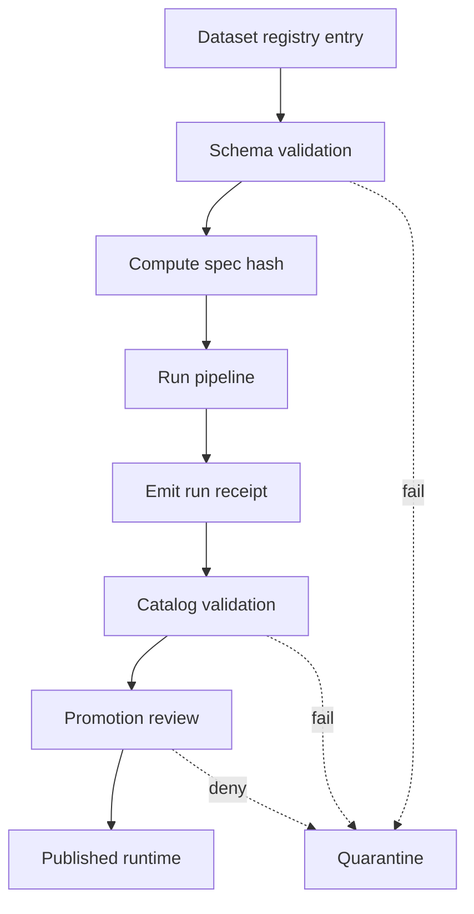
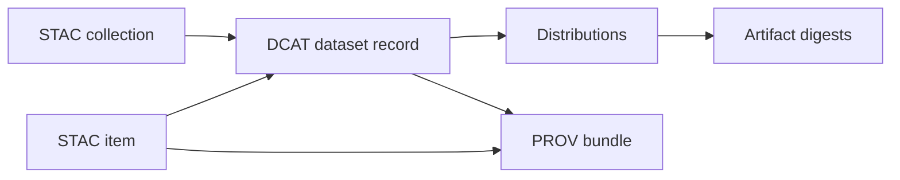

<!-- [KFM_META_BLOCK_V2]
doc_id: kfm://doc/7bcb2c2e-7f06-4a9f-9b57-1b1c6f2f79e4
title: Registry Checks Diagrams
type: standard
version: v1
status: draft
owners: TODO (set CODEOWNERS team)
created: 2026-03-01
updated: 2026-03-01
policy_label: public
related:
  - TODO: docs/governance/REVIEW_GATES.md
  - TODO: docs/standards/* (DCAT/STAC/PROV profiles)
  - TODO: data/registry/* (dataset registry entries + schemas)
tags: [kfm, diagrams, registry, checks, promotion-contract]
notes:
  - This README documents *diagram intent* and conventions. It does not assert current repo implementation details.
[/KFM_META_BLOCK_V2] -->

# Registry Checks Diagrams
Visual references for how **dataset registry entries** are validated and promoted through KFM’s **Promotion Contract** gates.

**Status:** draft • **Policy:** public • **Owners:** TODO


---

## Quick navigation
- [What lives here](#what-lives-here)
- [Why registry checks exist](#why-registry-checks-exist)
- [Diagram inventory](#diagram-inventory)
- [Promotion Contract gate matrix](#promotion-contract-gate-matrix)
- [CI checks to keep diagrams honest](#ci-checks-to-keep-diagrams-honest)
- [Diagram conventions](#diagram-conventions)
- [Definition of done for a registry-check change](#definition-of-done-for-a-registry-check-change)
- [Appendix: diagram templates](#appendix-diagram-templates)

---

## What lives here
This directory is for **diagrams that explain and standardize “registry checks”**—the validations and gates that prevent unreviewed or non-compliant datasets from reaching governed runtime surfaces.

### Acceptable contents
- Diagram *sources* (preferred):
  - Mermaid (`.mmd` / embedded ` ```mermaid ` blocks)
  - Draw.io (`.drawio`) **only if** an export is also checked in
- Diagram *exports* (recommended):
  - SVG (`.svg`) for crisp diffs
  - PNG (`.png`) only if necessary for compatibility
- Small supporting notes that help interpret the diagrams (keep them local to this folder)

### Exclusions
- No dataset payloads (RAW/WORK/PROCESSED artifacts do **not** belong in `docs/`)
- No secrets, credentials, tokens, or private endpoints
- No sensitive locations or vulnerable-site coordinates (if a diagram needs an example, use **coarse geography** or synthetic data)
- No “diagram-only truth”: if a diagram describes a check, it must be traceable to a spec/contract/policy/test elsewhere in the repo

---

## Why registry checks exist
Registry checks are the **front door** to KFM’s “truth path”:

- They define **what a dataset is** (stable identity, ownership/publisher, upstream origin, rights).
- They bind the dataset to a **spec** (so transforms and QA rules are deterministic).
- They drive **policy labeling** and **redaction obligations** (so the trust membrane can fail-closed).
- They block promotion unless minimum gates are satisfied.

> Principle: diagrams in this folder exist to make the gates understandable, reviewable, and testable—not to replace contracts.

---

## Diagram inventory
> Fill this in as diagrams land. Keep entries stable and add rows; don’t rewrite history.

| Diagram (source) | Export(s) | Scope | Gates touched | Last reviewed |
|---|---|---|---|---|
| TODO: `registry-checks__promotion-gates.mmd` | TODO: `registry-checks__promotion-gates.svg` | Overview of gates A–G | A, B, C, D, E, F, G | TODO |
| TODO: `registry-checks__registry-entry-lifecycle.mmd` | TODO: `registry-checks__registry-entry-lifecycle.svg` | Dataset entry → spec → receipts | A, B, C, F | TODO |
| TODO: `registry-checks__catalog-triplet-crosslinks.mmd` | TODO: `registry-checks__catalog-triplet-crosslinks.svg` | DCAT/STAC/PROV cross-link rules | D | TODO |

---

## Promotion Contract gate matrix
This table mirrors the **minimum gates** that must be met before promotion to governed runtime surfaces.

| Gate | Intent | What must exist (examples) | Typical “diagram focus” |
|---|---|---|---|
| **A** Identity & versioning | Deterministic dataset identity and drift detection | `dataset_id`, `dataset_version_id`, deterministic `spec_hash`, content digests | ID flow, hashing inputs, version bump rules |
| **B** Licensing & rights | Prevent unlicensed mirroring or unclear rights | License/rights fields + snapshot of upstream terms | Rights checkpoints, “metadata-only mode” branches |
| **C** Sensitivity & redaction | Default-deny when sensitive; enforce obligations | `policy_label` + documented obligations (generalize geometry, remove fields, etc.) | Redaction transforms and policy boundary |
| **D** Catalog triplet validation | Interop + provenance; cross-links must resolve | DCAT + STAC + PROV validate and cross-link; EvidenceRefs resolve deterministically | Cross-link graph + link-check rules |
| **E** QA & thresholds | Dataset-specific quality controls | QA report exists; thresholds met; else quarantine | QA decision nodes + quarantine loop |
| **F** Run receipt & audit | Every run is reproducible and reviewable | Run receipt capturing inputs, tooling, hashes, policy decisions; append-only audit record | Receipt lifecycle + “what changed and why” |
| **G** Release manifest | Promotion is recorded as a governed release | Release manifest referencing artifacts and digests | Promotion lane and approval path |

---

## CI checks to keep diagrams honest
Diagrams become dangerous when they drift from reality. When a diagram describes a check, we want a **corresponding enforceable gate**.

Recommended minimum CI assertions to keep parity:
- JSON schema validation for KFM profiles and registry shapes
- Link-checks for cross-links among DCAT/STAC/PROV artifacts
- Evidence resolver contract tests (public resolves; restricted denies without leakage)
- `spec_hash` stability tests and golden tests for canonicalization outputs

> If CI cannot enforce a diagrammed rule yet, mark the diagram section explicitly as **PROPOSED**.

---

## Diagram conventions

### Naming
Use a stable prefix and a short scope:
- `registry-checks__promotion-gates.*`
- `registry-checks__catalog-triplet-crosslinks.*`
- `registry-checks__receipts-and-audit.*`

### Preferred authoring format
- **Mermaid first** for diffability and inline review.
- If using Draw.io, you **MUST** check in an SVG export next to it.

### Mermaid style guide
- Keep node text short (avoid wrapping long prose into nodes)
- Prefer directional flow (`flowchart LR` or `flowchart TD`)
- Avoid embedding file paths that might change; reference concepts instead

---

## Core “mental model” diagram
This is the conceptual model these diagrams aim to explain:



---

## Definition of done for a registry-check change
When you change any registry-related rule (schema, gate logic, policies, receipt fields), complete this checklist in the same PR:

- [ ] Update or add a diagram in this folder reflecting the new rule
- [ ] Update the authoritative contract surface (schema/policy/spec/test) that makes the rule enforceable
- [ ] Add/adjust a test that fails closed when the rule is violated
- [ ] Confirm that sensitive-data obligations are still honored (default-deny; no leakage)
- [ ] Update the [Diagram inventory](#diagram-inventory) table row (last reviewed + scope)

---

## Appendix: diagram templates

<details>
<summary>Mermaid template: registry entry → promotion flow</summary>



</details>

<details>
<summary>Mermaid template: catalog cross-links</summary>



</details>

---

_Back to top_: [Quick navigation](#quick-navigation)
