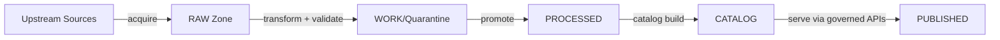
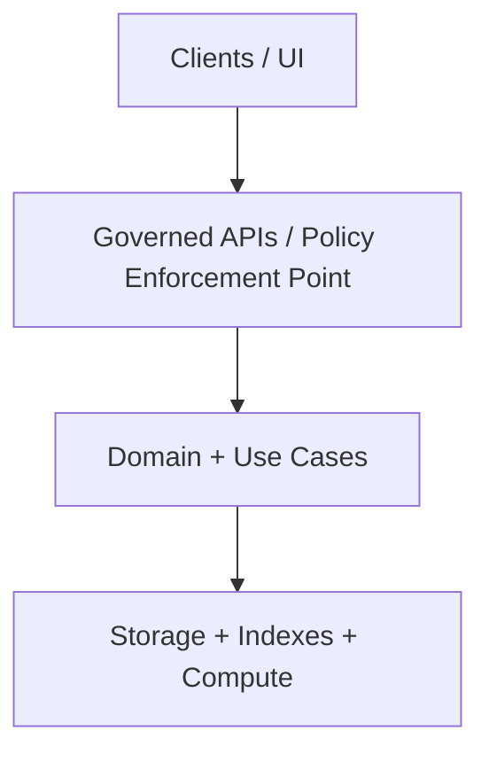

<!-- [KFM_META_BLOCK_V2]
doc_id: kfm://doc/b987adfe-9448-4279-af5d-5d386fc1c654
title: docs/diagrams/src — Diagram Sources
type: standard
version: v1
status: draft
owners: TODO
created: 2026-03-01
updated: 2026-03-01
policy_label: public
related:
  - ../README.md
  - ../../README.md
tags: [kfm, diagrams, documentation]
notes:
  - This README defines what *belongs* in docs/diagrams/src and how to keep diagrams governed + reproducible.
[/KFM_META_BLOCK_V2] -->

# docs/diagrams/src

> **Purpose:** Source-of-truth, *diff-friendly* diagram sources used across KFM documentation (architecture, data flow, UI, pipelines).


<!-- TODO(badges): Replace placeholders with real CI/status badges once repo paths are confirmed. -->

**Owners:** `TODO` • **Last updated:** 2026-03-01 • **Scope:** *diagram sources only*

---

## Quick navigation

- [What belongs here](#what-belongs-here)
- [What must not go here](#what-must-not-go-here)
- [Recommended layout](#recommended-layout)
- [Workflow](#workflow)
- [Conventions](#conventions)
- [Diagram Definition of Done](#diagram-definition-of-done)
- [Templates](#templates)
- [Appendix](#appendix)

---

## What belongs here

This directory contains **editable diagram source files** that are:

- **Text-first and reviewable** (preferred): Mermaid, PlantUML, Graphviz DOT, etc.
- **Rebuildable** (acceptable): Draw.io / diagrams.net source files *if* paired with deterministic exports.
- **Governance-aware**: diagrams that describe system behavior must not bypass the trust membrane in their architecture depiction.

> **NOTE**
> KFM is evidence-first and governed end-to-end; diagrams are part of the system’s documentation surface and should be treated as production artifacts. (See KFM governance guide.)

---

## What must not go here

**Do not** store the following in `docs/diagrams/src/`:

- Rendered outputs (**SVG/PNG/PDF**) that can be regenerated
- Huge binary assets that don’t diff well (unless there is no viable text alternative)
- Data files, datasets, or screenshots containing sensitive or restricted content
- One-off “scratch” diagrams that aren’t referenced anywhere

> **WARNING**
> If a diagram contains or implies sensitive locations or vulnerable sites, default to redaction/generalization and tag for governance review.

---

## Recommended layout

Actual repo structure is **not confirmed in this workspace**. The layout below is the **recommended** (and common) pattern:

```text
docs/diagrams/
  src/                       # (this directory) diagram sources
    README.md
    mermaid/                 # *.mmd, *.md (```mermaid)
    plantuml/                # *.puml
    graphviz/                # *.dot
    drawio/                  # *.drawio (source)
    assets/                  # small supporting assets (icons, legends) if needed
  out/                       # rendered exports (svg/png/pdf) (OPTIONAL, but recommended)
  index.md                   # diagram registry / catalog (OPTIONAL)
```

If your repo uses a different structure, **update this README** so the directory contract remains accurate.

---

## Workflow

### 1) Create or update a diagram source

1. Choose the **most diffable** format that works.
   - Prefer Mermaid / PlantUML for architecture, flows, sequences.
   - Use Draw.io only when the diagram cannot be expressed clearly as text.
2. Add a new file under the appropriate subfolder.
3. Keep the diagram **small and composable**.
   - Prefer multiple focused diagrams over one poster.

### 2) Render exports (if your docs embed images)

This repo’s diagram build tooling is **Unknown** here.

**Proposed** build options (pick one and standardize repo-wide):

```bash
# Option A (Mermaid CLI)
#   npm i -D @mermaid-js/mermaid-cli
mmdc -i docs/diagrams/src/mermaid/kfm-architecture.mmd \
     -o docs/diagrams/out/kfm-architecture.svg

# Option B (PlantUML)
#   requires plantuml + java
plantuml -tsvg docs/diagrams/src/plantuml/*.puml -o ../../out

# Option C (draw.io headless export)
#   requires draw.io / diagrams.net CLI
# drawio --export --format svg --output docs/diagrams/out docs/diagrams/src/drawio/*.drawio
```

> **TIP**
> If your docs renderer supports Mermaid inline (e.g., GitHub + some static site generators), you can often avoid committing exports entirely.

### 3) Link it from docs

- Prefer **relative links** from docs to diagrams.
- If embedding images, use `../out/<name>.svg` (if you maintain an `out/` folder).
- Keep diagram filenames stable; change content in-place.

### 4) Keep evidence + policy traceability

For diagrams that make system claims (architecture, data lifecycle, policy boundaries):

- Link to the relevant design/gov docs and ADRs.
- If a diagram is conceptual (not implemented), label it clearly in the diagram title or caption.

---

## Conventions

### Naming

| Thing | Convention | Example |
|---|---|---|
| File name | `kebab-case` | `truth-path-lifecycle.mmd` |
| Diagram scope | include scope prefix | `arch--trust-membrane.mmd` |
| Versions | avoid embedding versions in filenames (use git history) | ✅ `api-boundary.mmd` (not `api-boundary-v3.mmd`) |

### Content rules

- Avoid ambiguous arrows. Label edges with verbs.
- Avoid “magic happens here” boxes.
- Keep any node text free of the `|` character (helps Mermaid compatibility).
- When a diagram shows environments (dev/stage/prod), use consistent names across diagrams.

---

## Diagram Definition of Done

Before considering a diagram “done,” ensure:

- [ ] **Purpose** is stated (what question does it answer?)
- [ ] **Scope** is clear (what it does *not* cover)
- [ ] **Format** is as diffable as practical
- [ ] **Links** to related docs/ADRs are included (or noted as TODO)
- [ ] **Policy** concerns are addressed (redaction/generalization if needed)
- [ ] **Rebuildability**: exports (if committed) can be regenerated deterministically
- [ ] **Consistency**: naming conventions and notation match existing diagrams

---

## Templates

### Mermaid template: KFM flow (conceptual)



### Mermaid template: Layering and trust membrane (conceptual)



---

## Appendix

### FAQ

**Q: Should we commit rendered exports?**

- **Preferred:** Don’t commit exports if your docs pipeline renders from source.
- **Acceptable:** Commit exports if documentation targets require images (PDF builds, non-Mermaid renderers), *but keep them out of `src/`*.

**Q: Where do we register diagrams?**

- **Proposed:** Maintain `docs/diagrams/index.md` (or similar) as a catalog of key diagrams.

---

### Back to top

[↑ Back to top](#docsdiagramssrc)
