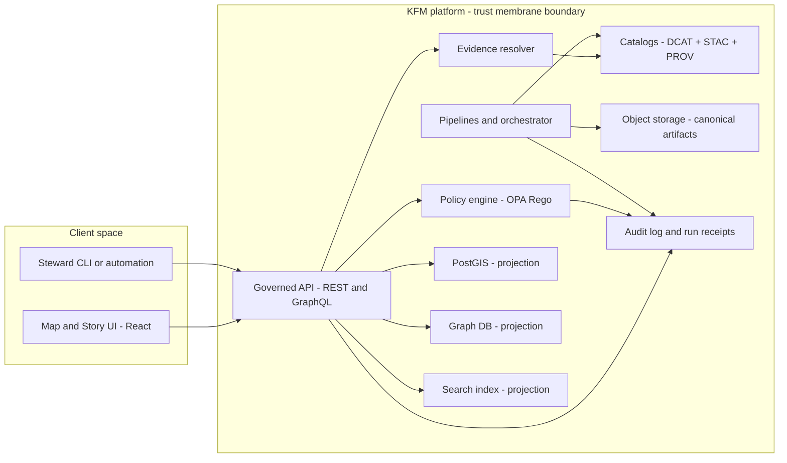

<!-- [KFM_META_BLOCK_V2]
doc_id: kfm://doc/35eb4a0c-18e5-45f2-9b1a-a88de266b9e5
title: C4 Container Diagrams
type: standard
version: v1
status: draft
owners: TBD (Architecture maintainers)
created: 2026-03-02
updated: 2026-03-02
policy_label: public
related:
  - docs/MASTER_GUIDE_v13.md
  - docs/architecture/KFM_REDESIGN_BLUEPRINT_v13.md
  - docs/governance/ROOT_GOVERNANCE.md
tags: [kfm, architecture, diagrams, c4]
notes:
  - Diagram sources live under docs/diagrams/src (render targets and build tooling may vary by repo).
  - Avoid secrets, hostnames, or sensitive infrastructure details in diagram source.
[/KFM_META_BLOCK_V2] -->

# C4 Container Diagrams
**One-line purpose:** Source-of-truth *C4 Level 2 (Container)* architecture diagrams for Kansas Frontier Matrix (KFM).


<!-- TODO: add repo CI badge(s) once workflow names/paths are confirmed -->

---

## Quick navigation
- [What this folder is](#what-this-folder-is)
- [How it fits in the repo](#how-it-fits-in-the-repo)
- [Directory contract](#directory-contract)
- [Diagram standards](#diagram-standards)
- [Baseline container inventory](#baseline-container-inventory)
- [Review gates](#review-gates)
- [Troubleshooting](#troubleshooting)
- [Appendix](#appendix)

---

## What this folder is
This directory holds the **editable sources** for KFM **C4 Container** diagrams (C4 Level 2).

Container diagrams are the place where we make the **trust membrane** and the **evidence-first contract** visible:
- clients/UI talk to **governed APIs**, not directly to databases/object storage
- policy checks and redaction/sanitization are explicit
- catalogs/provenance and evidence resolution are first-class runtime surfaces
- auditability is modeled as a primary concern (not an afterthought)

> NOTE  
> If you’re looking for “system context” (C4 Level 1) or “components within a container” (C4 Level 3), those belong in sibling C4 directories (if present).

[Back to top](#c4-container-diagrams)

---

## How it fits in the repo
This folder is under:

`docs/diagrams/src/architecture/c4/container/`

**Intended flow (typical):**
1) Edit diagram source files here (Mermaid / PlantUML / Structurizr DSL).
2) Render to an output location (often `docs/diagrams/dist/...` or `docs/architecture/diagrams/...`).
3) Reference rendered diagrams from architecture docs and runbooks.

> WARNING  
> Repo-specific rendering commands and output paths are **not confirmed** in this folder. If a diagram build pipeline exists, document it in this README under [Diagram standards](#diagram-standards) and keep it merge-blocking.

[Back to top](#c4-container-diagrams)

---

## Directory contract

### Acceptable inputs (what belongs here)
- **Diagram sources** (preferred, versionable):
  - `*.md` with ` ```mermaid ` blocks
  - `*.mmd` (Mermaid source)
  - `*.puml` (PlantUML)
  - `*.dsl` (Structurizr DSL)
- **Small helper assets** for diagrams (only if needed):
  - icons (SVG) that do not introduce license conflicts
  - diagram-specific README notes

### Exclusions (what must not go here)
- rendered “build artifacts” unless the repo standard explicitly says otherwise (PNG/SVG/PDF exports)
- credentials, tokens, internal hostnames, IPs, private URLs, or anything security-sensitive
- dataset-specific sensitive details (exact protected-site locations, restricted layer names, etc.)
- ad-hoc one-off diagrams that are not tied to an architectural decision (use ADRs or scratch space)

[Back to top](#c4-container-diagrams)

---

## Diagram standards

### 1) Preferred format: Mermaid-in-Markdown
When possible, prefer diagrams that render directly on GitHub using Mermaid:

- commit a `*.md` file that contains a ` ```mermaid ` block
- keep node labels short and readable
- avoid embedding secrets in diagrams

> TIP  
> If the repository uses a docs site that does *not* render Mermaid, store a rendered image in the repo’s approved output location and link it from the source file.

### 2) Required semantics for KFM container diagrams
A KFM container diagram must make these concepts visible:

- **Trust membrane boundary**
  - public/clients **must not** connect directly to databases or object storage
  - the diagram should visually show “outside” vs “inside” and what is governed

- **Catalog triplet as contract surfaces**
  - represent DCAT, STAC, and PROV as explicit runtime-readable artifacts/services

- **Policy enforcement & policy-safe behavior**
  - show the policy decision point(s) (e.g., OPA/Rego)
  - avoid “side doors” that bypass policy

- **Evidence resolution**
  - show the Evidence Resolver (or equivalent) and its link to catalog/provenance
  - show the Evidence Drawer surface in the UI (or the UX entry point)

- **Auditability**
  - governed operations emit audit references / run receipts
  - logs are treated as sensitive and redacted (model the boundary)

### 3) Naming conventions (proposed)
Use deterministic names so links remain stable:

- `kfm__c4__container__overview.md`
- `kfm__c4__container__deployment.md`
- `kfm__c4__container__focus_mode.md`

If you need variants, suffix them with a stable scope label:

- `...__public_only.md`
- `...__restricted_data_path.md`

[Back to top](#c4-container-diagrams)

---

## Baseline container inventory
This is a **proposed** baseline inventory to help keep diagrams consistent. Replace with the repo’s *actual* container list once confirmed.

| Container | Type | Primary responsibility | Trust membrane role | Evidence / provenance touchpoints |
|---|---|---|---|---|
| Map/Story UI (React) | Client | Map explorer, story viewing, evidence drawer entrypoints | Outside boundary | Requests EvidenceRefs; displays EvidenceBundles |
| Governed API (REST/GraphQL) | Service | Policy-aware access to catalogs, layers, stories, focus runs | Boundary gateway | Returns dataset_version_id, digests, policy labels, audit_ref |
| Policy Engine (OPA/Rego) | Sidecar/Lib | Allow/deny + obligations (redaction/generalization) | Boundary guard | Produces policy decisions used in audit + UX |
| Evidence Resolver | Service | Resolves EvidenceRefs into EvidenceBundles | Inside boundary | Reads DCAT/STAC/PROV; applies policy obligations |
| Catalog Store (DCAT/STAC/PROV) | Data | Canonical metadata + lineage | Inside boundary | Primary discovery & provenance interfaces |
| Object Storage (canonical artifacts) | Data | Immutable artifacts (by digest) | Inside boundary | Serves promoted artifacts through governed paths |
| PostGIS (projection) | DB | Spatial projection / query acceleration | Inside boundary | Rebuildable from artifacts + catalogs |
| Graph DB (projection) | DB | Entity relationships / traversal | Inside boundary | Rebuildable from artifacts + catalogs |
| Search index (projection) | Service | Text/semantic retrieval for Focus Mode and discovery | Inside boundary | Rebuildable; access policy-filtered |
| Pipeline/Orchestrator | Job/Service | Ingest → work → processed → catalog + receipts | Inside boundary | Emits PROV; produces catalogs; writes artifacts |
| Audit log / ledger | Data | Governed receipts, audit_ref resolution | Inside boundary | Sensitive; must be access-controlled |

[Back to top](#c4-container-diagrams)

---

## Example diagram (Mermaid)
Use this as a *starting point* (edit to match repo reality).



[Back to top](#c4-container-diagrams)

---

## Review gates
When you change container diagrams, your PR should satisfy:

### Merge-blocking checklist (diagram-level)
- [ ] Trust membrane is explicit and **no direct** client→DB or client→object-storage paths exist.
- [ ] Policy decision point(s) are modeled where sensitive data could flow.
- [ ] Evidence resolution is represented (EvidenceRef → EvidenceBundle) for map/story/focus entrypoints.
- [ ] Catalog triplet (DCAT/STAC/PROV) is present and shown as runtime-readable contract surfaces.
- [ ] Auditability is represented (audit_ref/run receipts) without leaking sensitive internals.
- [ ] Any new container has a **named contract surface** (API contract, schema, ADR, or policy rule reference).

### Minimum verification steps (repo reality check)
If this repo has a diagrams build pipeline, confirm and document:
- [ ] where sources live vs where rendered outputs live
- [ ] local command(s) to render diagrams
- [ ] CI check(s) that validate diagrams (lint, linkcheck, render step)
- [ ] how rendered diagrams are referenced from architecture docs

[Back to top](#c4-container-diagrams)

---

## Troubleshooting
**Mermaid doesn’t render on GitHub**
- Verify the code fence starts with ` ```mermaid `
- Reduce label complexity; Mermaid errors can be subtle
- If your docs site does not support Mermaid, export to the approved output folder and link it

**The diagram contradicts runtime behavior**
- Treat the diagram as a contract. Fix the implementation or update the diagram with an ADR and a rationale.
- If a new “side door” exists, it’s likely a trust membrane violation and should be reviewed as such.

---

## Appendix

<details>
<summary>Glossary (minimal)</summary>

- **C4 Container diagram:** C4 Level 2 view showing the deployable units (“containers”) and their interactions.
- **Trust membrane:** The governance/security boundary ensuring all access flows through governed APIs.
- **EvidenceRef / EvidenceBundle:** A reference scheme and its resolved evidence payload (policy-aware).

</details>

[Back to top](#c4-container-diagrams)
