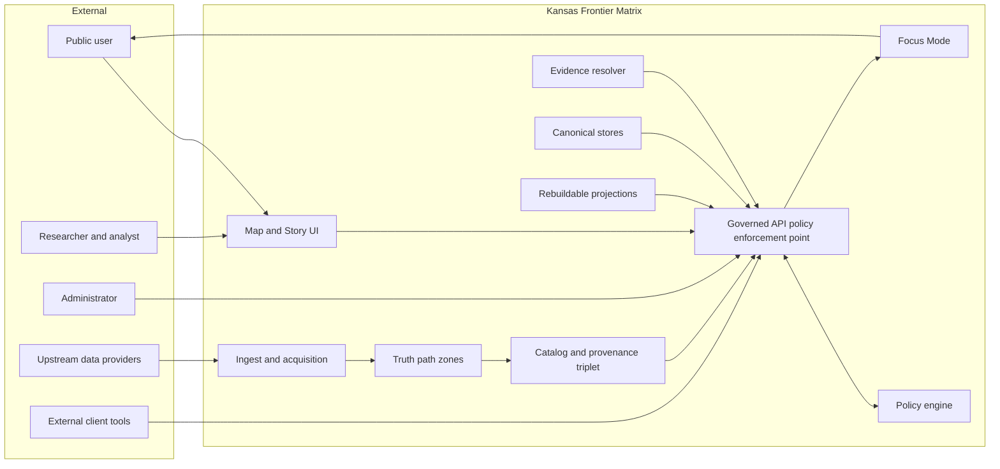

<!-- [KFM_META_BLOCK_V2]
doc_id: kfm://doc/e9e106d0-2382-4d06-b70c-8d075cd43d8b
title: C4 context diagrams for Kansas Frontier Matrix
type: standard
version: v1
status: draft
owners: KFM Architecture
created: 2026-03-02
updated: 2026-03-02
policy_label: public
related:
  - docs/diagrams/src/architecture/c4/context/
tags: [kfm, architecture, diagrams, c4]
notes:
  - System Context level only. Use this directory for the highest-level boundary and actor view of KFM.
[/KFM_META_BLOCK_V2] -->

<a id="top"></a>

# C4 context diagrams for Kansas Frontier Matrix

System Context diagrams for the Kansas Frontier Matrix (KFM). These diagrams define **who** interacts with KFM, **what** sits outside the system boundary, and the **policy and governance boundaries** that must not be bypassed.

**Status:** Draft  
**Owners:** KFM Architecture  


## Navigation

- [Purpose](#purpose)
- [Scope rules](#scope-rules)
- [Directory contract](#directory-contract)
- [Default context model](#default-context-model)
- [Build and render](#build-and-render)
- [Review and definition of done](#review-and-definition-of-done)
- [Change log](#change-log)

## Purpose

This directory is the source-of-truth for **C4 System Context** diagrams that explain KFM at a glance:

- Primary users and operators (citizens, researchers, admins)
- External data providers and upstream systems
- External client surfaces (OGC tools, partner apps)
- The KFM system boundary, including governance enforcement points
- Non-negotiable architecture invariants that must be visible at context level

[Back to top](#top)

## Scope rules

Context diagrams in this directory MUST:

- Treat **KFM** as a governed system spanning ingestion → catalog and provenance → governed APIs → UI surfaces.
- Make the **trust membrane** explicit: clients do not reach storage or databases directly.
- Reflect the **truth path** ordering at a high level (Upstream → RAW → WORK and Quarantine → PROCESSED → CATALOG and TRIPLET → PUBLISHED).
- Represent **policy enforcement** and **evidence resolution** as first-class context concepts.

Context diagrams in this directory MUST NOT:

- Contain production secrets such as tokens or internal hostnames.
- Encode environment-specific endpoints. Use generic labels.
- Expose sensitive or vulnerable site details. Use coarse geography or generalized references.
- Drift into container or component-level concerns.

> WARNING  
> If a diagram includes anything that would be unsafe to publish publicly, treat that diagram as restricted and relocate it to the appropriate governed location per project policy. Do not half redact inside a public doc.

[Back to top](#top)

## Directory contract

### Where this fits in the repo

This is a leaf directory for C4 Context sources:

- `docs/diagrams/src/` holds editable diagram sources.
- Generated outputs such as SVG and PNG should live in a separate generated location, not alongside sources.

> NOTE  
> The exact render pipeline varies by repo configuration. If your build outputs differ, update this README to match reality.

### Acceptable inputs

Any text-first diagram source that supports reviewable diffs, such as:

- Mermaid (`.mmd` or embedded Mermaid blocks in `.md`)
- PlantUML (`.puml`) using C4-PlantUML conventions
- Structurizr DSL (`.dsl`)
- Graphviz (`.dot`)

### Exclusions

Do not place the following here:

- Generated diagram artifacts unless the repo policy explicitly requires committed renders
- ADRs, design narratives, or long-form docs
- Private or restricted diagrams

### Expected layout

This is an example of what typically belongs under this directory. Adjust to match the actual files present:

```text
docs/diagrams/src/architecture/c4/context/
├── README.md
├── context.mmd
└── context.puml
```

[Back to top](#top)

## Default context model

Below is a reference context model that matches the platform invariants. Use it as a baseline and adapt for the specific deployment and product surfaces.



Text description of the diagram:

- Upstream providers feed ingestion and acquisition.
- Data moves through the truth path zones and produces catalogs and provenance.
- All client interactions flow through the governed API.
- Policy evaluation and evidence resolution are explicit dependencies for responses.
- Storage and indexes exist behind the trust membrane and are not accessed directly by the UI or external clients.

[Back to top](#top)

## Build and render

Because this repo may support multiple diagram toolchains, prefer a single canonical rendering path and keep it documented here.

### Recommended workflow

1. Edit the diagram source.
2. Render diagrams using the repository toolchain.
3. Validate links and ensure the diagram still reflects the invariants.
4. If rendered artifacts are committed in this repo, update them in the same change set.

### Commands

Replace the placeholders below with the real build commands used by the repo:

```bash
# TODO: replace with the repo's actual diagram build command(s)

# Example options:
# make diagrams
# npm run diagrams
# ./scripts/diagrams/build.sh
```

[Back to top](#top)

## Review and definition of done

A change to a context diagram is done when:

- [ ] The diagram still shows the trust membrane and truth path ordering at context level.
- [ ] No direct client-to-storage access is depicted.
- [ ] No secrets, internal hostnames, or sensitive site details were introduced.
- [ ] Any referenced sibling docs are linked correctly.
- [ ] If the repo requires rendered outputs, they were regenerated and committed.
- [ ] The PR description explains why the context changed and links to the motivating ADR or issue.

[Back to top](#top)

## Change log

- 2026-03-02: Initial scaffold of the C4 context README.
