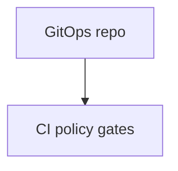
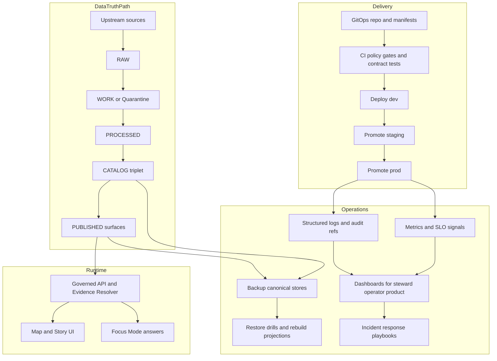

<!-- [KFM_META_BLOCK_V2]
doc_id: kfm://doc/1419c1dd-bd16-4ade-a905-d04cd2a27b31
title: Operations Diagrams (Source)
type: standard
version: v1
status: draft
owners: TODO
created: 2026-03-02
updated: 2026-03-02
policy_label: restricted
related:
  - docs/architecture/diagrams/
  - docs/governance/
  - docs/standards/
tags: [kfm, diagrams, operations, runbooks]
notes:
  - This directory holds diagram *sources* (text-first) for operational posture: deploy, observe, recover, respond.
  - Do not include secrets, internal endpoints, or sensitive topology details unless this repo is already restricted.
[/KFM_META_BLOCK_V2] -->

# Operations Diagrams (Source)
**Purpose:** Source-of-truth diagram definitions for operating KFM (deployment, monitoring/observability, backups & restores, and incident response).


---

## Quick navigation
- [What this folder is](#what-this-folder-is)
- [Where it fits](#where-it-fits)
- [What belongs here](#what-belongs-here)
- [What must NOT go here](#what-must-not-go-here)
- [Directory layout](#directory-layout)
- [Diagram registry](#diagram-registry)
- [Conventions](#conventions)
- [Reference diagram](#reference-diagram)
- [How to add or change an operations diagram](#how-to-add-or-change-an-operations-diagram)
- [Definition of done](#definition-of-done)

---

## What this folder is
This directory contains **diagram source files** that describe the operational “how” of KFM:

- **Deployment model** (environments, promotion, GitOps posture)
- **Observability** (logs/metrics/traces, dashboards for stewards/operators/product)
- **Backup & restore** (what is canonical, rebuild strategy, restore drills)
- **Incident response** (governance-flavored incident types + containment steps)
- **Operational boundaries** (trust membrane: policy boundary + evidence trail)

> NOTE  
> Some operational guidance in KFM is explicitly marked **PROPOSED**. Diagrams should clearly label whether they represent **Confirmed**, **Proposed**, or **Unknown / needs verification**.

[Back to top](#operations-diagrams-source)

---

## Where it fits
This folder is intended to be the **edit-friendly source layer** for operations diagrams.

| Path | Role |
|---|---|
| `docs/diagrams/src/operations/` | **You are here.** Editable diagram sources (Mermaid, PlantUML, etc.). |
| `docs/architecture/diagrams/` | Expected “published”/reader-facing diagrams location (verify in repo). |
| `docs/governance/` | Policies, review gates, incident definitions, publication rules. |
| `docs/standards/` | Diagram + doc standards (naming, review, safety). |

> WARNING  
> Do not assume specific repo subpackages or deployment stacks exist unless verified in the live repo. Treat diagrams as architecture intent unless proven otherwise.

[Back to top](#operations-diagrams-source)

---

## What belongs here
**Acceptable inputs (put these in this folder):**
- Text-first diagrams (preferred): `*.mmd` / Mermaid blocks, `*.puml`, `*.dot`, etc.
- “Operational flow” diagrams (runbooks, promotion flows, rollback decision trees)
- “Operational topology” diagrams at a safe abstraction level (systems + trust boundaries)
- Checklist diagrams (backup/restore steps, incident triage paths)

**Good diagram topics**
- `deployment__gitops_env_promotion`
- `observability__signals_dashboards`
- `backup_restore__canonical_stores_rebuild`
- `incident_response__governance_incidents`
- `promotion__truth_path_gates`

[Back to top](#operations-diagrams-source)

---

## What must NOT go here
**Exclusions (do not commit):**
- Secrets (tokens, keys, passwords), even if redacted
- Internal/private endpoints, IPs, firewall rules, or “how to break in” details
- Vendor account identifiers, subscription IDs, cluster join tokens
- Precise sensitive site locations (or any “targetable” sensitive operational details)
- Diagrams that bypass the trust membrane (clients must not directly access storage)

If a diagram truly needs sensitive detail, it should be:
1) **moved to a restricted location**, or  
2) **abstracted** to safe, policy-aligned boundaries.

[Back to top](#operations-diagrams-source)

---

## Directory layout
> This is a recommended structure. Actual files may differ.

```text
docs/diagrams/src/operations/
├── README.md
├── deployment/
│   ├── ops__deployment__gitops_model__v1.mmd
│   └── ops__deployment__service_topology__v1.mmd
├── observability/
│   ├── ops__observability__signals__v1.mmd
│   └── ops__observability__dashboards__v1.mmd
├── backup_restore/
│   └── ops__backup_restore__canonical_stores__v1.mmd
└── incident_response/
    └── ops__incident_response__governance_incidents__v1.mmd
```

[Back to top](#operations-diagrams-source)

---

## Diagram registry
Use this table to index **what exists** and how to render/locate it. (Fill in as diagrams are added.)

| Diagram | Scope | Source | Rendered output | Status |
|---|---|---|---|---|
| Deployment model | GitOps, env promotion | `deployment/...` | TODO | Proposed |
| Observability signals | logs/metrics/traces | `observability/...` | TODO | Proposed |
| Backup/restore plan | canonical stores + rebuild | `backup_restore/...` | TODO | Proposed |
| Incident response types | governance incident classes | `incident_response/...` | TODO | Proposed |

[Back to top](#operations-diagrams-source)

---

## Conventions

### Naming
Use stable, grep-friendly names:

`ops__<area>__<topic>__v<integer>.<ext>`

Examples:
- `ops__deployment__gitops_model__v1.mmd`
- `ops__incident_response__restricted_leakage__v1.mmd`

### Diagram header block
Every diagram source should start with a small metadata comment (format depends on tool). Example for Mermaid:



### Safety and governance rules (non-negotiable)
- **Default-deny** if a diagram might reveal sensitive operations.
- Prefer **trust-boundary diagrams** over “exact infrastructure diagrams”.
- If you need to show environments, keep it at: `dev`, `staging`, `prod` (no cluster IDs).
- Always show the **policy boundary** for runtime access (trust membrane).
- When showing data movement, label the **truth path zones** and the **promotion gates**.

[Back to top](#operations-diagrams-source)

---

## Reference diagram
This is a “big picture” operations sketch to keep terminology aligned. It is intentionally abstract.



[Back to top](#operations-diagrams-source)

---

## How to add or change an operations diagram
1) **Pick the operational question** you’re answering (deploy? observe? restore? respond?).  
2) **Decide the abstraction level**:
   - prefer boundaries + responsibilities
   - avoid vendor-locked wiring unless necessary and approved
3) **Create/update the diagram source** under the appropriate subfolder.
4) **Update the registry table** in this README.
5) **Run whatever diagram rendering/check pipeline exists in the repo** (if any). If none exists, ensure the diagram renders in GitHub’s Markdown viewer (Mermaid).
6) **Peer review** with:
   - an operator/SRE mindset reviewer
   - a governance/policy reviewer (if diagram touches sensitive flows)

---

## Definition of done
- [ ] Diagram answers a specific operational question
- [ ] Status is labeled (**confirmed / proposed / unknown**)
- [ ] No secrets, internal endpoints, or targetable topology details
- [ ] Trust boundary is explicit (policy enforcement on access)
- [ ] If data movement is shown: truth path zones + promotion gates are labeled
- [ ] README registry updated
- [ ] Reviewer sign-off recorded (PR)

[Back to top](#operations-diagrams-source)
