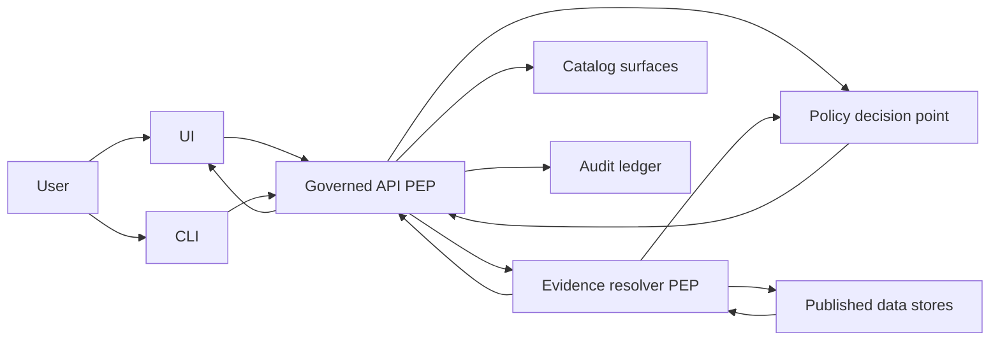
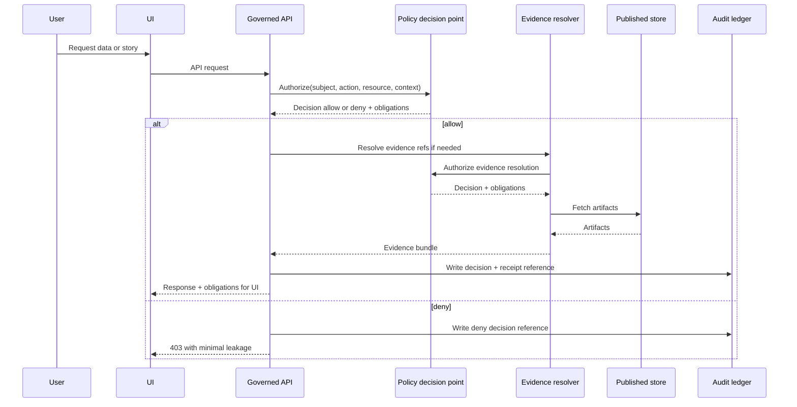

<!-- [KFM_META_BLOCK_V2]
doc_id: kfm://doc/3b1b6d6e-67a2-4ad0-a48d-1a9d9e0d6b4f
title: Access Management
type: standard
version: v1
status: draft
owners: KFM Platform Ops, Governance Stewards
created: 2026-03-02
updated: 2026-03-02
policy_label: restricted
related:
  - docs/diagrams/src/operations/README.md
  - docs/governance/ROOT_GOVERNANCE.md
  - docs/governance/REVIEW_GATES.md
tags: [kfm, operations, access-management, authn, authz, policy]
notes:
  - Default-deny posture; UI never makes policy decisions.
  - Some implementation details are intentionally TBD until identity provider and token strategy are chosen.
[/KFM_META_BLOCK_V2] -->

# Access Management

**Purpose:** Operational runbook + diagrams for controlling *who* can do *what* in KFM, and proving it via policy decisions, obligations, and audit trails.


<!-- TODO: add real CI badges once paths/status checks are confirmed in-repo -->

## Navigation

- [Scope](#scope)
- [Where this fits](#where-this-fits)
- [Operating invariants](#operating-invariants)
- [Architecture overview](#architecture-overview)
- [Roles and responsibilities](#roles-and-responsibilities)
- [Policy labels and obligations](#policy-labels-and-obligations)
- [Runbooks](#runbooks)
- [Controls and verification](#controls-and-verification)
- [Appendix](#appendix)

---

## Scope

This document covers **access management operations** for:

- **Human users** (Map Explorer, Story publishing, Focus Mode, admin consoles).
- **Service identities** (API, evidence resolver, catalog/indexers, pipeline runners).
- **Promotion and publishing gates** where “access” is enforced as policy-as-code.

Out of scope:

- Application feature UX details (covered elsewhere).
- Detailed infrastructure manifests and secret values (must not be stored in docs).
- Vendor-specific setup steps until the identity provider decision is recorded.

---

## Where this fits

**Path:** `docs/diagrams/src/operations/access-management/README.md`

This directory is for **operational diagrams and runbooks** that explain and enforce:

- Trust membrane access rules
- Authentication and authorization strategy
- Policy enforcement points across CI and runtime
- Audit and review workflows tied to promotion and publishing

### Acceptable inputs

- Mermaid diagrams (` ```mermaid `) describing auth flows, policy enforcement, and audit
- Checklists and runbooks for onboarding/offboarding/access review
- Links to governance docs and policy repositories
- RACI tables and minimal role matrices

### Exclusions

- Secrets, API keys, tokens, private endpoints
- Precise sensitive locations or restricted dataset details
- “Tribal knowledge” steps that cannot be verified or tested

---

## Operating invariants

These are the **non-negotiables** for KFM access management.

### Confirmed

- **Policy must match in CI and runtime** (same fixtures, same outcomes). CI guarantees are meaningless if runtime differs.
- **UI never makes policy decisions.** UI can show badges/notices but enforcement must be in governed services.
- **Default deny** for sensitive-location and restricted datasets unless policy explicitly allows access.
- **Redaction and generalization are first-class transforms** recorded in provenance; they are not “presentation-only.”

### Unknown and must be decided

- Which **OIDC identity provider** is used.
- Whether RBAC-only suffices or **ABAC** is required for partner datasets.
- Token/session lifetimes and rotation rules (human + service).

> NOTE  
> When unclear, KFM posture is **default-deny** and “ship a generalized public derivative” rather than exposing restricted precision.

---

## Architecture overview

### Policy-as-code placement

KFM access is enforced through policy-as-code with explicit **PEP** and **PDP** responsibilities.

- **PDP:** policy decision point (e.g., OPA) that evaluates `(subject, action, resource, context)` and returns:
  - allow/deny
  - policy label
  - obligations (redaction, notices, export rules)
- **PEP:** enforcement points that must call PDP and enforce the outcome:
  - CI gates (schema + policy fixture tests)
  - Runtime API (before data is served)
  - Evidence resolver (before citations resolve and bundles render)

### Trust membrane access flow



### Request and audit sequence



---

## Roles and responsibilities

### Baseline roles

The baseline roles below are a **starting point** intended to be minimal, testable, and evolvable.

- **Public user:** reads public layers/stories; Focus Mode limited to public evidence.
- **Contributor:** proposes datasets/stories; drafts content; cannot publish.
- **Reviewer or Steward:** approves promotions and story publishing; owns policy labels and redaction rules.
- **Operator:** runs pipelines and manages deployments; cannot override policy gates.
- **Governance council or community stewards:** authority over culturally sensitive materials and restricted collections.

### RACI starter

| Activity | Responsible | Accountable | Consulted | Informed |
|---|---|---|---|---|
| Dataset onboarding | Contributor + engineers | Steward | Governance council, legal | Operator |
| Dataset promotion | Operator + data engineer | Steward | Governance council, security | Contributor |
| Story publishing | Contributor | Steward | Governance council, legal | Public |
| Policy changes | Steward + policy engineer | Designated owner | Operators, contributors | Users |

> WARNING  
> “Operator cannot override policy gates” is intentional: operational power must not bypass governance.

---

## Policy labels and obligations

### Controlled vocabulary

Maintain a controlled vocabulary for `policy_label` (starter):

- `public`
- `public_generalized`
- `restricted`
- `restricted_sensitive_location`
- `internal`
- `embargoed`
- `quarantine`

### What obligations look like

Obligations are **machine-readable requirements** returned by policy and enforced by PEPs, for example:

- `show_notice`: UI must display a banner (“Geometry generalized due to policy.”)
- `redact_fields`: API must strip specific attributes from public exports
- `require_attribution`: exports must include license text and attribution
- `deny_precise_geometry`: tiles/exports must not reveal precise coordinates

---

## Runbooks

### 1. Human access request

**Goal:** grant the *minimum* access required, time-bound when appropriate, and auditable.

Checklist:

- [ ] Request includes: requester identity, purpose, resources/actions requested, time window, and evidence of approval path
- [ ] Steward confirms policy labels involved
- [ ] If sensitive-location or restricted: default deny unless an explicit policy exception exists
- [ ] If any public use is needed: route to `public_generalized` derivative instead of granting precision
- [ ] Record decision in audit ledger (who/what/why/when)

### 2. Service identity onboarding

Checklist:

- [ ] Service account is scoped to one workload and one environment
- [ ] Credentials stored in a secrets manager (not in repo)
- [ ] Rotation schedule defined and rotation events logged
- [ ] Policy fixtures include allow/deny test cases for this service identity
- [ ] Network access is least-privilege (namespace + egress restrictions)

### 3. Quarterly access review

Checklist:

- [ ] Export list of active roles/groups and last-used timestamps (if available)
- [ ] Review all `restricted*` access grants
- [ ] Remove unused access
- [ ] Verify “break-glass” was not used (or each use has ticket + postmortem)
- [ ] Publish a review receipt (restricted visibility)

### 4. Offboarding

Checklist:

- [ ] Remove group memberships and role grants
- [ ] Revoke sessions/tokens (if supported)
- [ ] Rotate shared secrets if the departing user had access
- [ ] Confirm access is removed from audit and policy test fixtures remain valid

### 5. Break-glass access

Rules:

- Must be time-bound and ticketed
- Must be logged
- Must trigger an after-action review
- Must never be used to “publish” or change policy labels

---

## Controls and verification

### CI controls

Minimum set:

- Schema validation for policy inputs/outputs
- Policy fixture tests that cover:
  - allow/deny for each role vs each policy label
  - obligations presence and enforcement expectations
- Contract tests for API auth surfaces and error models
- “No restricted leakage” tests for public tile/export outputs

### Runtime controls

Minimum set:

- Every governed API request passes a PEP check before serving
- Evidence resolution is policy checked before bundles are returned
- Errors do not leak restricted metadata (including differences between 403 and 404 that reveal existence)
- Audit ledger is append-only; audit access is restricted

### Minimum verification steps for maintainers

To convert Unknown → Confirmed:

1. Identify the configured **OIDC provider** and document it in an ADR.
2. Confirm where policy bundle lives and how it is tested in CI.
3. Confirm which services are PEPs (API, evidence resolver, tile server, export endpoints).
4. Confirm where audit receipts are stored and retention rules.

---

## Appendix

### Policy decision template

A policy decision should be representable as:

- **decision:** `allow` or `deny`
- **policy_label:** the resource label evaluated
- **obligations:** array of structured obligations that PEPs must enforce

### Example policy sketch

```rego
package kfm.authz

default allow = false

allow {
  input.user.role == "steward"
}

allow {
  input.user.role == "public"
  input.action == "read"
  input.resource.policy_label == "public"
}

obligations[o] {
  input.resource.policy_label == "public_generalized"
  o := {"type": "show_notice", "message": "Geometry generalized due to policy."}
}
```

---

## Change log

- **2026-03-02:** Initial draft created (this document).

---

### Back to top

- [Back to top](#access-management)
