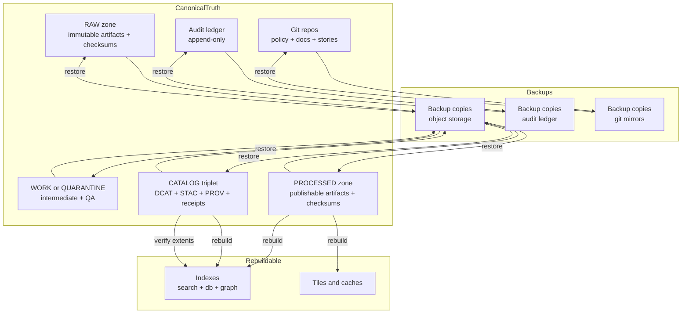

<!-- [KFM_META_BLOCK_V2]
doc_id: kfm://doc/6d6e2a9a-0ad4-4d4b-bc0b-8b9bbf5c3d9f
title: Backup and Recovery
type: standard
version: v1
status: draft
owners: KFM Ops
created: 2026-03-02
updated: 2026-03-02
policy_label: public
related:
  - docs/diagrams/src/operations/README.md
  - docs/operations/incident-response/README.md
  - infra/README.md
tags: [kfm, operations, backup, recovery, disaster-recovery, runbook, diagrams]
notes:
  - Keep this document provider-neutral. Do not add secrets, internal hostnames, or credential material.
  - Treat all “PROPOSED” defaults as placeholders until infra is verified in-repo and governance signs off.
[/KFM_META_BLOCK_V2] -->

# 🧰 Backup and Recovery
KFM operations diagrams + runbook stubs for restoring *canonical truth* safely and rebuilding projections fast.

 <!-- TODO: wire to repo release/badge -->
 <!-- TODO -->
 <!-- TODO -->

---

## Quick navigation
- [Purpose](#purpose)
- [Where this fits](#where-this-fits)
- [Key idea: canonical vs rebuildable](#key-idea-canonical-vs-rebuildable)
- [Backup scope](#backup-scope)
- [Restore plan](#restore-plan)
- [Validation checklist](#validation-checklist)
- [Restore drills](#restore-drills)
- [Security and safety rules](#security-and-safety-rules)
- [Directory contract](#directory-contract)
- [Appendix: diagrams](#appendix-diagrams)

---

## Purpose
This directory documents **how KFM backs up and restores** the system *without breaking the trust membrane* and *without losing the auditable truth path*.

It provides:
- Mermaid diagrams explaining the recovery flow
- Checklists for what MUST be backed up vs what can be rebuilt
- Runbook stubs for restore drills (tabletop → partial → full)

> [!WARNING]
> **Never store credentials, encryption keys, internal DNS names, or cloud account IDs in this directory.**
> Keep examples sanitized and provider-neutral.

---

## Where this fits
This folder lives under:

- `docs/diagrams/src/operations/backup-and-recovery/`

It should be referenced by higher-level ops docs (TODO: link once confirmed) and used as the *diagram source of truth* for backup/restore flows.

### Expected local tree (minimal)
> Update this as real diagram files land.

```text
docs/diagrams/src/operations/backup-and-recovery/
├── README.md                  # you are here
└── diagrams/                  # OPTIONAL (preferred once diagrams multiply)
    ├── backup-scope.mmd       # TODO
    └── restore-flow.mmd       # TODO
```

---

## Key idea: canonical vs rebuildable
KFM is safer to operate if we treat storage as two classes:

- **Canonical (must be backed up):** things that define “source truth” and evidence traceability
- **Rebuildable (can be regenerated):** projections and indexes derived from canonical truth

This shapes both:
- **Backup scope** (don’t waste recovery budget on things you can regenerate)
- **Restore order** (restore canonical → rebuild projections → verify evidence resolution)

---

## Backup scope

### Canonical stores to back up (CONFIRMED INTENT)
Back up these, at minimum:

- **Object storage** holding truth-path zones:
  - `RAW` (immutable acquisition + checksums)
  - `WORK/QUARANTINE` (intermediate QA/redaction candidates)
  - `PROCESSED` (publishable artifacts + checksums)
  - `CATALOG/TRIPLET` (DCAT + STAC + PROV + run receipts)
- **Audit ledger** / append-only audit trail
- **Policy repository state (git)** (policies are part of governance enforcement)
- **Story nodes and docs (git)** (published narratives are governed outputs)

### Rebuildable projections (recommended to rebuild)
Examples (provider/stack-dependent):
- Search indexes
- Graph projections
- Tile caches / vector tile builds
- Derived query accelerators / materializations

> [!NOTE]
> You *may* back up rebuildables for speed, but your recovery plan must not depend on them.
> Treat them as cache-like accelerants.

---

## Restore plan

### Restore order (CONFIRMED INTENT)
1. **Restore canonical stores**
2. **Run rebuild pipelines** to reconstruct projections
3. **Validate counts and extents against catalogs**
4. **Run smoke tests** (API + UI) and verify evidence resolution

### What “restore canonical” means in practice (PROPOSED)
Provider-neutral interpretation:
- Restore object store prefixes/buckets for RAW/WORK/PROCESSED/CATALOG
- Restore audit ledger records (or verify append-only log continuity)
- Restore git repos (policy + docs + story nodes) from your source-of-truth forge and/or mirrored backups

> [!TIP]
> Prefer restoring **immutable, content-addressed artifacts** first (RAW/PROCESSED/CATALOG), then deal with WORK/QUARANTINE.
> WORK is allowed to be messy; canonical truth is not.

---

## Validation checklist
Use this checklist to decide if a restore is *actually complete*.

### A. Integrity (MUST)
- [ ] Canonical artifacts exist where catalogs say they should
- [ ] Artifact checksums/digests match expected values
- [ ] Catalog triplet validates (DCAT/STAC/PROV)
- [ ] Evidence references resolve (no “guessing” paths)

### B. Governance & policy (MUST)
- [ ] Policy engine tests pass (default-deny still holds)
- [ ] Restricted/sensitive datasets remain restricted after restore
- [ ] No direct client access to storage/DB is introduced by “hotfix” wiring

### C. Runtime surfaces (SHOULD)
- [ ] Governed API smoke tests pass (core endpoints)
- [ ] UI smoke tests pass (Map + Story + Focus entry points)
- [ ] Observability is live (logs/metrics sufficient to detect regression)

---

## Restore drills
Restores that aren’t practiced are fiction.

### Drill types (PROPOSED)
- **Tabletop drill:** paper exercise + runbook gaps logged
- **Partial restore drill:** restore a single dataset version + rebuild its projections
- **Full environment drill:** restore canonical stores into an isolated environment, rebuild projections, run full validation

### Recording drill outcomes (CONFIRMED INTENT)
Every drill should produce a **run receipt / audit record** capturing:
- what was restored
- from where
- hashes/digests verified
- what was rebuilt
- test outcomes
- who approved promotion back to service

---

## Security and safety rules

### Hard rules
- **Backups must be protected like production** (access control, integrity checks, encryption).
- **Restore tooling must validate integrity** (don’t restore blindly).
- **Least privilege**: only a small, audited group can trigger restores of canonical stores.
- **Fail closed**: if you cannot verify integrity or policy, do not re-open runtime surfaces.

### Privacy / deletion obligations (PROPOSED WARNING)
If KFM has workflows that require deletion (legal, contractual, or governance), ensure the backup/restore system:
- doesn’t resurrect data assumed deleted
- supports scoped restores (not always “restore everything”)

> [!WARNING]
> If deletion obligations exist, involve governance owners before designing retention/restore defaults.

---

## Directory contract

### Acceptable inputs
This directory may contain:
- Mermaid diagrams (` ```mermaid `)
- Markdown runbooks and checklists
- Sanitized configuration *examples* (no secrets) that illustrate a concept
- Links (or TODO stubs) pointing to the actual infra implementation (once verified)

### Exclusions
Do **not** place here:
- secrets, tokens, kubeconfigs, database connection strings
- internal hostnames, private bucket names, account IDs
- any restricted coordinates or sensitive site location data
- provider-specific “copy/paste” restore commands unless scrubbed and approved

---

## Appendix: diagrams

### 1) Backup scope and recovery flow (conceptual)


### 2) Restore runbook skeleton (copy/paste)
> Replace placeholders after infra verification.

```text
RUNBOOK: Canonical Restore + Projection Rebuild

0. Preconditions
   - Incident declared and scoped
   - Restore operator assigned (on-call)
   - Governance approver assigned (policy + rights)

1. Restore canonical stores
   - Restore RAW/WORK/PROCESSED/CATALOG
   - Restore audit ledger
   - Restore policy + docs/story git state

2. Rebuild projections
   - Rebuild indexes
   - Rebuild tiles/caches

3. Validate
   - Validate catalogs (DCAT/STAC/PROV)
   - Verify artifact digests
   - Validate counts and extents

4. Smoke test
   - Governed API critical paths
   - UI entry points
   - Evidence resolution

5. Record receipt
   - Append drill/incident receipt to audit ledger
   - Attach test outputs

6. Return to service
   - Governance sign-off
   - Monitor for regression
```

---

<a id="top"></a>
**Back to top:** [Quick navigation](#quick-navigation)
