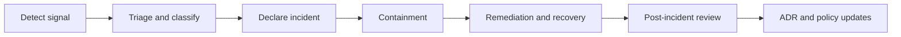

<!-- [KFM_META_BLOCK_V2]
doc_id: kfm://doc/8e1c478f-ffa3-4f98-89a7-9e85e8549c41
title: Incident Response Diagrams and Runbook
type: standard
version: v1
status: draft
owners: kfm-ops (TBD)
created: 2026-03-02
updated: 2026-03-02
policy_label: restricted
related:
  - kfm://doc/KFM-GDG-vNext@2026-02-20
tags: [kfm, operations, incident-response, governance, runbook, diagrams]
notes:
  - This directory contains *source* diagrams and compact runbook material for KFM incident response.
  - Do not store secrets or internal contact lists here (link to a secure system instead).
[/KFM_META_BLOCK_V2] -->

<a id="top"></a>

# 🧯 Incident Response (IR) — Diagrams + Governance Runbooks

**Purpose:** Maintain *governed*, repeatable incident response playbooks and diagrams for KFM, including **governance-specific incidents** (policy, rights/licensing, citations/catalog integrity, determinism).


<!-- TODO: Replace with repo CI badges once known -->

## Quick nav
- [Purpose](#purpose)
- [Where this fits](#where-this-fits)
- [Directory contract](#directory-contract)
- [Incident lifecycle](#incident-lifecycle)
- [Incident taxonomy](#incident-taxonomy)
- [Roles and comms](#roles-and-comms)
- [Playbooks](#playbooks)
- [Diagram registry](#diagram-registry)
- [Gates and definition of done](#gates-and-definition-of-done)
- [Appendix: templates](#appendix-templates)

---

## Purpose

KFM is an evidence-first, policy-governed system. That means “incidents” are not only uptime outages—they can also be **trust membrane breaches** (restricted leakage), **rights/licensing risks**, **citation/catalog corruption**, and **nondeterministic pipelines**.

This folder exists to keep **incident response operationally executable**:
- clear diagrams for how we respond,
- compact checklists for responders,
- governance-aligned remediation patterns (retraction + new versions),
- and post-incident improvement hooks (ADR + policy updates).

> WARNING  
> This repo path is **not** the place for secrets, production credentials, or private contact lists.  
> Store escalation rosters in an access-controlled system and link it here.

[Back to top](#top)

---

## Where this fits

This folder lives under `docs/diagrams/src/...` and is intended to serve:
- operators running deployments / pipelines,
- stewards handling policy and rights governance,
- reviewers who need to assess incident impacts on published artifacts,
- maintainers updating controls (policy packs, validators, link checkers).

**Related (conceptual) KFM operations controls:**
- Observability: structured logs (correlation ids, audit refs) and key latency/failure metrics
- Backups: canonical stores + restore drills with recorded run receipts
- Incident response: governance incident types and required per-type definitions

[Back to top](#top)

---

## Directory contract

### What belongs here (acceptable inputs)
**Source-of-truth diagram sources** and supporting runbook text. Recommended formats:
- Mermaid diagrams in Markdown (`README.md` sections or `*.mmd`)
- PlantUML (`*.puml`) if the repo supports it
- Draw.io (`*.drawio`) or Excalidraw (`*.excalidraw`) sources **only if** you can keep diffs reviewable
- Lightweight templates (`*.md`) for incident declaration, status updates, post-incident review

### What must NOT go here (exclusions)
- Secrets: tokens, keys, internal URLs with credentials, auth headers
- Private escalation rosters (names/emails/phones), unless already public and approved
- Restricted coordinates or identifiers for sensitive locations
- Raw logs containing sensitive data (store in secure logging system, reference by incident id + time window)

[Back to top](#top)

---

## Suggested directory shape (update to match reality)

```text
docs/diagrams/src/operations/incident-response/
├─ README.md
├─ ir-lifecycle.mmd                  # Mermaid source (optional)
├─ ir-governance-incident-types.mmd  # Mermaid source (optional)
├─ ir-evidence-and-audit-flow.mmd    # Mermaid source (optional)
└─ templates/
   ├─ incident-declaration.md
   ├─ status-update.md
   └─ post-incident-review.md
```

> NOTE  
> If your repo has a diagram build step (e.g., rendering Mermaid to SVG), document the exact command in this README once confirmed.

[Back to top](#top)

---

## Incident lifecycle



### Always-on principles
- **Fail closed when uncertain**: if scope/sensitivity is unclear, restrict access and escalate to steward review.
- **Protect the trust membrane**: keep clients behind governed APIs + policy enforcement.
- **Preserve evidence**: capture the minimum artifacts needed to reproduce and audit what happened.

[Back to top](#top)

---

## Incident taxonomy

### Governance incident types (minimum set)
KFM incidents include (at least):
1. **Restricted data leakage**
2. **Licensing violation risk** (e.g., unlicensed media published)
3. **Corrupted catalogs or broken citations**
4. **Pipeline producing non-deterministic outputs**

### Required per-incident-type definition
For each incident type, define (and keep current):
- detection signals
- escalation contacts (steward, operator, council)
- containment steps
- remediation steps (including **retraction and new versions**)
- post-incident review outputs (**ADR + policy updates**)

[Back to top](#top)

---

## Roles and comms

### Recommended roles (scale up/down as needed)
- **Incident Commander (IC):** owns tempo, decisions, status cadence, and exit criteria.
- **Operator Lead:** infra/pipeline controls; containment execution; restores/rebuilds.
- **Steward Lead:** policy/risk decisions; rights/licensing actions; review triggers; retraction approvals.
- **Comms Lead:** stakeholder updates; external messaging coordination (if applicable).
- **Scribe:** timeline, decisions, links to evidence and receipts.

### Channels and artifacts (TBD)
- Incident channel: `TBD`
- Status page / doc: `TBD`
- Ticket system: `TBD`
- Secure escalation roster: `TBD (link)`

> TIP  
> Put “how to reach people” in a secure system; put “how to run the process” in this repo.

[Back to top](#top)

---

## Playbooks

> NOTE  
> These playbooks are written to be **governance-first** and **tool-agnostic**.  
> Add tool-specific commands only when verified in your deployment environment.

### IR-01 — Restricted data leakage

**Definition:** Restricted content becomes accessible to an unauthorized actor or surface (UI, API, export, logs, cached tiles, published artifacts).

**Detection signals**
- Spike in policy denials / unusual access patterns
- Evidence resolver returns content that should be restricted
- Reports from partners/community about exposure
- Public artifact contains restricted coordinates/identifiers

**Escalation**
- Operator + Steward immediately
- Council escalation if scope includes partner-controlled datasets, Indigenous/community-restricted knowledge, or safety-sensitive sites

**Containment (fail closed)**
- Disable the affected surface(s) / endpoint(s) or tighten policy rules to block access
- Stop promotions/publishing for affected dataset(s) and dependent Story Nodes
- Preserve logs/audit refs (securely) and record the time window

**Remediation**
- Identify exact leaked artifact(s) and the policy decision path that allowed access
- Retract affected public artifacts where possible
- Publish corrected versions (new dataset versions / updated Story Nodes) with repaired policy labels/obligations
- Add/strengthen policy tests (fixtures) to prevent recurrence

**Post-incident**
- ADR documenting root cause and control changes
- Policy pack updates + tests
- Validate evidence resolution gates still fail closed for similar cases

---

### IR-02 — Licensing violation risk (unlicensed media published)

**Definition:** Content is published or distributed without rights clearance, missing attribution, or violating license terms.

**Detection signals**
- Missing/incorrect rights metadata
- Complaints/takedown notices from rights holders
- Steward review flags “rights unclear” content that already shipped

**Escalation**
- Steward immediately, Operator for takedown/retraction actions
- Legal/compliance consult if required by organizational policy (TBD)

**Containment**
- Stop publishing new Story Nodes using the asset class in question
- Restrict downloads/exports for affected distributions (if policy supports)
- Remove/replace assets from public surfaces if required

**Remediation**
- Correct rights metadata, attribution, or replace assets with permitted alternatives
- Publish new versions for affected artifacts and update dependent Story Nodes
- Encode rights obligations in policy (e.g., “no download”, watermark, thumbnail-only)

**Post-incident**
- Update rights clearance playbook references and stewards’ QA checklist
- Add checks in CI/publish gate for rights completeness

---

### IR-03 — Corrupted catalogs or broken citations

**Definition:** DCAT/STAC/PROV records drift, links break, EvidenceRefs don’t resolve, or the evidence resolver fails to bundle required metadata/digests.

**Detection signals**
- Link checker failures / schema validation failures
- Evidence resolver error rate rises
- Story publishing gate fails due to unresolved citations
- Focus Mode responses begin to abstain due to evidence resolution failures

**Escalation**
- Operator for system health; Steward if this blocks publishing or risks incorrect provenance

**Containment**
- Freeze promotion/publishing until catalogs and links validate
- If public surfaces show stale or inconsistent evidence, restrict to last known good versions

**Remediation**
- Rebuild projections (search/graph/tiles) if needed after restoring canonical stores
- Repair cross-links and re-run validators
- Re-issue catalogs with corrected digests/paths (new versions where required)

**Post-incident**
- ADR capturing cause (e.g., pipeline regression, manual edit, storage move)
- Add CI gates: schema validation + linkcheck blocks merges/promotions

---

### IR-04 — Pipeline producing non-deterministic outputs

**Definition:** Same spec/inputs produce different outputs across runs, breaking reproducibility, caching, and trust.

**Detection signals**
- Output digests drift unexpectedly between reruns
- Spec hash stable but artifact digests differ
- QA metrics fluctuate without upstream changes

**Escalation**
- Operator (pipeline), Steward if published versions are impacted

**Containment**
- Quarantine affected runs (do not promote)
- Freeze dependent releases until determinism is restored
- Preserve run receipts and environment fingerprints (container digests, git commit, parameters)

**Remediation**
- Identify nondeterministic sources (unordered operations, floating randomness, time-dependent steps)
- Pin dependencies and environment; enforce deterministic ordering
- Re-run pipelines and publish corrected versions once stable

**Post-incident**
- Add deterministic checks to CI (golden tests, spec-hash invariants, cross-OS stability checks where required)
- ADR documenting the determinism strategy

[Back to top](#top)

---

## Diagram registry

> Update this table when you add or rename diagram sources in this directory.

| Diagram | Source file | Purpose | Consumers | Status |
|---|---|---|---|---|
| IR lifecycle | `ir-lifecycle.mmd` | Shared incident response flow | Ops + Steward | TODO |
| Governance incident types | `ir-governance-incident-types.mmd` | Canonical KFM incident taxonomy | Ops + Council | TODO |
| Evidence and audit flow | `ir-evidence-and-audit-flow.mmd` | How evidence/receipts support IR | Focus/Story/Infra | TODO |

[Back to top](#top)

---

## Gates and definition of done

### For changes to incident response docs/diagrams
- [ ] Diagram source updated and renders on GitHub (Mermaid syntax valid)
- [ ] Any new incident type includes required definition fields (signals, escalation, containment, remediation, review)
- [ ] No secrets or restricted coordinates introduced
- [ ] Links are relative and stable (or clearly marked TODO)
- [ ] Post-incident improvements include ADR/policy test hooks (even if just stubs)

### For closing an incident (process DoD)
- [ ] Incident declared and severity/priority recorded (scale is project-defined)
- [ ] Containment completed (with timestamps)
- [ ] Remediation completed (including retractions/new versions where required)
- [ ] Stakeholders updated with final outcome
- [ ] Post-incident review scheduled/completed
- [ ] ADR and policy/test updates merged (or tracked with explicit owner + due date)

[Back to top](#top)

---

## Appendix: templates

<details>
<summary><strong>Incident declaration template</strong> (copy/paste)</summary>

```markdown
🚨 **Declaring Incident:** <short description>

- **IC:** <name>
- **Started:** <YYYY-MM-DD hh:mm TZ>
- **Type:** IR-0X (<restricted leakage | licensing | citations/catalog | nondeterminism | other>)
- **Severity:** <project scale>
- **Priority:** <project scale>
- **Scope:** <systems/datasets/story nodes>
- **User impact:** <what broke / what risk exists>
- **Next update:** <time>

**Immediate actions**
- [ ] Containment step 1
- [ ] Containment step 2

**Evidence pointers**
- Audit refs: <ids>
- Run receipts: <ids>
- Affected dataset versions: <ids>
```
</details>

<details>
<summary><strong>Status update template</strong> (cadence)</summary>

```markdown
🟡 **Incident Update:** <timestamp>

- **What we know:** ...
- **What we did:** ...
- **What we’re doing next:** ...
- **Risks/unknowns:** ...
- **Next update:** <time>
```
</details>

<details>
<summary><strong>Post-incident review template</strong></summary>

```markdown
# Post-Incident Review — <incident id / title>

## Summary
- What happened (facts only):
- Impact:
- Detection:
- Resolution:

## Timeline (UTC or explicit TZ)
| Time | Event |
|---|---|
| ... | ... |

## Root cause
- Primary cause:
- Contributing factors:

## What went well
- ...

## What went wrong
- ...

## Corrective actions (tracked)
| Action | Owner | Due | Link |
|---|---|---|---|
| ADR update | ... | ... | ... |
| Policy test fixtures | ... | ... | ... |
| Validator improvements | ... | ... | ... |

## Governance notes
- Any retractions/new versions issued:
- Any policy label changes:
- Any review triggers invoked:
```
</details>
