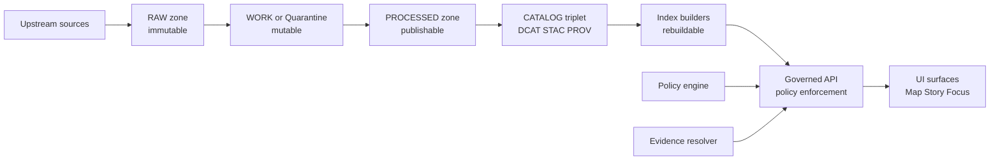
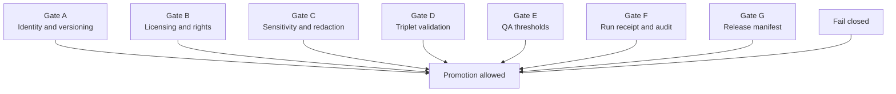

<!-- [KFM_META_BLOCK_V2]
doc_id: kfm://doc/6b3f6f2d-0c36-4c8e-9d3e-1dbb0e2a3d57
title: Pipeline Diagrams Source
type: standard
version: v1
status: draft
owners: KFM Engineering (TODO: confirm)
created: 2026-03-02
updated: 2026-03-02
policy_label: public
related:
  - docs/diagrams/README.md (TODO: confirm)
  - docs/architecture/diagrams/ (TODO: confirm)
  - docs/standards/ (TODO: confirm)
tags: [kfm, diagrams, pipelines]
notes:
  - This directory stores editable, text-first pipeline diagrams (Mermaid/PlantUML/etc.).
  - Compiled exports (SVG/PNG/PDF) should live outside src/ (see “Directory layout”).
[/KFM_META_BLOCK_V2] -->

# Pipeline Diagrams Source

Source-of-truth diagram **sources** for KFM pipelines: ingestion → lifecycle zones → catalogs/lineage → projections → governed API → UI.

> **Status:** Draft • **Trust posture:** evidence-first, policy-aware, cite-or-abstain


## Quick navigation

- [What belongs here](#what-belongs-here)
- [How this fits in KFM](#how-this-fits-in-kfm)
- [Directory layout](#directory-layout)
- [Diagram registry](#diagram-registry)
- [Conventions](#conventions)
- [Templates](#templates)
- [Rendering and exports](#rendering-and-exports)
- [Definition of done](#definition-of-done)
- [Minimum verification steps](#minimum-verification-steps)

---

## What belongs here

**This folder is for pipeline-diagram _sources_ that we want to review like code** (diffable, text-based where possible), covering:

- The **truth path** lifecycle transitions (Upstream → RAW → WORK/Quarantine → PROCESSED → CATALOG/Triplet → PUBLISHED).
- The **Promotion Contract** gates that must fail closed at each promotion boundary.
- The **trust membrane**: clients and UI do not access storage directly; all access crosses the governed API/policy boundary.
- Pipeline internals at the “right” abstraction level (connectors, normalizers, validators, catalog builders, index builders).

### What must *not* go here

- **Compiled exports** (SVG/PNG/PDF) unless this repo intentionally vendors exports in-tree.
- **Screenshots of diagrams** (unless the source format is irreducibly visual).
- **Secrets** (tokens, endpoints, internal hostnames) or sensitive operational topology.
- **Exact coordinates** / precise locations for vulnerable or restricted sites.

> ⚠️ If a diagram needs to mention sensitive infrastructure details, it must be generalized and labeled appropriately (policy default-deny).

[Back to top](#pipeline-diagrams-source)

---

## How this fits in KFM

KFM is a governed, evidence-first system. Pipelines are not just “ETL jobs”; they are **the enforcement path** for:

- **Identity and versioning** (deterministic dataset/version IDs, content digests)
- **Licensing and rights** (terms snapshotting, enforcement)
- **Sensitivity and redaction obligations**
- **Catalog triplet** generation (DCAT + STAC + PROV + run receipts)
- **Rebuildable projections** (indexes, tiles) derived from canonical stores

These diagrams support:

- Architecture docs and ADRs
- Onboarding and code review
- CI/promotion gate reviews
- Incident response and “what changed” diffs

[Back to top](#pipeline-diagrams-source)

---

## Directory layout

> This repo may choose a different layout; treat the following as **recommended** until verified.

```text
docs/diagrams/                                         # Diagram hub (sources + optional generated exports)
├─ src/                                                # Text-defined diagram sources (reviewed; diff-friendly)
│  └─ pipelines/                                       # Pipeline diagrams (truth path, promotion, trust membrane, templates)
│     ├─ README.md                                     # Pipeline diagrams index + naming/version rules + render instructions
│     ├─ pipe__truth-path__v1.md                       # Truth path diagram (Markdown w/ mermaid block; v1)
│     ├─ pipe__promotion-contract__v1.md               # Promotion contract gates diagram (Markdown w/ mermaid block; v1)
│     ├─ pipe__trust-membrane__v1.md                   # Trust membrane diagram (Markdown w/ mermaid block; v1)
│     └─ pipe__ingest__template__v1.md                 # Ingest pipeline template diagram (starter; copy/paste; v1)
│
└─ dist/                                               # OPTIONAL: generated exports (never hand-edit; commit policy applies)
   └─ pipelines/                                       # Rendered pipeline diagrams (SVG exports)
      ├─ pipe__truth-path__v1.svg                      # Rendered export for pipe__truth-path__v1 (generated)
      └─ pipe__promotion-contract__v1.svg              # Rendered export for pipe__promotion-contract__v1 (generated)
```

If your repo uses a single location for all diagram exports, update this README to point to it.

[Back to top](#pipeline-diagrams-source)

---

## Diagram registry

Maintain an index of pipeline diagrams so reviewers can quickly answer: “what is the diagram ID, where is the source, and what scope does it cover?”

| diagram_id | scope | source | owner | status |
|---|---|---|---|---|
| `pipe__truth-path__v1` | lifecycle zones | `pipe__truth-path__v1.md` | TODO | draft |
| `pipe__promotion-contract__v1` | promotion gates | `pipe__promotion-contract__v1.md` | TODO | draft |
| `pipe__trust-membrane__v1` | policy boundary | `pipe__trust-membrane__v1.md` | TODO | draft |

> TIP: treat `diagram_id` like a contract surface. If you rename it, update all inbound links.

[Back to top](#pipeline-diagrams-source)

---

## Conventions

### Naming

- **Prefix by domain:** `pipe__...` for pipelines.
- Use **kebab-case** and keep names short.
- Include a version suffix (`__v1`, `__v2`) when meaningfully changing semantics.

Examples:

- `pipe__truth-path__v1.md`
- `pipe__catalog-triplet__v1.md`
- `pipe__index-builders__v1.md`

### Diagram source format

Preferred (diff-friendly):

- `*.md` containing Mermaid blocks
- `*.mmd` Mermaid-only files
- `*.puml` PlantUML files

Allowed when necessary:

- `*.drawio` (ensure the file is reviewable; keep changes scoped)
- `*.excalidraw` (when a sketch is the right tool)

### Diagram metadata

For each diagram source file, include a short header (top of file) with:

- `diagram_id`
- `status` (draft/review/published)
- `owners`
- `updated` date
- `policy_label` (public/restricted/etc.)

You can use the same `KFM_META_BLOCK_V2` header as other docs.

### Time awareness

Pipelines are inherently timeful. When a diagram includes time concepts:

- Distinguish **event time** (when a thing happened) vs **transaction time** (when we ingested it).
- Show where time metadata is captured (acquisition manifest, receipts, catalogs).

### Governance posture

Diagrams in this folder should reinforce KFM invariants:

- **Truth path** is explicit.
- **Promotion gates** are explicit.
- **Trust membrane** is explicit.

[Back to top](#pipeline-diagrams-source)

---

## Templates

### Template: truth path and trust membrane using Mermaid

Copy this into a new file such as `pipe__truth-path__v1.md`.



### Template: Promotion Contract gates using Mermaid



> NOTE: The gates are shown as a “required set.” CI may evaluate them in any order.

[Back to top](#pipeline-diagrams-source)

---

## Rendering and exports

Because repos vary, this README intentionally does not assume a specific renderer.

### Option A Mermaid recommended

- If you render in CI, prefer **deterministic exports** (pin tool versions).
- Treat generated outputs as build artifacts unless you intentionally commit them.

Example (if you use `mmdc`):

```bash
# Render one diagram
mmdc -i docs/diagrams/src/pipelines/pipe__truth-path__v1.mmd \
     -o docs/diagrams/dist/pipelines/pipe__truth-path__v1.svg
```

### Option B: PlantUML

```bash
plantuml -tsvg docs/diagrams/src/pipelines/*.puml
```

### Option C: Draw.io

If you must use draw.io sources, keep them minimal and consider exporting SVGs for docs consumption.

[Back to top](#pipeline-diagrams-source)

---

## Definition of done

A pipeline diagram change is “done” when:

- [ ] Diagram sources are updated (and exports, if tracked).
- [ ] Diagram includes or references the truth path / promotion gates / trust membrane as appropriate.
- [ ] No sensitive details are leaked (hostnames, secrets, exact vulnerable locations).
- [ ] Naming follows the registry conventions.
- [ ] Registry table is updated (diagram_id, owner, status).
- [ ] Links to related docs are updated.

[Back to top](#pipeline-diagrams-source)

---

## Minimum verification steps

Because repo layouts evolve, confirm these items and update this README accordingly:

1. **Where diagram exports belong** (committed `dist/` vs CI artifacts).
2. **Which tool renders diagrams** (Mermaid CLI, PlantUML, draw.io export).
3. **Which CI gate enforces diagram validity** (linting, link checks, broken diagram detection).
4. **Where the authoritative definitions of truth path and promotion gates live** (docs/standards vs docs/architecture vs governance docs).

[Back to top](#pipeline-diagrams-source)
