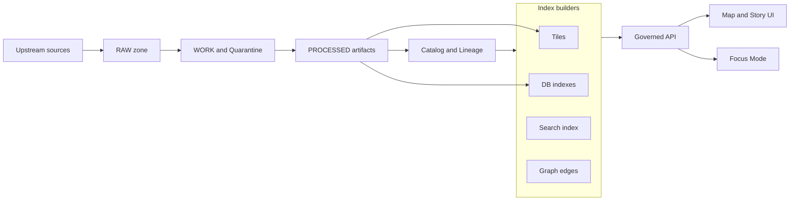

<!-- [KFM_META_BLOCK_V2]
doc_id: kfm://doc/5f0a2c06-2470-47a2-8da1-3e6a0b1e5c6a
title: Index and Tiles Pipeline Diagrams
type: standard
version: v1
status: draft
owners: TBD
created: 2026-03-02
updated: 2026-03-02
policy_label: public
related:
  - kfm://concept/truth-path
  - kfm://concept/trust-membrane
  - kfm://concept/rebuildable-projections
tags: [kfm, diagrams, pipelines, tiles, indexing]
notes:
  - Diagram sources for the rebuildable projections layer: spatial indexes + tile artifacts.
  - This folder is diagram-source only; it does not define runtime code or a production runbook.
[/KFM_META_BLOCK_V2] -->

# Index and Tiles Pipeline

Produce **rebuildable** map delivery artifacts (tiles) and query accelerators (indexes) from **promoted** data — without ever becoming a new “source of truth”.


---

## Quick navigation

- [Purpose](#purpose)
- [Where this fits](#where-this-fits)
- [What belongs here](#what-belongs-here)
- [Pipeline overview diagram](#pipeline-overview-diagram)
- [Inputs and outputs](#inputs-and-outputs)
- [Tile strategy](#tile-strategy)
- [Index strategy](#index-strategy)
- [Determinism and reproducibility](#determinism-and-reproducibility)
- [Policy and safety](#policy-and-safety)
- [Definition of done](#definition-of-done)
- [Appendix](#appendix)

---

## Purpose

This directory contains **diagram sources** describing the **Index and Tiles** portion of the KFM system:

- **Tiles**: artifacts optimized for map rendering (for example, a static PMTiles bundle).
- **Indexes**: rebuildable projections that accelerate queries (for example, spatial indexing in a geospatial database).

> **Core rule:** index and tile outputs are *projections* derived from promoted artifacts — they are safe to delete and regenerate.

[Back to top](#quick-navigation)

---

## Where this fits

The system’s “truth path” promotes data through zones, produces catalogs/lineage, and then builds projections (including indexes and tiles) used by runtime services.

- **Canonical truth** lives in promoted artifacts + catalogs/lineage.
- **Indexes and tiles** are **rebuildable projections** created *after* promotion and cataloging.

[Back to top](#quick-navigation)

---

## What belongs here

This folder is for **diagram source files** and lightweight registries used to keep those diagrams consistent.

### Acceptable inputs

- Diagram sources (preferred):
  - Mermaid (`.mmd`, `.md` with Mermaid blocks)
  - Draw.io source (`.drawio`) if your workflow requires it
- Small supporting text for diagrams:
  - Diagram registry tables
  - Assumption notes
  - Glossary for diagram terms

### Exclusions

- ❌ Generated renders (PNG/SVG/PDF) unless the repo explicitly stores rendered artifacts alongside sources
- ❌ Runtime code, production runbooks, or operational “how to deploy” instructions
- ❌ Dataset-specific secrets, credentials, or private endpoints

> NOTE: If you need a deployment/runbook, create a separate doc under an ops/runbooks area and link to it from here.

[Back to top](#quick-navigation)

---

## Directory tree

> This is a **proposed** minimal layout. Adjust to match the repo’s actual diagram build system.

```text
docs/diagrams/src/pipelines/index-and-tiles/
  README.md
  00_overview.mmd
  10_tiles_pmtiles_flow.mmd
  20_indexes_postgis_flow.mmd
  30_api_tiles_contract.mmd
  40_policy_cache_variants.mmd
```

[Back to top](#quick-navigation)

---

## Pipeline overview diagram



**Interpretation:** this directory documents the **IDX** box — particularly **Tiles** and **DB indexes** — and how those outputs are consumed *only through* the governed API boundary.

[Back to top](#quick-navigation)

---

## Inputs and outputs

### Inputs

| Input | Source | Minimum identifier |
|---|---|---|
| Promoted vector features | PROCESSED zone artifacts | `dataset_version_id` + artifact digest |
| Promoted raster assets | PROCESSED zone artifacts | `dataset_version_id` + artifact digest |
| Catalog and lineage metadata | DCAT + STAC + PROV | cross-linked IDs + run receipt refs |
| Policy context | policy engine fixtures + labels | `policy_label` + obligations |

### Outputs

| Output | Purpose | Rebuildable | Typical consumer |
|---|---|---:|---|
| PMTiles bundle or vector tile set | fast map rendering | ✅ | map client via governed API |
| Spatial DB structures | fast bbox and attribute query | ✅ | governed API query endpoints |
| Cache keys and manifests | correctness + perf | ✅ | API + edge caching layers |
| Verification artifacts | reproducibility | ✅ | CI and audit tooling |

[Back to top](#quick-navigation)

---

## Tile strategy

Two buildable approaches exist:

1. **Dynamic tile service** (database → tile server → MVT)
2. **Prebuilt PMTiles** served as static assets

**Recommended MVP default:** **prebuilt PMTiles for large layers**, plus a small “identify-on-click” feature query endpoint for inspection and evidence linking.

### Projection guidance

- Use **WGS84** (or project standard) for stored geometries and analysis artifacts.
- Use **Web Mercator** for tiled map delivery where appropriate.

[Back to top](#quick-navigation)

---

## Index strategy

Indexing is treated as a **projection build step**, not as “publishing new truth”.

Typical index targets:

- Spatial access paths (bbox queries, proximity)
- Attribute filters used by UI/Focus flows
- Time filtering for time-aware layers

### Key rule

If an index build is wrong, slow, or out-of-date, the system should be able to:

1. **delete** the projection
2. **rebuild** it from promoted artifacts + receipts
3. validate that the rebuilt projection matches expected digests and constraints

[Back to top](#quick-navigation)

---

## Determinism and reproducibility

This pipeline must be deterministic enough that:

- Identical inputs produce identical outputs **or**
- the run receipt captures *why* a difference exists (tool version changes, parameter changes)

Minimum deterministic posture:

- Inputs are content-addressed or pinned
- Ordering is stable
- Avoid clock-dependent outputs in file content
- Pay special attention to **stable floating point handling when generating tiles**

[Back to top](#quick-navigation)

---

## Policy and safety

### Trust membrane rule

Clients never access storage directly. All reads are mediated by the **Policy Enforcement Point** and (when needed) the evidence resolver.

### Tile and cache considerations

- Tile outputs must respect `policy_label` and obligations.
- Cache keys must vary by policy and authorization context (do not serve a restricted/generalized variant to the wrong audience).
- When obligations require generalization, prefer generating a **policy-safe derivative** as its own artifact with receipts, rather than “ad hoc redaction” in the client.

[Back to top](#quick-navigation)

---

## Definition of done

Use this checklist when adding or updating diagrams in this folder:

- [ ] MetaBlock present and updated date changed
- [ ] Diagrams reflect the truth path ordering: promotion → catalogs/lineage → projections
- [ ] Tile strategy is documented (and labeled if a decision is still open)
- [ ] Index strategy is documented as rebuildable, not canonical
- [ ] Determinism constraints are called out (including tile float stability)
- [ ] Policy boundary and cache variants are shown
- [ ] Diagram filenames are stable and referenced from this README
- [ ] Links to related architecture/policy docs are added where available

[Back to top](#quick-navigation)

---

## Appendix

### Glossary

- **Rebuildable projection**: a derived store that can be regenerated from canonical artifacts.
- **PMTiles**: a single-file tile archive suitable for strong caching and reproducible delivery.
- **Trust membrane**: the boundary preventing policy bypass; enforced by governed APIs + policy evaluation.
- **Promotion contract**: gates and receipts required before anything becomes publishable.

### Open questions

- What tile approach is used for the first production slice: PMTiles-only, dynamic service-only, or hybrid?
- Where do rendered diagram artifacts live, if they are stored in-repo?
- Which datasets are “large layers” that require PMTiles by default?
