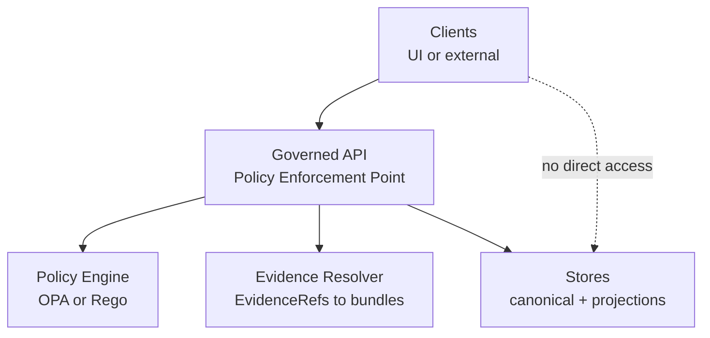
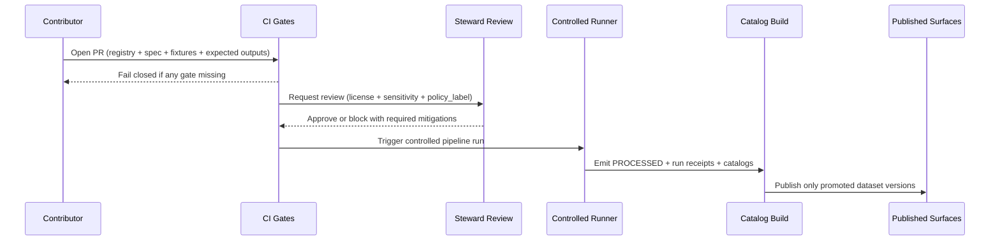

<!-- [KFM_META_BLOCK_V2]
doc_id: kfm://doc/7c4d6f5c-38db-4d5f-a2f5-6b9a3a0d1b8c
title: Ingest Pipeline Diagrams
type: standard
version: v1
status: draft
owners: KFM Maintainers (TODO: set CODEOWNERS-backed team)
created: 2026-03-02
updated: 2026-03-02
policy_label: restricted
related:
  - docs/diagrams/README.md (TODO: verify)
  - src/pipelines/ingest/ (TODO: verify)
  - packages/ingest/ (TODO: verify)
tags: [kfm, diagrams, pipelines, ingest, governance]
notes:
  - This folder documents the ingestion slice of the KFM truth path with diagram sources intended for PR review and onboarding.
  - Keep diagrams aligned with Promotion Contract gates and trust membrane invariants.
[/KFM_META_BLOCK_V2] -->

# Ingest Pipeline Diagrams
Diagram sources for the **ingestion** portion of the KFM truth path (Upstream → RAW → WORK/QUARANTINE → PROCESSED → CATALOG/TRIPLET → PUBLISHED), including the **Promotion Contract gates** and the **trust membrane** boundary.

> **Rule of thumb:** If a diagram implies *publishing* without gates, or *clients touching storage*, it’s wrong.

---

## Navigation
- [Purpose](#purpose)
- [Where this fits](#where-this-fits)
- [What lives here](#what-lives-here)
- [Diagrams](#diagrams)
  - [Truth path: ingest slice](#truth-path-ingest-slice)
  - [Trust membrane: policy boundary](#trust-membrane-policy-boundary)
  - [PR-based promotion workflow](#pr-based-promotion-workflow)
- [Promotion Contract gates](#promotion-contract-gates)
- [Conventions](#conventions)
- [Change checklist](#change-checklist)
- [Related docs](#related-docs)

---

## Purpose
This directory exists to make **ingestion** easy to review and hard to mis-implement:

- Provide a shared mental model for how data enters KFM.
- Make **gates** and **auditability** visually explicit (fail-closed posture).
- Support PR reviews: changes to ingest code/specs should update these diagrams.

---

## Where this fits
These are **docs/diagrams** artifacts that *describe* (and should mirror) the actual pipeline implementation.

- Pipeline code is expected elsewhere (e.g., `src/pipelines/` and/or a shared ingest module), while this folder holds the **diagram sources** that explain ingest architecture and governance boundaries.  
- Treat these diagrams as **governed documentation**: changes should be reviewable, reversible, and consistent with invariants.

---

## What lives here

### ✅ Acceptable inputs (belongs here)
- Mermaid diagrams that document:
  - connector → RAW acquisition → WORK/QUARANTINE transforms → PROCESSED outputs
  - catalog triplet generation (DCAT + STAC + PROV + run receipts)
  - Promotion Contract gates and “fail closed” paths
  - trust membrane boundaries (client/API/policy/evidence/stores)
- Small explanatory tables/checklists that make reviews easier.
- Links to ADRs/specs (when verified).

### ❌ Exclusions (must not go here)
- Secrets (API keys, tokens), internal endpoints, credentials, or private paths.
- Raw or processed datasets (even “small samples”) unless they are explicitly approved for inclusion elsewhere.
- Screenshots containing sensitive locations, private individuals, or restricted geometry.
- Implementation code (put code in pipeline modules; keep diagrams here).

---

## Diagrams

### Truth path: ingest slice

```mermaid
flowchart LR
  %% Ingest slice of the truth path (governed, auditable)
  A[Upstream sources] --> B[Connector fetch or snapshot]
  B --> C[RAW zone\nimmutable artifacts + checksums\nlicense or terms snapshot]
  C --> D[WORK or QUARANTINE\nnormalize + QA + redaction candidates]
  D --> E[PROCESSED zone\npublishable artifacts + checksums]
  E --> F[CATALOG or TRIPLET\nDCAT + STAC + PROV + run receipts\ncross-linked IDs]
  F --> G[PUBLISHED surfaces\nserved via governed API]

  %% Gates (conceptual)
  C -->|Promotion gates apply| D
  D -->|Promotion gates apply| E
  E -->|Triplet validates + links resolve| F
  F -->|Policy allowed| G
```

**Notes to reviewers**
- If licensing is unclear or validation fails, the dataset stays in **QUARANTINE** (do not “fix it in production”).
- “Promotion” is a governed event, not a file copy.

---

### Trust membrane: policy boundary

**What this diagram must communicate**
- Clients (including the UI) **never** access storage directly.
- All reads are policy evaluated at the API boundary, and evidence resolution is part of the governed surface.

---

### PR-based promotion workflow

---

## Promotion Contract gates
Promotion to **PUBLISHED** is blocked unless the minimum gates are met.

| Gate | Intent (what reviewers should look for) | Diagram implications |
|---|---|---|
| A — Identity & versioning | Stable `dataset_id`, immutable `dataset_version_id`, deterministic `spec_hash` | Show IDs flowing through catalogs and receipts |
| B — Licensing & rights | Explicit license, rights holder, attribution; unclear license → quarantine | Show “license snapshot” captured in RAW |
| C — Sensitivity & redaction | `policy_label` assigned; redaction/generalization plan recorded when needed | Show quarantine path + redaction transforms |
| D — Catalog triplet validation | DCAT/STAC/PROV validate and cross-link; EvidenceRefs resolve | Show triplet as a required surface before publish |
| E — Run receipt & checksums | Receipts enumerate inputs/outputs; checksums recorded | Show receipts emitted from runs and attached to versions |
| F — Policy/contract tests | Policy tests pass; evidence resolution works in CI; contracts validate | Show CI as a blocking gate, not advisory |

> If you can’t point to where a gate is enforced (CI and/or runtime), treat it as **not enforced**.

---

## Conventions

### Diagram style rules
- Prefer **Mermaid** (`flowchart`, `sequenceDiagram`) so GitHub renders it inline.
- Avoid leaking operational details:
  - No internal hostnames
  - No secret env var names
  - No private bucket names
- Keep node labels short and reviewable. Put long details in adjacent text.

### File naming (PROPOSED)
If you add separate diagram files (instead of embedding everything in README), use predictable names:
- `00_ingest_overview.mmd`
- `10_truth_path_ingest.mmd`
- `20_trust_membrane_ingest.mmd`
- `30_promotion_workflow_ingest.mmd`

---

## Change checklist
Use this when modifying ingest diagrams (or ingest code/specs that affect them):

- [ ] Diagram still shows **Truth path zones** (RAW, WORK/QUARANTINE, PROCESSED, CATALOG/TRIPLET, PUBLISHED).
- [ ] Diagram still shows **trust membrane** (no client → storage paths).
- [ ] Promotion Contract gates are still represented (at least implicitly).
- [ ] Quarantine path is explicit for: unclear license, failed validation, sensitivity concerns.
- [ ] Anything labeled “PUBLISHED” implies: catalogs validated + receipts present + policy label assigned.
- [ ] No secrets, private endpoints, or restricted coordinates are included.
- [ ] If architecture changed, link to an ADR or spec (TODO if not yet created).

---

## Related docs
- `docs/architecture/` (TODO: confirm exact path)
- `docs/quality/` (TODO: confirm exact path)
- Ingest module docs (e.g., `packages/ingest/README.md`) (TODO: confirm exact path)
- Catalog triplet docs (DCAT/STAC/PROV) (TODO: confirm exact path)

---

Glossary (quick)

- **RAW**: immutable acquisition artifacts + checksums + license/terms snapshot  
- **WORK/QUARANTINE**: intermediate transforms + QA + candidate redactions; quarantine blocks promotion  
- **PROCESSED**: publishable artifacts in approved formats + checksums  
- **CATALOG/TRIPLET**: cross-linked DCAT + STAC + PROV + run receipts  
- **PUBLISHED**: governed runtime surfaces served via the API boundary  
- **Run receipt**: audit record capturing inputs, outputs, parameters, tool versions/digests, and policy decisions  
- **Trust membrane**: rule that clients do not access storage directly; policy is enforced at the API boundary  

---

<a href="#ingest-pipeline-diagrams">Back to top</a>

