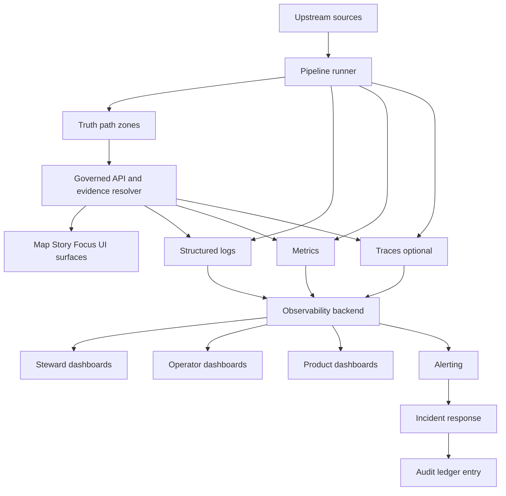

<!-- [KFM_META_BLOCK_V2]
doc_id: kfm://doc/7f61a7e4-efda-46a8-9f06-b1b6cb3a8f2f
title: Pipeline Monitoring
type: standard
version: v1
status: draft
owners: KFM Platform Ops (TODO)
created: 2026-03-02
updated: 2026-03-02
policy_label: public
related:
  - kfm://doc/kfm-ultimate-blueprint-2026-02-20
  - kfm://doc/tooling-kfm-pipeline-2026-02-27
tags:
  - kfm
  - pipelines
  - monitoring
  - observability
notes:
  - Monitoring diagrams, conventions, and runbook pointers for truth-path pipelines and governed runtime surfaces.
[/KFM_META_BLOCK_V2] -->

# Pipeline Monitoring
Evidence-first monitoring for KFM truth-path pipelines (RAW → WORK/QUARANTINE → PROCESSED → CATALOG/TRIPLET → PUBLISHED) and the governed runtime surfaces.


**Purpose:** Provide a single, governed place to document *what* we monitor, *why*, and *how* it ties back to the Promotion Contract gates, run receipts, and the trust membrane.

---

## Quick navigation
- [Scope](#scope)
- [What belongs here](#what-belongs-here)
- [What must not go here](#what-must-not-go-here)
- [Monitoring architecture](#monitoring-architecture)
- [Required signals](#required-signals)
- [Dashboards](#dashboards)
- [Alerting](#alerting)
- [Runbooks](#runbooks)
- [Promotion Contract gate-to-signal map](#promotion-contract-gate-to-signal-map)
- [Directory layout](#directory-layout)
- [Appendix: templates](#appendix-templates)

---

## Scope

This folder is for **monitoring/observability documentation + diagrams** that support KFM’s governed pipeline posture:

- **Truth path is real** (zones + gates), not a metaphor.
- **Receipts are first-class artifacts** (every run emits a run receipt / audit record).
- **Trust membrane is enforced** (clients do not bypass governed APIs; audit logs are redacted and access-controlled).

> NOTE  
> This directory intentionally focuses on *monitoring the system we actually operate*, not general “how observability works” guidance.

---

## What belongs here

Acceptable inputs include:

- Diagrams (Mermaid preferred) documenting:
  - pipeline run lifecycle observability
  - Promotion Contract gates → checks → alerts
  - evidence resolver / citation resolution monitoring
- SLO/SLA definitions for pipeline + runtime surfaces (proposed; keep them measurable)
- Dashboard inventory (names, audiences, required panels)
- Alert policy (what pages humans vs. what opens tickets)
- Runbook index (links to runbooks elsewhere, or lightweight runbooks here if needed)

---

## What must not go here

🚫 Do **not** commit:

- Secrets, tokens, kubeconfigs, service-account keys
- Raw logs containing PII or sensitive coordinates
- Anything that would allow inference of restricted dataset existence (e.g., “restricted dataset X failed gate Y”) outside restricted ops channels
- Direct links that bypass the trust membrane (e.g., “query S3 directly” instructions)

> WARNING  
> Monitoring data can be sensitive. Treat telemetry as a governed artifact: redact, minimize, and restrict access where required.

---

## Monitoring architecture

This diagram is the conceptual “signal flow” we want to preserve (implementation choices may vary by environment).



---

## Required signals

Minimum observability should make the *truth path + governance* debuggable.

### Logs
**Requirement:** structured logs with **correlation IDs** and an **audit_ref** (or equivalent) so we can join events to receipts and audit entries.

Recommended minimum log fields (align to receipts and evidence bundles):

| Field | Why it matters |
|---|---|
| `correlation_id` | trace a request/run end-to-end across services |
| `run_id` | join runtime telemetry to run receipts |
| `dataset_slug` / `dataset_version_id` | tie failures to a specific promoted (or blocked) version |
| `spec_hash` | detect drift / non-determinism |
| `policy_label` / `decision_id` | explain allow/deny and obligations |
| `audit_ref` | durable pointer to audit ledger record |
| `gate` | Promotion Contract gate name when relevant |
| `zone` | raw/work/processed/catalog/published |

### Metrics
**Requirement (minimum):**
- request latency (P95) per endpoint
- evidence resolver latency
- tile response latency
- pipeline run durations and failures
- traces are optional early

> TIP  
> Emit metrics at the same boundary points you emit receipts: “run started”, “validated”, “catalog built”, “promotion manifest written”, “published”.

#### Proposed metric naming (adapt to your metrics stack)
- `kfm_pipeline_run_duration_seconds{dataset_slug, operation, status}`
- `kfm_pipeline_gate_fail_total{gate, dataset_slug}`
- `kfm_evidence_resolve_duration_seconds{status}`
- `kfm_api_request_duration_seconds{route, method, status}`
- `kfm_citation_unresolvable_total{surface}`

### Traces (optional early)
If enabled, traces should propagate the same `correlation_id` and must not leak restricted payloads.

---

## Dashboards

Dashboards should support **three distinct audiences**:

1. **Steward view**  
   - policy denials
   - rights issues
   - quarantines

2. **Operator view**  
   - pipeline health (runs, failures, durations)
   - storage usage
   - deployment status

3. **Product view**  
   - UI performance
   - accessibility regression indicators

> NOTE  
> “Steward dashboard” is not optional. If policy is enforced but invisible, teams will “debug by bypass,” which violates the trust membrane.

---

## Alerting

Alerting should separate:
- **Hard governance failures** (fail-closed conditions that should block promotion immediately)
- **Degradation** (SLO burn, latency, slow pipelines)
- **Trust risks** (potential leakage, broken citations, corrupted catalogs)

### Suggested alert classes (starter)
- **Gate failure spike**: `kfm_pipeline_gate_fail_total` rising unexpectedly
- **Quarantine backlog**: WORK/QUARANTINE growing without resolution
- **Broken cross-links**: catalog linkcheck failures (EvidenceRefs not resolving)
- **Evidence resolver degradation**: p95 latency above SLO
- **Policy anomaly**: sudden change in deny-rate by endpoint/role
- **Non-determinism**: spec_hash mismatch or digest drift detected in CI

---

## Runbooks

This directory may include short runbooks, but it should always link to the canonical ops runbooks if they exist elsewhere.

Starter runbook index (create these as needed):
- **RB-01** Gate failures (identify which gate, which dataset_version_id, what artifact missing)
- **RB-02** Catalog triplet validation failures (DCAT/STAC/PROV + cross-links)
- **RB-03** Evidence resolver failures (unresolvable refs vs unauthorized vs malformed)
- **RB-04** Suspected restricted data leakage (containment + audit + rollback)
- **RB-05** Non-deterministic pipeline outputs (spec_hash / digest drift)

---

## Promotion Contract gate-to-signal map

This table is meant to keep monitoring tightly coupled to governance gates.

| Gate | Fail-closed condition | What to log | What to measure | Alert? |
|---|---|---|---|---|
| A Identity & versioning | missing/unstable IDs or spec_hash | dataset_version_id, spec_hash | drift checks failing | yes (block) |
| B Licensing & rights | missing rights metadata / terms snapshot | license status, reason | count missing rights | yes (block) |
| C Sensitivity & redaction | missing label/obligations not applied | policy_label, decision_id | deny-rate, obligation failures | yes (block) |
| D Catalog triplet validation | DCAT/STAC/PROV invalid or not cross-linked | which validator failed | validator failure rate | yes (block) |
| E QA thresholds | QA report missing or thresholds not met | QA report digest | QA pass rate | yes (block) |
| F Run receipt & audit | receipt missing or audit append missing | run_id, audit_ref | missing receipt count | yes (block) |
| G Release manifest | manifest missing or mismatched digests | manifest digest | mismatch count | yes (block) |

> WARNING  
> Do not alert with messages that disclose restricted dataset existence to unauthorized channels. Alerts must be policy-safe.

---

## Directory layout

**Proposed** local layout (adjust to match repo reality):

```text
docs/diagrams/src/pipelines/monitoring/                        # Pipeline monitoring diagrams + dashboards inventory + linked runbooks
├─ README.md                                                   # Index + scope (monitoring) + naming rules + where dashboards/runbooks live
├─ diagrams/                                                   # Mermaid sources for monitoring concepts
│  ├─ monitoring-signal-flow.mmd                               # Signals flow (pipeline → logs/metrics/traces → alerts → runbooks)
│  └─ promotion-gates-observability.mmd                        # Gate checkpoints ↔ observability signals ↔ receipts/audit correlation
├─ dashboards/                                                 # Dashboard inventory/docs (or exported definitions if policy allows)
│  ├─ steward/                                                 # Steward dashboards (promotion status, QA trends, approval queues)
│  ├─ operator/                                                # Operator dashboards (SLOs, error rates, queue depth, infra health)
│  └─ product/                                                 # Product dashboards (usage, engagement; policy-safe metrics only)
└─ runbooks/                                                   # Runbooks referenced by monitoring alerts (fast “what to do next”)
   ├─ RB-01-gate-failures.md                                   # Gate failure triage + remediation checklist
   ├─ RB-02-catalog-validation.md                              # Catalog validation failure triage (DCAT/STAC/PROV + linkcheck)
   └─ RB-04-leakage-response.md                                # Leakage response (containment, redaction, audit, notification)
```

---

## Appendix: templates

### Template: policy-safe alert payload (example)
```json
{
  "alert_type": "promotion_gate_failure",
  "severity": "high",
  "correlation_id": "corr-...",
  "run_id": "kfm://run/....",
  "gate": "D",
  "dataset_version_id": "2026-02.abcd1234",
  "policy_safe_summary": "Catalog validation failed; promotion blocked.",
  "audit_ref": "kfm://audit/entry/123"
}
```

### Template: dashboard panel checklist
- [ ] Shows **counts and rates** (not just raw numbers)
- [ ] Breaks down by `dataset_slug` and `dataset_version_id`
- [ ] Links to receipts/audit references (policy-safe)
- [ ] Redacts restricted fields
- [ ] Has an owner + escalation path

---

<a id="top"></a>
**Back to top:** [Quick navigation](#quick-navigation)
