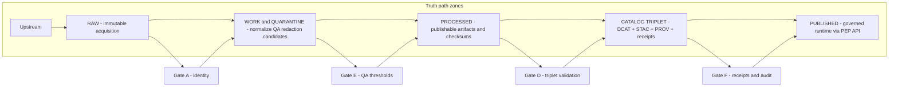
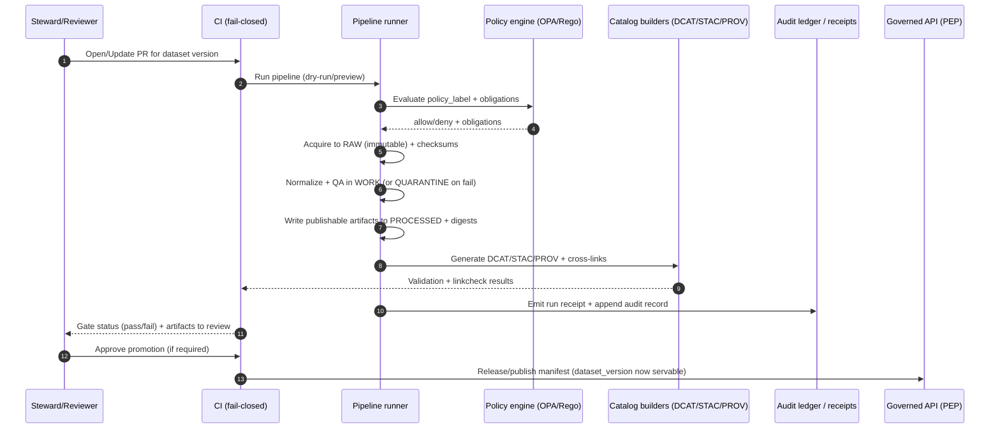

<!-- [KFM_META_BLOCK_V2]
doc_id: kfm://doc/04109221-9072-4860-849e-5a251de40388
title: Promotion Pipeline Diagrams
type: standard
version: v1
status: draft
owners: TODO
created: 2026-03-02
updated: 2026-03-02
policy_label: public
related:
  - "TODO: add docs/diagrams index link"
  - "TODO: add docs/diagrams/src/pipelines index link"
  - "TODO: add truth-path overview link"
tags: [kfm, pipelines, promotion, governance, diagrams]
notes:
  - Source diagrams for the Promotion Contract and dataset version promotion workflow.
  - Keep this directory free of secrets and dataset-specific sensitive coordinates.
[/KFM_META_BLOCK_V2] -->

# Promotion pipeline diagrams (promote/)


**Purpose:** maintain the _source_ diagrams that document how KFM promotes a dataset version through the truth path (Upstream → RAW → WORK/QUARANTINE → PROCESSED → CATALOG/TRIPLET → PUBLISHED) under the **Promotion Contract**.

> [!WARNING]
> **Trust membrane reminder:** diagrams in this folder should reinforce (not contradict) the rule that clients never access storage directly; all access is governed and policy-evaluated at the PEP/API boundary.

---

## Navigation

- [What belongs here](#what-belongs-here)
- [Truth path and promotion at a glance](#truth-path-and-promotion-at-a-glance)
- [Promotion Contract gates](#promotion-contract-gates)
- [Diagrams in this folder](#diagrams-in-this-folder)
- [How to update a diagram](#how-to-update-a-diagram)
- [Definition of Done for diagram changes](#definition-of-done-for-diagram-changes)
- [Minimum verification steps](#minimum-verification-steps)
- [References](#references)

---

## What belongs here

### Where this fits in the repo

This folder is part of `docs/diagrams/src/…` and is intended to hold **diagram sources** for documentation builds and GitHub rendering. It should be “safe to publish” (no secrets, no restricted data).

### Acceptable inputs

- Mermaid diagrams (`*.mmd` or fenced ` ```mermaid ` blocks inside `README.md`)
- Rendered exports (`*.svg`, `*.png`) **only if** a companion editable source exists
- Small supporting assets (icons, legend images) that are license-safe and do not embed sensitive info
- Short notes that help reviewers understand _why_ a diagram changed (not implementation details)

### Exclusions

- ❌ Runtime configuration (env vars, secrets, credentials)
- ❌ Dataset-specific raw/processed artifacts
- ❌ Exact coordinates or identifying attributes for sensitive sites (use coarse/generalized examples)
- ❌ Implementation code (belongs in `apps/`, `packages/`, `tools/`, etc.)
- ❌ “Truth by diagram” claims that are not enforced by tests or promotion gates

[Back to top](#promotion-pipeline-diagrams-promote)

---

## Truth path and promotion at a glance

The “truth path” is a **governed lifecycle**. Promotion is the act of moving a dataset version into the publishable + governed surfaces, and it MUST be blocked unless required artifacts and validations exist (fail closed).



### Conceptual sequence of a promotion run



> [!NOTE]
> The exact tooling (CLI commands, workflow names, directory locations) must be verified in the live repo. This folder documents **requirements and intent**, not assumed implementations.

[Back to top](#promotion-pipeline-diagrams-promote)

---

## Promotion Contract gates

Promotion gates are intended to be automated in CI, reviewed during steward sign-off, and **fail closed**.

| Gate | Name | What it protects | Minimum evidence/artifacts (examples) |
|---:|---|---|---|
| A | Identity & versioning | Deterministic identity; reproducibility | `dataset_id`, `dataset_version_id`, deterministic `spec_hash`, artifact digests |
| B | Licensing & rights | Prevents unlicensed data from leaking | license/rights fields + snapshot of upstream terms |
| C | Sensitivity + redaction plan | Prevents sensitive-location leakage | `policy_label` + obligations + redaction/generalization plan recorded in lineage |
| D | Catalog triplet validation | Makes discovery + citations deterministic | DCAT/STAC/PROV validate and **cross-link**; EvidenceRefs resolve |
| E | QA & thresholds | Prevents silent quality regressions | QA report exists; thresholds met; otherwise QUARANTINE |
| F | Run receipt & audit record | Auditability + rollback safety | Run receipt enumerating inputs/outputs + hashes; append-only audit record |
| G | Release/promotion manifest (recommended) | Reproducible release tracking | Release manifest referencing artifacts + digests + approvals |

### Fail-closed behaviors (required posture)

- **Unknown license** → QUARANTINE (no publish).
- **Policy denied** → QUARANTINE (or produce only generalized public derivative, if policy obligations allow).
- **Broken catalog cross-links** → block promotion (citations must resolve without guessing).
- **Missing receipts/hashes** → block promotion (no unverifiable outputs).

[Back to top](#promotion-pipeline-diagrams-promote)

---

## Diagrams in this folder

> [!TIP]
> Prefer Mermaid sources so diffs are reviewable and diagrams render on GitHub.

**Recommended naming (stable & grep-friendly):**

| Diagram | Source filename | Purpose |
|---|---|---|
| Truth path overview | `promote__truth_path.mmd` | Zones + key transitions |
| Gate map | `promote__gates.mmd` | A–G gate responsibilities |
| Promotion sequence | `promote__sequence.mmd` | PR → CI → publish control loop |
| Failure modes | `promote__fail_closed.mmd` | Quarantine routes + “deny by default” |
| Manifest/receipt relationship | `promote__receipts_and_manifests.mmd` | How receipts, checksums, and release manifests relate |

> [!IMPORTANT]
> If you add a rendered export (SVG/PNG), include the editable source next to it and link both here.

[Back to top](#promotion-pipeline-diagrams-promote)

---

## How to update a diagram

1. **Identify the change type**
   - Contract change (gates/required artifacts)
   - Process change (sequence of steps)
   - Terminology change (rename zone, rename gate)
2. **Update source first** (`*.mmd` / Mermaid blocks).
3. **Keep diagrams policy-safe**
   - Avoid exact coordinates for sensitive locations.
   - Avoid embedding personal data, secrets, tokens, internal URLs.
4. **Tie the diagram to a gate/test**
   - If the diagram implies a rule, note where that rule is enforced (CI check / policy test / validator).
5. **Link the change**
   - Add/adjust links in [Diagrams in this folder](#diagrams-in-this-folder).

[Back to top](#promotion-pipeline-diagrams-promote)

---

## Definition of Done for diagram changes

- [ ] Diagram renders correctly on GitHub (or in the docs build, if applicable).
- [ ] Diagram matches the **truth path** and **fail-closed Promotion Contract** posture.
- [ ] Any new term is defined (or linked to a glossary).
- [ ] No secrets or sensitive-location precision is introduced.
- [ ] If the diagram changes a requirement, a corresponding checklist/test/gate exists (or a tracking issue is opened).

---

## Minimum verification steps

Use these checks when you need to turn “diagram intent” into “repo-confirmed reality”:

- [ ] Capture commit hash + root tree (attach to PR).
- [ ] Locate the actual promotion command(s)/workflow(s) used in CI.
- [ ] Identify where `spec_hash` is computed and validated.
- [ ] Identify where OPA/Rego policy tests run and how obligations are applied.
- [ ] Run catalog validators + linkcheckers on a known-good dataset version.
- [ ] Promote one MVP dataset end-to-end and store artifacts/receipts as build outputs.

[Back to top](#promotion-pipeline-diagrams-promote)

---

## References

- **KFM architecture + invariants:** truth path, trust membrane, Promotion Contract posture.
- **Promotion gates:** gate definitions and example CI checks.
- **Templates:** run receipt and promotion manifest templates (for reproducible promotion events).

(Links are provided in the root docs index; add relative links here once paths are confirmed.)
