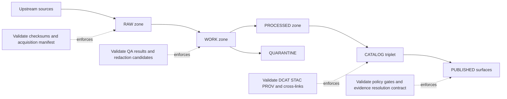
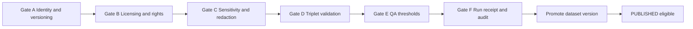

<!-- [KFM_META_BLOCK_V2]
doc_id: kfm://doc/7b0a3d43-5a8b-4bff-9b84-8c0906e2a4bb
title: Validate Pipeline Diagrams
type: standard
version: v1
status: draft
owners: KFM maintainers (TBD in repo)
created: 2026-03-02
updated: 2026-03-02
policy_label: public
related:
  - TODO: link to Promotion Contract doc (path or kfm:// id)
  - TODO: link to policy gate docs (path or kfm:// id)
  - TODO: link to evidence resolver contract (path or kfm:// id)
tags: [kfm, diagrams, pipelines, validate, promotion-contract, governance]
notes:
  - Source diagrams + contributor notes for KFM’s fail-closed validation stage.
[/KFM_META_BLOCK_V2] -->

# Validate Pipeline Diagrams
> **One-line purpose:** Source diagrams and notes for the **fail-closed validation gates** that enforce the KFM **Promotion Contract** (the “truth path” into governed runtime surfaces).


<!-- TODO: replace/add repo-specific CI badge once workflow names are known -->

## Quick navigation
- [What belongs in this directory](#what-belongs-in-this-directory)
- [Where this fits](#where-this-fits)
- [Validation goals and non-goals](#validation-goals-and-non-goals)
- [Promotion Contract gates](#promotion-contract-gates)
- [Core diagrams](#core-diagrams)
- [Contributor workflow](#contributor-workflow)
- [Verification checklist](#verification-checklist)

---

## What belongs in this directory

**This directory is for diagram sources** (and the minimum explanatory markdown) that describe how the **Validate** stage works across KFM pipelines.

### Acceptable inputs
- Mermaid diagrams (`.md` with ```mermaid``` blocks, or `.mmd` if your toolchain uses it)
- Small supporting markdown notes that explain *why* a validation exists and what artifact proves it
- “Contract surface” diagrams (promotion gates, evidence resolution contract, policy enforcement boundaries)
- Minimal examples **that do not include sensitive data** (use placeholders / fake IDs)

### Exclusions
- ❌ Dataset payloads (raw/work/processed data files)  
- ❌ Real credentials, tokens, or private URLs  
- ❌ Precise coordinates or vulnerable-site details (unless policy explicitly permits and the doc is labeled accordingly)  
- ❌ Repo-wide pipeline runbooks (keep those in the pipeline/runbooks area; link to them from here)

---

## Where this fits

KFM’s lifecycle is designed as a **truth path**: data moves through storage zones (RAW → WORK/QUARANTINE → PROCESSED → CATALOG/TRIPLET) and only then becomes eligible for **PUBLISHED** runtime surfaces (API + UI). Validation is the enforcement mechanism that keeps that path auditable and safe.

This directory focuses on the **Validate** step(s) that:
- block promotion when required artifacts are missing,
- quarantine inputs when licensing/sensitivity is unclear,
- ensure catalogs + lineage are consistent,
- and guarantee EvidenceRefs can resolve to policy-allowed EvidenceBundles.

---

## Validation goals and non-goals

### Goals
- **Fail closed:** if validation cannot prove an invariant, promotion/publishing stops.
- **Make trust inspectable:** every “pass” should correspond to evidence artifacts (reports, receipts, catalogs, manifests).
- **Keep CI and runtime consistent:** “green in CI” should mean “same semantics at runtime,” not a separate interpretation.
- **Prevent policy bypass:** validation supports (and should never undermine) the governed API + evidence resolver boundary.

### Non-goals
- Replace dataset-specific QA design (this directory documents patterns and gates, not every dataset’s thresholds).
- Provide operational deployment procedures (those belong in runbooks / infra docs).
- Encode implementation details that may drift (keep those as “examples” + link to authoritative contracts/schemas).

---

## Promotion Contract gates

> **Mental model:** Promotion is a **pipeline outcome** gated by **contracts**. “Validation” here means proving the required contract artifacts exist and are internally consistent.

| Gate | What it proves | Typical evidence artifacts | Typical enforcement point |
|---|---|---|---|
| A — Identity & versioning | Stable dataset identity and deterministic versioning (e.g., spec hash, digests) | dataset spec, digest list, hash report | CI + pipeline |
| B — Licensing & rights | Rights are explicit; unclear rights never silently ship | terms snapshot, rights metadata | CI + steward review |
| C — Sensitivity & redaction | policy label + obligations exist; risky data is generalized/redacted (or blocked) | policy decision record, redaction plan, provenance | CI + pipeline |
| D — Catalog triplet validation | DCAT/STAC/PROV validate and cross-link; references resolve | validated catalogs + linkcheck report | CI + pipeline |
| E — QA & thresholds | Dataset-specific QA checks meet thresholds | QA report(s), threshold outputs | pipeline + CI fixtures |
| F — Run receipt & audit | Reproducibility + auditability for the run | run receipt, audit append | pipeline |
| G — Production posture (recommended) | Supply chain + basic perf/a11y smoke checks | SBOM, provenance, smoke results | CI + release pipeline |

> NOTE: Exact file names/paths for these artifacts are **repo-dependent**. This README documents the governance intent and diagram set, not the current repo implementation.

---

## Core diagrams

### Diagram 1 — Truth path zones + where “validate” bites


### Diagram 2 — Fail-closed promotion gating sequence


---

## Contributor workflow

### Add or update a validation diagram
1. **Make the change small and reviewable.**
2. Prefer Mermaid diagrams; keep node text short (readable diffs).
3. If you introduce a new “gate” concept, also add:
   - a short rationale (1–3 bullets),
   - the artifact that proves it (what file/report/receipt),
   - and the fail-closed behavior (what happens on failure).

### Diagram quality checklist
- [ ] Diagram has a title + a 1–2 sentence caption nearby
- [ ] Diagram reflects **contracts and artifacts**, not private implementation guesses
- [ ] Diagram does not embed sensitive locations or private identifiers
- [ ] Any “MUST” rule maps to a check (CI gate, validator, policy test, or runtime enforcement)

---

## Verification checklist

Use this as the minimum “convert Unknown → Confirmed” checklist when wiring validation in the live repo:

- [ ] Identify the authoritative schemas/contracts for: dataset specs, catalogs, run receipts, promotion manifests
- [ ] Confirm the repo’s actual validator tooling and how it runs in CI
- [ ] Confirm how policy tests run (fixtures) and how results are enforced at runtime
- [ ] Confirm how EvidenceRefs are validated and resolved end-to-end
- [ ] Confirm where quarantine outputs live and how “not promoted” is guaranteed

---

## Appendix: Example run receipt shape (illustrative)

<details>
<summary>Show example (illustrative) run receipt skeleton</summary>

```json
{
  "run_id": "kfm://run/<timestamp>.<id>",
  "actor": {"principal": "svc:pipeline", "role": "pipeline"},
  "operation": "ingest+publish",
  "dataset_version_id": "<dataset_version_id>",
  "inputs": [{"uri": "raw/<source>", "digest": "sha256:<...>"}],
  "outputs": [{"uri": "processed/<artifact>", "digest": "sha256:<...>"}],
  "environment": {
    "container_digest": "sha256:<image>",
    "git_commit": "<commit>",
    "params_digest": "sha256:<...>"
  },
  "validation": {"status": "pass|fail", "report_digest": "sha256:<...>"},
  "policy": {"decision_id": "kfm://policy_decision/<...>"},
  "created_at": "<iso8601>"
}
```

</details>

---

<a id="back-to-top"></a>
**Back to top:** [Validate Pipeline Diagrams](#validate-pipeline-diagrams)
