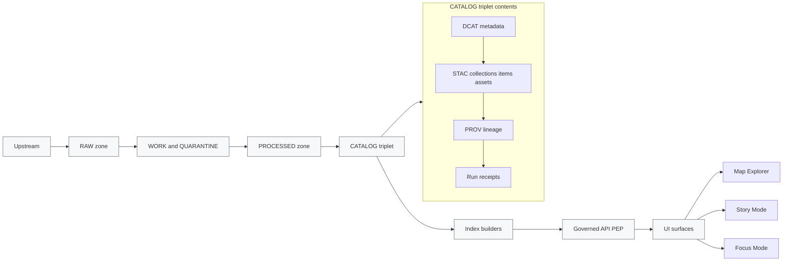
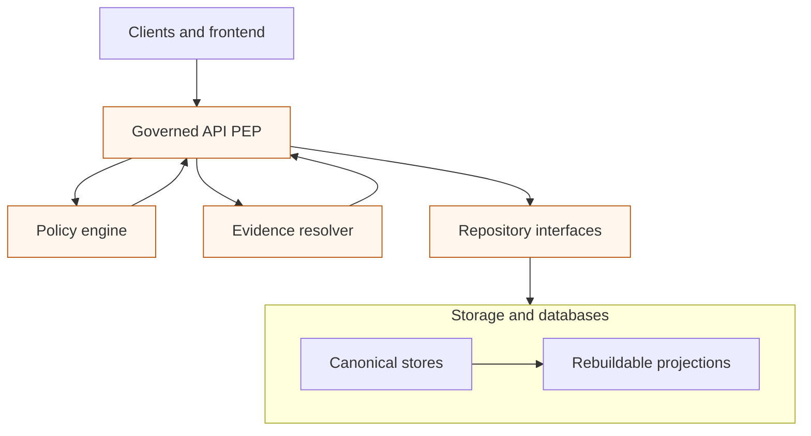

<!-- [KFM_META_BLOCK_V2]
doc_id: kfm://doc/8f1b5af0-1d92-4d1c-9f83-3a0e05ad6a46
title: Truth Path diagram sources
type: standard
version: v1
status: draft
owners: KFM Platform; KFM Governance
created: 2026-03-01
updated: 2026-03-01
policy_label: public
related:
  - docs/diagrams/README.md
  - docs/diagrams/src/README.md
  - docs/diagrams/src/trust-membrane/README.md
tags: [kfm, diagrams, truth-path, governance]
notes:
  - This README documents the *normative* Truth Path diagram set and how to maintain it safely.
  - TODO: confirm related paths in-repo and update the `related:` list.
[/KFM_META_BLOCK_V2] -->

<a id="top"></a>

# Truth Path Diagram Sources
Source files for the **KFM Truth Path** diagrams (lifecycle zones + promotion gates + trust membrane boundary).

 <!-- TODO: replace with real badge target -->
 <!-- TODO -->
 <!-- TODO -->

**Owners:** KFM Platform · KFM Governance  
**Status:** Draft (treat changes as governed)

---

## Quick navigation
- [What this directory is](#what-this-directory-is)
- [Truth Path contract](#truth-path-contract)
- [Diagrams](#diagrams)
- [Promotion Contract gates](#promotion-contract-gates)
- [Trust membrane notes](#trust-membrane-notes)
- [How to update safely](#how-to-update-safely)
- [Directory layout](#directory-layout)
- [Appendix](#appendix)

---

## What this directory is

This folder holds the **diagram sources** that communicate KFM’s non-negotiable “truth path” lifecycle:

> Upstream → RAW → WORK/QUARANTINE → PROCESSED → CATALOG/TRIPLET → PUBLISHED

These diagrams are not decoration. They are:
- A shared mental model for engineering + governance
- A review aid for PRs that touch pipelines, storage, catalogs, policy, UI, or Focus Mode
- A “smoke test” for architecture drift (if the system no longer matches the diagram, something is wrong)

> **WARNING**
> If a proposed diagram change implies any of the following, treat it as a breaking governance change:
> - UI or external clients can access storage/DB directly
> - Promotion can happen without passing fail-closed gates
> - Citations don’t resolve to governed evidence bundles
> - RAW artifacts can be edited in-place

[Back to top](#top)

---

## Truth Path contract

### Lifecycle zones (normative semantics)

| Zone | Core rule | Typical artifacts (examples) | Mutability |
|---|---|---|---|
| Upstream | Source-of-record outside KFM | Agency APIs, bulk downloads, vendor drops | Not controlled by KFM |
| RAW | Immutable acquisition copy + checksums + terms snapshot | Fetch manifests, original files, API snapshots, checksum lists | **Append-only** |
| WORK / QUARANTINE | Transform + QA + redaction candidates; isolate failures | Normalized outputs, reprojections, QA reports, candidate generalizations | Mutable |
| PROCESSED | Publishable artifacts in approved formats + digests | GeoParquet, PMTiles, COGs; derived runtime metadata | Immutable by digest (recommended) |
| CATALOG / TRIPLET | Cross-linked metadata + lineage | DCAT + STAC + PROV + run receipts; link maps | Mutable via versioned catalog rebuild |
| PUBLISHED | Governed runtime surfaces | Governed API responses, tiles endpoints, Map/Story/Focus UIs | Mutable runtime, but only for **promoted** versions |

> **NOTE**
> “QUARANTINE” is not just a label: quarantined items **do not promote**.

[Back to top](#top)

---

## Diagrams

### 1) Truth path end-to-end
Use this diagram when discussing ingestion/pipelines, storage zones, cataloging, indexing, and runtime serving.



### 2) Trust membrane boundary
Use this diagram when reviewing policy enforcement, evidence resolution, API design, network boundaries, or “no direct storage access” posture.



> **TIP**
> Keep these diagrams **text-first** (Mermaid preferred) so diffs are reviewable and PRs can gate on them.

[Back to top](#top)

---

## Promotion Contract gates

Promotion is a governed transition from “data exists somewhere” to “KFM is allowed to serve it.”

Minimum gates (fail closed):

| Gate | What must be true | Why it exists | Typical verification |
|---|---|---|---|
| A — Identity & versioning | Dataset + version IDs exist; deterministic `spec_hash`; content digests | Prevent silent drift; enable reproducibility | Spec/hash tests; digest verification |
| B — Licensing & rights | Rights metadata present; upstream terms snapshot stored | Prevent illegal distribution | CI blocks missing/unknown license |
| C — Sensitivity & redaction | `policy_label` assigned; obligations defined and applied | Prevent sensitive leakage | Policy tests; redaction tests |
| D — Catalog triplet validation | DCAT/STAC/PROV validate and cross-link; EvidenceRefs resolve | Deterministic citations + interoperability | Schema validation + link checks |
| E — QA & thresholds | Dataset-specific QA reports exist; thresholds pass | Stop broken data from shipping | QA report artifacts; threshold checks |
| F — Run receipt & audit | Receipts capture inputs/tools/hashes/policy decisions | Auditability and rollback | Receipt schema validation; append-only audit |
| G — Release manifest (recommended) | Promotion recorded as a manifest referencing digests | Reproducible release bookkeeping | Manifest exists + references match |

> **NOTE**
> The diagram set should make it visually obvious that **nothing reaches PUBLISHED** unless these gates pass.

[Back to top](#top)

---

## Trust membrane notes

The trust membrane exists to ensure:
- **No direct client access** to storage/DB
- Policy is evaluated uniformly at the governed API (PEP)
- Evidence resolution and redaction obligations are applied consistently
- All user-facing claims can be traced to versioned artifacts + receipts

If you are reviewing a change that touches *any* of these, the trust membrane diagram is the required context.

[Back to top](#top)

---

## How to update safely

### Minimal “Definition of Done” for diagram changes
- [ ] Diagram still matches the canonical zone order: Upstream → RAW → WORK/QUARANTINE → PROCESSED → CATALOG/TRIPLET → PUBLISHED
- [ ] Diagram explicitly indicates **immutability** expectations (RAW append-only; processed by digest recommended)
- [ ] Diagram indicates **fail-closed promotion gates**
- [ ] Diagram indicates the **trust membrane boundary** (clients don’t touch stores)
- [ ] Any renamed node is justified and aligned with governance docs
- [ ] Accessibility: diagram has nearby explanatory text (don’t rely on visuals alone)
- [ ] TODOs are minimized; unknowns are called out explicitly (no implied repo structure)

### Suggested workflow (adjust to repo tooling)
1. Edit the diagram source files (prefer Mermaid).
2. Render preview:
   - GitHub preview (Mermaid) **or**
   - Local render tooling (if your repo standardizes this; TODO: link the command here once confirmed)
3. Open PR with:
   - Before/after screenshot(s) of rendered diagrams (if applicable)
   - Short rationale: what governance invariant is clarified or corrected
   - Checklist above completed

> **TODO (repo wiring)**
> Confirm whether this repo has a standard diagram build step (e.g., a script or CI job that renders `src/` → `out/`). Once confirmed, document the exact command(s) and expected output paths here.

[Back to top](#top)

---

## Directory layout

> **Directory Documentation Standard**  
> Title + purpose ✅ · where it fits ✅ · acceptable inputs ✅ · exclusions ✅

### Where it fits
- `docs/diagrams/` is the human-facing diagram library.
- `docs/diagrams/src/` holds editable sources.
- `docs/diagrams/src/truth-path/` holds truth-path specific sources and this README.

### Acceptable inputs (what belongs here)
- Text-based diagram sources (preferred): `*.mmd`, `*.mermaid`, or Markdown with Mermaid blocks
- Vector sources (if absolutely needed): `*.drawio`, `*.excalidraw` (keep diffs manageable)
- Small helper assets strictly required by diagrams (icons, etc.), if policy-safe

### Exclusions (what must not go here)
- Dataset-specific private or sensitive examples (especially anything that increases targeting risk)
- Rendered build artifacts **if** your repo has a dedicated output directory for renders (TODO: confirm)
- UI mockups (belongs in UI/UX docs)
- “Architecture wishlists” that contradict KFM invariants (put proposals in ADRs instead)

### Expected tree (update once files exist)
```text
docs/diagrams/src/truth-path/
  README.md
  truth-path.mmd            # preferred: lifecycle + gates + runtime flow
  trust-membrane.mmd        # preferred: boundary + policy/evidence
  (optional) *.drawio       # only if text format is insufficient
  (optional) assets/        # tiny icons used by diagrams
```

[Back to top](#top)

---

## Appendix

<details>
<summary><strong>Appendix A — Naming conventions</strong></summary>

- Use the exact zone names in diagram labels:
  - `RAW`
  - `WORK / QUARANTINE`
  - `PROCESSED`
  - `CATALOG / TRIPLET`
  - `PUBLISHED`
- Prefer “Governed API (PEP)” when referencing the runtime enforcement point.
- Prefer “Evidence resolver” when referencing citation/evidence bundling.

</details>

<details>
<summary><strong>Appendix B — Open questions (explicit UNKNOWNs)</strong></summary>

- UNKNOWN: Where rendered diagram outputs should live in this repo (if anywhere).
- UNKNOWN: Whether CI enforces diagram validity/rendering.
- UNKNOWN: Repo-standard tooling (Mermaid CLI, draw.io export, etc.).

Minimum verification steps:
- Locate any existing `docs/diagrams` build script and link it in this README.
- Confirm whether rendered outputs are committed, and if so, where.
- Confirm naming conventions used elsewhere under `docs/diagrams/src/`.

</details>

[Back to top](#top)
