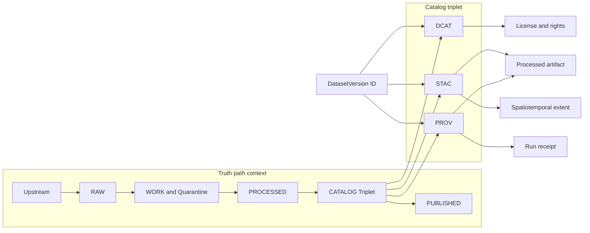
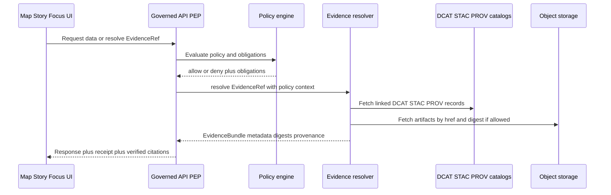

<!-- [KFM_META_BLOCK_V2]
doc_id: kfm://doc/7f0c9bb7-1144-4b63-8cbf-2e9c4b3f31d7
title: Catalog linkage
type: standard
version: v1
status: draft
owners: TBD
created: 2026-03-01
updated: 2026-03-01
policy_label: restricted
related:
  - docs/diagrams/src/truth-path/catalog-linkage/README.md
tags: [kfm, diagrams, truth-path, catalog, dcat, stac, prov, evidence]
notes:
  - This directory documents the contract for cross-linking DCAT + STAC + PROV so EvidenceRefs resolve deterministically.
  - Treat all repo-path references outside this folder as “verify in repo” until confirmed.
[/KFM_META_BLOCK_V2] -->

# Catalog linkage

**Purpose:** Define and visualize the **linkage contract** between **DCAT**, **STAC**, and **PROV** (“the catalog triplet”) so that:

- Promotion gates can fail closed on broken lineage or missing identifiers.
- Evidence-first UX can open any claim/layer into an inspectable **EvidenceBundle**.
- Focus Mode and Story publishing can enforce **hard citation verification** (resolve or abstain).

**Status:** draft • **Policy label:** restricted (default-deny until repo governance confirms otherwise)


---

## Navigation

- [What catalog linkage means](#what-catalog-linkage-means)
- [Linkage invariants](#linkage-invariants)
- [Identifier families](#identifier-families)
- [Linkage matrix](#linkage-matrix)
- [Diagrams](#diagrams)
- [How changes are reviewed](#how-changes-are-reviewed)
- [Minimum verification steps](#minimum-verification-steps)
- [Appendix](#appendix)

---

## What catalog linkage means

Catalog linkage is the **explicit, testable set of cross-references** that binds:

- **Dataset-level metadata** (DCAT),
- **Artifact / asset metadata** (STAC),
- **Lineage and run receipts** (PROV),

into one coherent, navigable graph.

A valid linkage contract ensures that an EvidenceRef like `stac://...` or `prov://...` is:

1. **Resolvable** (no guessing),
2. **Policy-evaluable** (default-deny when unclear),
3. **Reproducible** (digests, receipts, and stable IDs),
4. **Inspectable** (humans can trace the “why” behind a claim).

> **NOTE**
> This directory is documentation and diagrams only. It should not become a shadow-catalog or a second source of truth.

---

## Linkage invariants

These invariants are what this folder exists to make visible and reviewable.

### Invariant 1 — One DatasetVersion ID is the join key

Every DCAT/STAC/PROV record produced for a promotion must reference the same immutable:

- `dataset_id`
- `dataset_version_id`

If these are missing or inconsistent, **linkage is broken** and promotion must fail closed.

### Invariant 2 — Assets are digest-addressed

Every promoted artifact must be addressable by digest (example: `sha256:…`) and the digest must appear consistently across:

- STAC asset metadata,
- PROV entity metadata,
- EvidenceBundle artifact list (runtime),
- Any release manifest (if used).

### Invariant 3 — PROV explains “how” and “with what”

PROV must link:

- inputs → activities (runs) → outputs,
- including enough environment capture to support reproducibility (tooling versions, container digest, commit id where available).

### Invariant 4 — Linkage is validated as a gate

Broken links are not “doc bugs”; they are trust bugs. Catalog linkage must be validated by automated checks (validators + linkcheck) so merges fail closed when:

- IDs are missing,
- links point nowhere,
- EvidenceRefs do not resolve deterministically.

### Invariant 5 — Trust membrane alignment

This directory assumes the trust membrane posture: UI and clients **do not** touch raw stores directly. Catalog linkage is what makes policy-evaluated evidence resolution possible through governed interfaces.

---

## Identifier families

Use these as the shared vocabulary for diagrams and reviews.

| Identifier | What it identifies | Stability requirement | Where it must appear |
|---|---|---:|---|
| `dataset_id` | Logical dataset identity | Stable | DCAT, STAC, PROV, API discovery, citations |
| `dataset_version_id` | Immutable promoted dataset version | Stable + immutable | DCAT, STAC, PROV, receipts, EvidenceBundle |
| `spec_hash` | Deterministic spec identity | Stable per spec | Promotion gates, receipts, audit |
| `run_id` | A specific pipeline run | Immutable | PROV Activity, receipts, audit ledger |
| `artifact_digest` | Content-addressed artifact identifier | Immutable | STAC assets, PROV Entities, EvidenceBundle |

> **WARNING**
> Never “re-use” identifiers across content changes. New content ⇒ new version ⇒ new digests.

---

## Linkage matrix

This is the practical checklist: what must link to what.

| From | Must link to | Why it matters | Typical validation |
|---|---|---|---|
| DCAT Dataset | `dataset_id`, `dataset_version_id` | Discovery + join key | schema validation |
| DCAT Distribution | STAC Collection or Item and/or artifact href | Distribution is how artifacts are accessed | linkcheck + media type checks |
| STAC Collection | DCAT dataset/distribution | Dataset-to-assets join | linkcheck |
| STAC Item | PROV activity and/or run receipt reference | Evidence explains “how produced” | linkcheck + required fields |
| STAC Asset | digest + href to processed artifact | Integrity + reproducibility | digest presence + href reachability |
| PROV Activity | inputs (prov:used) + outputs (prov:generated) | Lineage graph completeness | PROV validation |
| PROV Entity | artifact digest + stable artifact identity | Binds lineage to real bytes | digest consistency checks |
| EvidenceRef | resolves to DCAT/STAC/PROV/doc/graph | Hard citation verification | resolver integration tests |

---

## Diagrams

### Catalog triplet linkage overview



### EvidenceRef resolution flow



---

## How changes are reviewed

### What belongs in this directory

This folder is for **diagram sources and explanatory linkage notes** that help reviewers and maintainers answer:

- “Do these catalogs cross-link correctly?”
- “Will EvidenceRefs resolve without guessing?”
- “Will Gate D fail closed if something breaks?”
- “Is the linkage contract consistent with policy labels and obligations?”

### What must not go here

- **No** dataset catalogs (DCAT/STAC/PROV) that are treated as authoritative runtime artifacts.
- **No** raw or processed data.
- **No** code-generated outputs unless the repo’s standards explicitly require committing them.

---

## Change checklist

Use this checklist in PRs that touch catalog linkage diagrams or the linkage contract.

- [ ] Diagram labels match the canonical vocabulary (`dataset_id`, `dataset_version_id`, `run_id`, `artifact_digest`)
- [ ] Any newly introduced link type is reflected in the [Linkage matrix](#linkage-matrix)
- [ ] Gate expectations remain fail-closed (no “best effort” resolution)
- [ ] EvidenceRef resolution still requires **no guessing**
- [ ] Policy label and obligations are represented where they affect linkage (redactions may change geometry, extents, or asset visibility)
- [ ] Any repo references outside this folder are verified and updated (avoid drifting doc pointers)

---

## Minimum verification steps

These are the smallest checks a maintainer can run to confirm this linkage contract matches the implementation.

> **NOTE**
> Commands are intentionally generic because actual tool entrypoints vary by repo. Replace with the repo’s canonical commands once confirmed.

1. **Locate validator and linkcheck tooling**
   - Search for “validator”, “linkcheck”, “stac”, “dcat”, “prov”, “EvidenceRef”, “evidence/resolve”
2. **Confirm Gate D behavior**
   - Verify CI fails when:
     - a STAC asset href is broken
     - required IDs are missing
     - EvidenceRef cannot resolve deterministically
3. **Confirm EvidenceRef schemes supported**
   - Confirm resolver supports at least: `dcat://`, `stac://`, `prov://`, `doc://`
4. **Confirm digest consistency checks exist**
   - Ensure digests align across STAC assets, PROV entities, and any evidence bundle output schema

---

## Appendix

### Proposed directory structure

Update this once the folder is populated in-repo.

```text
docs/diagrams/src/truth-path/catalog-linkage/
  README.md
  catalog-triplet-linkage.mmd              # optional: diagram source
  evidence-ref-resolution.mmd              # optional: diagram source
  linkage-matrix.md                        # optional: deeper matrix + examples
  assets/                                  # optional: exported images if committed by policy
```

### Non-normative example snippets

If you add example JSON fragments here, keep them:

- minimal,
- clearly labeled as examples,
- free of sensitive coordinates or restricted fields.

---

<a id="top"></a>
**Back to top:** [Catalog linkage](#catalog-linkage)
