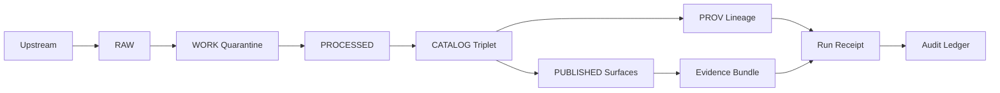
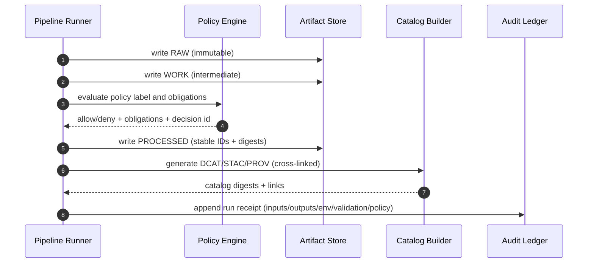

<!-- [KFM_META_BLOCK_V2]
doc_id: kfm://doc/9f8a1b64-6a9a-4b1f-9d61-ff8e8d6de8a2
title: Truth Path Receipts (diagram sources)
type: standard
version: v1
status: draft
owners: TBD
created: 2026-03-01
updated: 2026-03-01
policy_label: public
related:
  - docs/diagrams/src/truth-path/
tags: [kfm, truth-path, receipts, provenance, prov, audit]
notes:
  - This README documents the *diagram sources* for receipts/audit within the Truth Path.
  - Do not place real secrets, sensitive coordinates, or non-redacted audit logs here.
[/KFM_META_BLOCK_V2] -->

# Truth Path Receipts
Diagram sources that explain **run receipts** and the **append-only audit ledger** that make KFM’s truth path auditable.


---

## Quick navigation
- [What this folder is](#what-this-folder-is)
- [Receipts in the Truth Path](#receipts-in-the-truth-path)
- [Receipt contract](#receipt-contract)
- [Diagram set](#diagram-set)
- [Editing rules](#editing-rules)
- [Verification checklist](#verification-checklist)
- [Appendix: sanitized examples](#appendix-sanitized-examples)

---

## What this folder is

**Path:** `docs/diagrams/src/truth-path/receipts/`

This folder holds **source diagrams** (Mermaid, PlantUML, Draw.io, etc.) for how receipts work in KFM.

### Where it fits in the repo
- `docs/diagrams/src/…` is the *authoring/source* side of diagrams (editable text / editable assets).
- Rendered outputs (SVG/PNG) are **not confirmed** in this repo snapshot; if your repo has a `docs/diagrams/out/` (or similar), put generated files there and keep this directory source-only.

### Acceptable inputs
- Mermaid diagrams (`.md` containing Mermaid blocks, or `.mmd`)
- PlantUML (`.puml`)
- Draw.io / diagrams.net (`.drawio`)
- Small, **sanitized** JSON examples used *only* for explaining structure (no real secrets, no PII)

### Exclusions
- ❌ Real audit logs (even if “public”), unless explicitly redacted and approved
- ❌ Secrets, tokens, credentials, private endpoints
- ❌ Exact coordinates / precise locations for sensitive sites or records
- ❌ Anything that would let a reader reconstruct restricted inputs or obligations

[Back to top](#truth-path-receipts)

---

## Receipts in the Truth Path

### Why receipts exist (contract, not “nice to have”)
Receipts are the **audit spine** that lets us prove:

- what inputs were used,
- what outputs were produced,
- what software/environment produced them,
- what validation happened,
- what policy decision allowed/denied/obligated the result.

Receipts matter because **promotion and publishing are fail-closed**: if required artifacts (including receipts) are missing or invalid, KFM must block promotion/publishing.

### The minimal lifecycle context
KFM’s truth path is commonly described as:

`Upstream → RAW → WORK/Quarantine → PROCESSED → CATALOG (DCAT+STAC+PROV) → PUBLISHED`

Receipts connect the **CATALOG/PROV** lineage to **PUBLISHED** runtime surfaces (API/UI/Focus), so the UI can show evidence and provenance without guessing.

[Back to top](#truth-path-receipts)

---

## Receipt contract

### Receipt types (recommended)
**CONFIRMED concept:** every pipeline run and every Focus Mode query should emit a receipt.  
**PROPOSED split:** keep receipt *shape* consistent, vary `operation` and `inputs/outputs` by type.

| Type | Typical `operation` | Inputs | Outputs | Notes |
|---|---|---|---|---|
| Pipeline run receipt | `ingest`, `normalize`, `publish`, `index` | RAW/WORK artifacts + params | PROCESSED + CATALOG artifacts | Drives promotion gates |
| Focus Mode query receipt | `focus_query` | question + EvidenceRefs + policy context | answer + citations + bundle digests | Treat as governed artifact |
| Promotion receipt | `promote` | dataset_version_id + manifests | release/promotion manifest | Useful for rollback audit |

### Minimal fields (starter)
Use this as the minimum mental model for the diagrams and examples:

- **Identity:** `run_id` (stable), `dataset_version_id` (when applicable)
- **Actor:** principal/service + role
- **Operation:** a normalized operation label
- **Inputs/Outputs:** list of `{uri, digest}` (content-addressable)
- **Environment capture:** container/image digest, git commit, parameter digest
- **Validation:** pass/fail + report digest
- **Policy hook:** policy decision reference (and/or obligations applied)
- **Timestamp:** created time

> NOTE  
> The precise schema enforcement mechanism (JSON Schema vs. something else) is **repo-dependent**. The diagrams here should describe the *contract surface*, not an implementation.

[Back to top](#truth-path-receipts)

---

## Diagram set

### Directory tree
> **PROPOSED structure** (create/adjust to match your repo’s actual diagram toolchain):

```text
docs/diagrams/src/truth-path/receipts/
├── README.md
├── receipts__truth_path_flow__v1.mmd
├── receipts__pipeline_run__sequence__v1.mmd
├── receipts__focus_mode__sequence__v1.mmd
└── samples/
    ├── run_receipt__sanitized__v1.json
    ├── evidence_bundle__sanitized__v1.json
    └── promotion_manifest__sanitized__v1.json
```

### Core diagram: receipts in the truth path


### Core diagram: pipeline run receipt sequence


[Back to top](#truth-path-receipts)

---

## Editing rules

### Diagram authoring rules (hard)
- Use **synthetic** or **sanitized** sample identifiers.
- Never paste secrets, tokens, internal URLs, or live credentials.
- If a diagram needs “an example dataset”, use placeholders like `example_dataset` and `sha256:...`.

### Governance rules (hard)
- If policy/rights/sensitivity is unclear: **default-deny** (do not depict a permissive behavior as guaranteed).
- If you illustrate location-sensitive content, use **generalized geography** (coarse extent, not exact points).

[Back to top](#truth-path-receipts)

---

## Verification checklist

Use this checklist when adding/updating diagrams in this folder:

- [ ] Diagram matches the truth path stages (RAW/WORK/PROCESSED/CATALOG/PUBLISHED).
- [ ] Receipt includes the minimum “contract fields” (identity, actor, inputs/outputs, env, validation, policy).
- [ ] Diagram shows **audit ledger as append-only** (no mutation semantics).
- [ ] Diagram includes policy evaluation as allow/deny + obligations (when relevant).
- [ ] No secrets / sensitive coordinates / unredacted logs in examples.

### Minimum repo verification steps (fail-closed)
Because repo reality can differ, verify before claiming specifics:
- Locate the actual receipt schema/template(s) (search for `run receipt`, `prov`, `receipt`, `audit ledger`).
- Confirm how diagrams are rendered in CI (search for `mermaid`, `plantuml`, `diagrams`, `render` in build scripts).
- Confirm where receipts are stored (zone layout + paths) and whether there is a receipt viewer.

[Back to top](#truth-path-receipts)

---

## Appendix: sanitized examples

### Example: run receipt (sanitized)
```json
{
  "run_id": "kfm://run/2026-03-01T00:00:00Z.example",
  "actor": { "principal": "svc:pipeline", "role": "pipeline" },
  "operation": "ingest_and_publish",
  "dataset_version_id": "2026-03.example1234",
  "inputs": [
    { "uri": "raw/example/source.csv", "digest": "sha256:1111..." }
  ],
  "outputs": [
    { "uri": "processed/example/events.parquet", "digest": "sha256:2222..." }
  ],
  "environment": {
    "container_digest": "sha256:image...",
    "git_commit": "deadbeef...",
    "params_digest": "sha256:params..."
  },
  "validation": { "status": "pass", "report_digest": "sha256:report..." },
  "policy": { "decision_id": "kfm://policy_decision/example" },
  "created_at": "2026-03-01T00:05:00Z"
}
```

### Example: evidence bundle (sanitized)
```json
{
  "bundle_id": "sha256:bundle...",
  "dataset_version_id": "2026-03.example1234",
  "title": "Example record",
  "policy": {
    "decision": "allow",
    "policy_label": "public",
    "obligations_applied": []
  },
  "license": { "spdx": "CC-BY-4.0", "attribution": "Example publisher" },
  "provenance": { "run_id": "kfm://run/2026-03-01T00:00:00Z.example" },
  "artifacts": [
    {
      "href": "processed/example/events.parquet",
      "digest": "sha256:2222...",
      "media_type": "application/x-parquet"
    }
  ],
  "checks": { "catalog_valid": true, "links_ok": true },
  "audit_ref": "kfm://audit/entry/example"
}
```

[Back to top](#truth-path-receipts)
