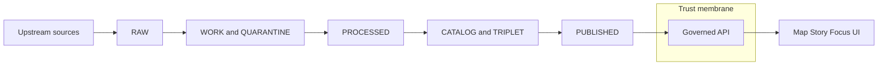

<!-- [KFM_META_BLOCK_V2]
doc_id: kfm://doc/5a3f1d0f-1d43-4e7b-86c6-0bf9a7dd39cb
title: Truth Path Zones Diagram Sources
type: standard
version: v1
status: draft
owners: TBD
created: 2026-03-01
updated: 2026-03-01
policy_label: public
related:
  - kfm://concept/truth-path
  - kfm://concept/promotion-contract
  - kfm://concept/trust-membrane
tags: [kfm, diagrams, truth-path, zones]
notes:
  - This README documents the meaning of KFM lifecycle zones for diagram authors.
  - Semantics MUST remain aligned with the KFM vNext governance sources; diagrams are not a place to invent rules.
[/KFM_META_BLOCK_V2] -->

# Truth Path Zones
Source diagrams for KFM’s governed data lifecycle zones (RAW → WORK/QUARANTINE → PROCESSED → CATALOG/TRIPLET → PUBLISHED).


## Quick navigation
- [Purpose](#purpose)
- [Where this fits](#where-this-fits)
- [Truth path overview](#truth-path-overview)
- [Zone definitions](#zone-definitions)
- [Promotion Contract gates](#promotion-contract-gates)
- [Diagram authoring rules](#diagram-authoring-rules)
- [Directory contents](#directory-contents)
- [Acceptable inputs](#acceptable-inputs)
- [Exclusions](#exclusions)

---

## Purpose
This directory documents **what each “zone” means** in the KFM truth path so that:
- diagrams remain **semantically consistent** across docs, UI, and pipeline discussions
- reviews can treat diagrams as **governed artifacts** (not vibes)
- contributors don’t accidentally weaken the **trust membrane** by “simplifying” the model

> NOTE  
> In KFM, the lifecycle is not a metaphor. Zones are storage + validation gates that create an auditable path from upstream sources to governed runtime surfaces.

---

## Where this fits
- **docs/diagrams/src/**: diagram source-of-truth (Mermaid preferred)
- **docs/diagrams/src/truth-path/**: lifecycle + trust membrane concepts
- **docs/diagrams/src/truth-path/zones/**: **zone semantics** and reusable zone diagrams/cards

This README is the “legend” for any diagram that uses zone labels.

---

## Truth path overview


### Non-negotiable interpretation
- **Promotion gates apply at each transition**. If a gate fails, promotion **stops** (fail-closed).
- **Clients do not access storage directly**. All runtime access is policy-evaluated at the governed API boundary.

---

## Zone definitions

### Zone summary matrix
| Zone | What it is | Mutability | Typical contents | Promotion posture |
|---|---|---:|---|---|
| RAW | Immutable acquisition copy of upstream payloads + checksums | Immutable / append-only | acquisition manifest, raw artifacts, checksums, minimal metadata, terms snapshot | Never edited; superseded by new acquisition |
| WORK / QUARANTINE | Intermediate transforms + QA + candidate redactions | Mutable | normalization outputs, reprojections, tiling jobs, QA reports, redaction/generalization candidates | QUARANTINE blocks promotion |
| PROCESSED | Publishable artifacts in approved formats with stable IDs + checksums | Immutable-by-digest | GeoParquet, PMTiles, COG, standardized schemas, derived metadata for runtime | Must satisfy gates before serving |
| CATALOG / TRIPLET | Cross-linked metadata + lineage surface | Immutable-by-digest | DCAT dataset metadata, STAC collections/items/assets, PROV bundles, run receipts, link maps | Must validate + cross-link |
| PUBLISHED | Governed runtime surfaces | Governed (served) | policy-filtered API responses, tiles, story pages, Focus Mode outputs | Only promoted versions are eligible |

---

### RAW
**RAW** is the *immutable* acquisition layer.
- Keep the original upstream payloads and a **terms snapshot**.
- Record checksums for every artifact.
- Treat RAW as **append-only**: do not patch; re-acquire and supersede.

**Good diagram emphasis:** “Immutable acquisition” + “Checksums everywhere”.

### WORK and QUARANTINE
**WORK** is where you:
- normalize formats (example: parse CSV to parquet; reproject; tile; de-duplicate)
- run QA checks and produce QA reports
- prepare candidate redactions / generalizations

**QUARANTINE** is where you put anything that cannot be promoted because of:
- failed validation
- unclear licensing
- sensitivity concerns
- upstream instability that breaks reproducibility

**Good diagram emphasis:** WORK is “mutable and fixable”; QUARANTINE is “blocked”.

### PROCESSED
**PROCESSED** contains publishable artifacts:
- approved formats (GeoParquet, PMTiles, COG, text corpora, etc.)
- checksums for each processed artifact
- derived metadata needed for runtime (bbox, temporal extent, counts)

**Good diagram emphasis:** “Publishable + standardized + stable IDs”.

### CATALOG and TRIPLET
The **Triplet** is KFM’s interoperability and evidence surface:
- **DCAT**: dataset-level metadata (license, publisher, distributions, themes)
- **STAC**: asset-level metadata (collections, items, assets) for spatiotemporal artifacts
- **PROV**: lineage (activities, agents, entities) describing how artifacts were created

**Hard rule:** The triplet must be **cross-linked** so **EvidenceRefs resolve without guessing**.

**Good diagram emphasis:** “Cross-linking is the contract”.

### PUBLISHED
**PUBLISHED** is not “a folder” as much as a **runtime posture**:
- only promoted dataset versions can be served
- runtime surfaces are reached through the governed API boundary
- policy labels + obligations apply (redaction/generalization) and must be testable

**Good diagram emphasis:** “Policy enforcement + evidence resolution + logging”.

---

## Promotion Contract gates
Promotion MUST be blocked unless the minimum gates are satisfied (fail-closed).

| Gate | Minimum requirement | What diagrams should communicate |
|---|---|---|
| A | Identity and versioning: dataset_id + dataset_version_id, deterministic spec hash, content digests | “Everything has a stable ID and a digest” |
| B | Licensing and rights metadata + terms snapshot | “No rights, no promotion” |
| C | Sensitivity classification + redaction plan (policy label + obligations) | “Default-deny when unclear” |
| D | Catalog triplet validation + cross-links + resolvable EvidenceRefs | “No broken links in truth surfaces” |
| E | QA checks and thresholds are documented and met | “Quarantine on failure” |
| F | Run receipt + append-only audit record | “Reproducible by receipt” |
| G | Release / promotion manifest references artifacts + digests | “Promotion is a recorded release” |

> WARNING  
> If a diagram shows promotion to PUBLISHED without showing gates (explicitly or implicitly), it is misleading.

---

## Diagram authoring rules
### Requirements
- Mermaid is preferred for **diffability** and code review.
- Avoid “pretty but ambiguous” diagrams:
  - label zone boundaries clearly
  - show mutability (immutable vs mutable) visually
  - show promotion gates at least once per diagram set

### Conventions
- Use consistent zone labels: `RAW`, `WORK`, `QUARANTINE`, `PROCESSED`, `CATALOG/TRIPLET`, `PUBLISHED`
- Do not use `|` characters inside Mermaid node text (it breaks some renderers).
- Diagrams that depict runtime must include the **trust membrane boundary** at the governed API.

### Definition of Done for a new or changed zone diagram
- [ ] Matches the zone definitions in the KFM vNext governance sources
- [ ] Clearly marks mutability (append-only vs mutable vs immutable-by-digest)
- [ ] Shows how promotion is blocked (fail-closed) when gates fail
- [ ] Does not imply direct client access to storage/DB
- [ ] Includes a short caption explaining intent and non-goals

---

## Directory contents
> NOTE  
> The list below is a **recommended** structure (not a claim about what is already present in the repo).

```text
docs/diagrams/src/truth-path/zones/                     # Truth Path zones diagrams (RAW→WORK/QUARANTINE→PROCESSED→CATALOG→PUBLISHED)
├─ README.md                                            # You are here: zone diagram index + conventions + how to render/validate + export policy
├─ _templates/                                          # Recommended: zone “cards” + diagram scaffolds (keep consistent)
│  └─ (zone templates live here)                        # Template sources for zone diagrams (Mermaid/DrawIO/etc. as chosen)
├─ zone-raw.*                                           # Diagram source for RAW semantics (immutability, acquisition IDs, allowed ops)
├─ zone-work-quarantine.*                               # Diagram source for WORK/QUARANTINE semantics (QC, remediation loops, fail reasons)
├─ zone-processed.*                                     # Diagram source for PROCESSED semantics (versioned artifacts, checksums, QA evidence)
├─ zone-catalog-triplet.*                               # Diagram source for CATALOG/TRIPLET semantics (DCAT/STAC/PROV + linkage rules)
├─ zone-published.*                                     # Diagram source for PUBLISHED semantics (policy-safe exports, distribution posture)
└─ gates-promotion-contract.*                           # Diagram source for promotion gates overview (A–G, receipts, fail-closed)
```

---

## Acceptable inputs
This directory should contain:
- Mermaid (`.mmd`) and/or Markdown diagram sources used to render zone visuals
- small supporting assets that are *diagram-specific* (icons, callout images) if absolutely necessary
- short captions and “diagram intent” notes embedded near the diagram source

---

## Exclusions
Do **not** put these here:
- pipeline implementation docs (belongs in pipeline/ingest/runbooks)
- full policy specs or Rego (belongs in `policy/`)
- dataset specs / registry entries (belongs in `data/registry` or equivalent)
- generated diagram outputs (keep builds separate from sources)

---

<a id="back-to-top"></a>
**Back to top:** [Quick navigation](#quick-navigation)
