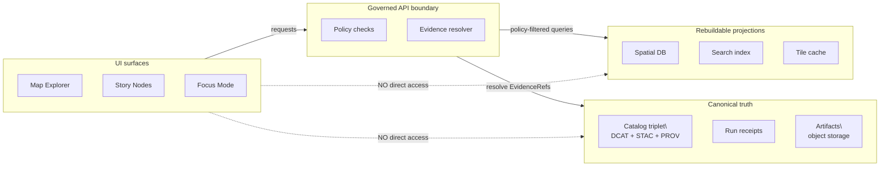
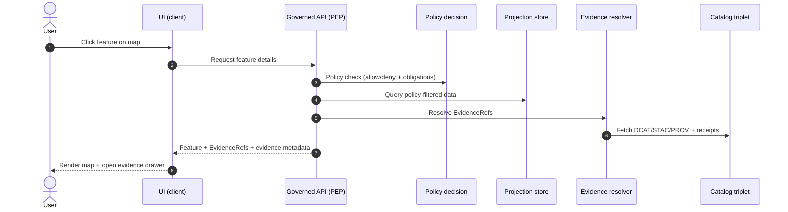
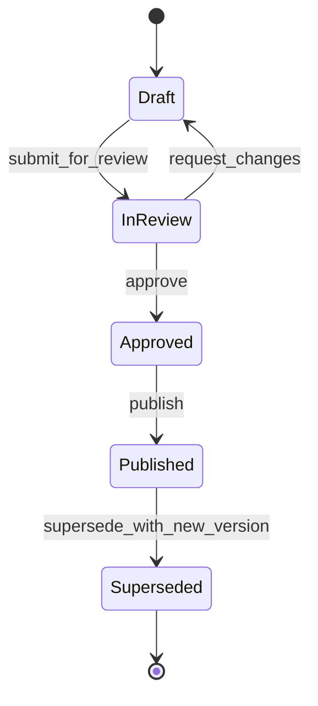

<!-- [KFM_META_BLOCK_V2]
doc_id: kfm://doc/d8ef0bdf-41ef-4f16-84ed-f45154ad1ff2
title: UI diagram sources
type: standard
version: v1
status: draft
owners: KFM UI
created: 2026-03-01
updated: 2026-03-01
policy_label: public
related:
  - docs/diagrams/README.md
  - docs/diagrams/src/README.md
  - docs/diagrams/src/ui/README.md
tags: [kfm, ui, diagrams]
notes:
  - Source-of-truth diagram files for KFM UI surfaces (Map, Story, Focus).
  - Rendered outputs should live outside src/ (see “Export workflow”).
[/KFM_META_BLOCK_V2] -->

# UI diagram sources
_Map-first UI diagrams, treated as governed documentation artifacts._


<!-- TODO: Replace/augment with repo-specific CI and “diagrams build” badges once workflows exist. -->

**Purpose:** This folder holds **source files** for diagrams about KFM’s UI surfaces (Map Explorer, Story Nodes, Focus Mode).  
These diagrams exist to make the system **buildable, reviewable, and testable**—not just pretty.

> ⚖️ **Invariant to reflect in UI diagrams:** the UI is a client. It never accesses storage directly; all data access flows through the governed API + policy + evidence boundary (“trust membrane”).

---

## Navigation
- [What belongs here](#what-belongs-here)
- [Where this fits in KFM](#where-this-fits-in-kfm)
- [Directory contract](#directory-contract)
- [Naming conventions](#naming-conventions)
- [Export workflow](#export-workflow)
- [Diagram registry](#diagram-registry)
- [Contribution checklist](#contribution-checklist)
- [Governance and sensitivity](#governance-and-sensitivity)
- [Appendix: templates](#appendix-templates)

---

## What belongs here

**UI-focused diagram sources, such as:**
- User journeys and interaction flows (discover → inspect → evidence → cite/publish)
- UI component architecture (Map canvas, layer panel, time control, evidence drawer, story editor, focus panel)
- State machines (story review/publish states; focus “cite-or-abstain” outcomes)
- Contracts-at-a-glance: what the UI *expects* from the governed API (policy-filtered results, EvidenceRefs, receipts)

**Preferred formats (in order):**
1. **Mermaid** (`.mmd` or markdown with fenced `mermaid`) for architecture, flows, and state machines
2. **Draw.io** (`.drawio`) when you need precise layout
3. **Excalidraw** (`.excalidraw`) for rough sketching that is still versionable

> TIP: Choose the simplest format that reviewers can diff and understand.

---

## Where this fits in KFM

The UI diagrams in this folder should **encode KFM’s non-negotiable invariants**:

- **Truth path:** promoted, versioned artifacts flow to governed runtime surfaces (API + UI).
- **Trust membrane:** the UI never bypasses policy and evidence resolution.
- **Evidence-first UX:** users can open from any claim/layer into inspectable evidence.
- **Cite-or-abstain:** Focus Mode answers must cite resolvable evidence, or abstain.

### Reference architecture (UI perspective)



---

## Directory contract

### Fits in the repo
This directory is the **UI slice** of the diagram source tree:

```
docs/diagrams/src/
└─ ui/
   ├─ README.md        # you are here
   └─ <diagram files>  # *.mmd, *.drawio, *.excalidraw, *.md (with mermaid)
```

> NOTE: Keep diagram sources here; keep rendered artifacts outside `src/` so diffs stay meaningful.

### Acceptable inputs
- Diagram sources: `*.mmd`, `*.md` (with Mermaid), `*.drawio`, `*.excalidraw`
- Lightweight sidecars: `*.yml` / `*.json` manifests describing ownership and usage (optional but recommended)

### Exclusions
- ❌ Rendered binaries committed next to sources (e.g., `*.png`, `*.svg`) — put them in a rendered directory instead
- ❌ Screenshots of licensed or restricted UI/data unless rights + policy allow
- ❌ Anything containing secrets, internal tokens, or restricted coordinates/locations

---

## Naming conventions

Use **kebab-case** and start filenames with `ui-` so they are easily discoverable.

**Recommended pattern:**
```
ui-<surface>-<topic>-<type>.<ext>
```

Examples:
- `ui-map-explorer-evidence-drawer-flow.mmd`
- `ui-story-publish-state-machine.mmd`
- `ui-focus-cite-or-abstain-sequence.mmd`

**Type keywords** (pick one):
- `arch`, `flow`, `sequence`, `state`, `wireframe`, `data-contract`

---

## Export workflow

Rendered diagrams should be reproducible.

**Proposed default (adjust to repo tooling):**
- Source lives in: `docs/diagrams/src/ui/`
- Rendered output lives in: `docs/diagrams/rendered/ui/`
- A small manifest (optional) lives in: `docs/diagrams/rendered/ui/manifest.json`

### Example commands (replace with repo scripts once present)

```bash
# Mermaid -> SVG (requires mermaid-cli; often via npm)
npx --yes @mermaid-js/mermaid-cli@latest \
  -i docs/diagrams/src/ui/ui-map-explorer-evidence-drawer-flow.mmd \
  -o docs/diagrams/rendered/ui/ui-map-explorer-evidence-drawer-flow.svg

# Draw.io -> SVG/PNG (requires drawio CLI installed)
drawio -x -f svg \
  -o docs/diagrams/rendered/ui \
  docs/diagrams/src/ui/ui-story-editor-wireframe.drawio
```

### What “done” means for a new diagram
- Source file committed under `docs/diagrams/src/ui/`
- Rendered artifact committed under the rendered directory
- Diagram is linked from at least one consumer doc (or TODO link is recorded)
- Diagram is registered below (owner + usage captured)

---

## Diagram registry

Keep this table updated so reviewers can answer: **what is this diagram, who owns it, and where is it used?**

| Diagram ID | Title | Source | Rendered output | Owner | Status | Used by |
|---|---|---|---|---|---|---|
| ui-map-explorer-evidence-drawer-flow | Evidence drawer interaction flow | `ui-map-explorer-evidence-drawer-flow.mmd` | `../rendered/ui/ui-map-explorer-evidence-drawer-flow.svg` | @KFM-UI | draft | `docs/<TODO>` |
| ui-story-publish-state-machine | Story publish/review states | `ui-story-publish-state-machine.mmd` | `../rendered/ui/ui-story-publish-state-machine.svg` | @KFM-UI | draft | `docs/<TODO>` |
| ui-focus-cite-or-abstain-sequence | Focus Mode cite-or-abstain sequence | `ui-focus-cite-or-abstain-sequence.mmd` | `../rendered/ui/ui-focus-cite-or-abstain-sequence.svg` | @KFM-UI | draft | `docs/<TODO>` |

> TODO: Replace placeholder rows with real diagrams (or delete the table until the first diagram lands).

---

## Contribution checklist

When adding or changing a UI diagram:

- [ ] The diagram makes **boundaries explicit** (UI vs governed API vs storage/projections)
- [ ] The diagram reflects **evidence-first UX** (claims open into evidence)
- [ ] Any policy implications are shown as **checks at the boundary**, not “UI logic”
- [ ] If it mentions datasets/layers, it uses **stable identifiers** (no hand-wavy names)
- [ ] If it includes examples, they are **policy-safe** (no restricted coordinates, no sensitive sites)
- [ ] The diagram is exported reproducibly and linked from at least one doc
- [ ] The registry table is updated (owner, status, used-by)

---

## Governance and sensitivity

UI diagrams can accidentally leak sensitive information.

**Default-deny mindset for diagrams:**
- Don’t embed precise coordinates for sensitive locations unless policy explicitly permits.
- If a public representation is allowed, diagram against a **public/generalized** dataset version.
- Avoid sharing restricted dataset names or metadata in public documentation.

If you’re unsure, treat it as **needs governance review** and coordinate with policy stewards.

---

## Appendix: templates

<details>
<summary><strong>Mermaid template: UI interaction + evidence drawer</strong></summary>



</details>

<details>
<summary><strong>Mermaid template: UI state machine (Story publish)</strong></summary>



</details>

---

_Back to top:_ [Navigation](#navigation)
