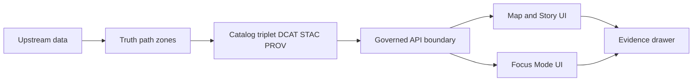
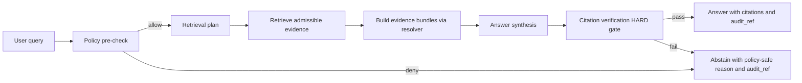
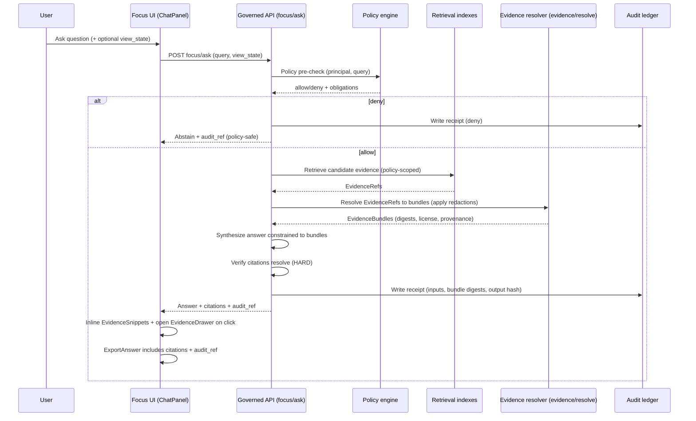
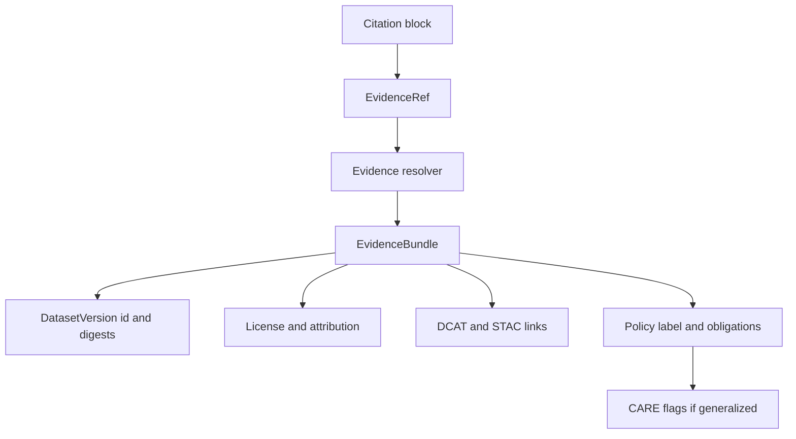

<!-- [KFM_META_BLOCK_V2]
doc_id: kfm://doc/6b1b2f3d-7d3f-4a8f-9c55-1c6c2e3f6d5a
title: Focus Mode UI Diagrams
type: standard
version: v1
status: draft
owners: kfm-ui (TBD)
created: 2026-03-01
updated: 2026-03-01
policy_label: public
related:
  - kfm://doc/TO_FILL__KFM_GDG_vNext
  - kfm://doc/TO_FILL__KFM_DeliveryPlan
  - kfm://contract/TO_FILL__focus_response_v1
tags: [kfm, diagrams, ui, focus-mode, governance, cite-or-abstain]
notes:
  - Source diagrams for Focus Mode control loop, trust surfaces, and citation handshake.
  - Keep this directory free of rendered/exported artifacts (commit sources only).
[/KFM_META_BLOCK_V2] -->

# Focus Mode UI diagrams
Governed diagram sources for **Focus Mode**: cite-or-abstain UX, evidence/citation handshake, and audit-first behaviors.

> TODO: Replace placeholder badges with real repo workflows / lints once known.

---

## Quick nav
- [Purpose](#purpose)
- [Where this fits](#where-this-fits)
- [What belongs here](#what-belongs-here)
- [What must not go here](#what-must-not-go-here)
- [Non-negotiable Focus Mode requirements](#non-negotiable-focus-mode-requirements)
- [Canonical diagrams](#canonical-diagrams)
- [Diagram conventions](#diagram-conventions)
- [Review checklist](#review-checklist)
- [Preview and export](#preview-and-export)
- [Appendix: Suggested file set](#appendix-suggested-file-set)

---

## Purpose
This folder is the **source-of-truth diagram set** for the Focus Mode UI surface.

These diagrams exist to:
- keep **implementation** aligned with KFM invariants (policy + evidence + audit),
- make the **trust membrane** and **trust surfaces** visible in UI flows,
- document **abstention** and **partial answer** UX so it is consistent across Map / Story / Focus.

---

## Where this fits
Focus Mode sits at the end of the governed pipeline, and must remain evidence-linked.

**Interpretation:** Focus Mode is not a “chat feature”; it is a **governed Q&A workflow** that must always route through the policy + evidence boundary and produce an audit reference.

---

## What belongs here
✅ **Diagram source files** that explain Focus Mode UI behavior and contracts, including:
- Control-loop diagrams (policy → retrieve → bundle → verify → receipt).
- Sequence diagrams (UI ↔ API ↔ evidence resolver ↔ policy).
- UI state diagrams (idle / retrieving / verifying / answered / abstained).
- Citation block / “evidence handshake” diagrams.
- Error + restriction UX (“no ghost metadata”, policy-safe messaging).
- Accessibility notes embedded *in diagrams* (keyboard paths, focus order).

**Preferred formats**
- Mermaid in Markdown (`.md`) or Mermaid source (`.mmd` / `.mermaid`).
- SVG only when it is **hand-authored** and diff-friendly (avoid binary exports).

---

## What must not go here
❌ **Do not commit outputs** or risky materials:
- Rendered exports (PNG/PDF) unless explicitly required by a downstream doc and approved.
- Screenshots containing real coordinates, restricted layers, or sensitive identifiers.
- Any secrets, tokens, credentials, or “sample responses” containing real restricted content.
- “Proof” diagrams that imply direct client access to DB/object storage (violates trust membrane).

> **WARNING:** If you need an example, synthesize **toy data** (e.g., “Dataset A”, “bbox=[…]”) and keep it policy-safe.

---

## Non-negotiable Focus Mode requirements
These are treated as **MUST** requirements for UI + flow diagrams.

### 1) Cite-or-abstain is a hard gate
Focus Mode must either:
- return an answer with **resolvable citations** (EvidenceRefs → EvidenceBundles), **or**
- **abstain / reduce scope** when citations cannot be verified.

### 2) Every Focus Mode run produces an audit reference
The UI must surface `audit_ref` in:
- success responses (exportable),
- abstentions (for follow-up),
- policy-safe error states.

### 3) Policy must be visible (not hidden)
When information is withheld or generalized, UI must:
- show *why* in policy-safe terms,
- show allowed alternatives,
- avoid revealing restricted existence (“ghost metadata”).

### 4) View-state context is supported
Focus Mode may accept **view_state hints** (bbox/time/layers) so it answers **in context** of the map.

---

## Canonical diagrams

### Focus Mode control loop

### Focus Mode UI + API sequence

### Citation block handshake

---

## Diagram conventions

### File naming
Use a consistent prefix:
- `focus-mode__control-loop.mmd`
- `focus-mode__sequence.mmd`
- `focus-mode__ui-states.mmd`
- `focus-mode__citation-handshake.mmd`
- `focus-mode__abstention-ux.mmd`

### Diagram headers inside files
At the top of each diagram file, include a short comment block:
- purpose (1–2 lines)
- last updated date
- related work package / contract (if known)
- sensitivity note (e.g., “toy examples only”)

### Normative language
Use:
- **MUST / MUST NOT** for requirements
- **SHOULD** for strong recommendations
- **MAY** for optional behaviors

And label anything implementation-specific as **PROPOSED** (unless proven in repo).

---

## Review checklist
Use this checklist in PRs that change Focus Mode diagrams:

- [ ] Control loop includes **policy pre-check** and **citation verification HARD gate**
- [ ] Abstention UX explains “why” in policy-safe terms and includes `audit_ref`
- [ ] Citations are modeled as **EvidenceRefs → EvidenceBundles** (not plain URLs)
- [ ] Diagram shows **EvidenceDrawer** / evidence inspection path
- [ ] View-state hint path is shown (bbox/time/layers)
- [ ] No diagrams imply UI bypasses governed API boundary
- [ ] No sensitive examples, no real restricted coordinates
- [ ] Mermaid renders in GitHub (or doc site) without custom plugins

---

## Preview and export

### Local preview (options)
- VS Code Mermaid extensions (fastest for iteration)
- Mermaid Live Editor (copy/paste; avoid sensitive content)
- CLI rendering (only if repo adopts it): `mmdc` / mermaid-cli (TODO: confirm toolchain)

> NOTE: Prefer committing **sources**. If exports are required, create a separate `docs/diagrams/rendered/` directory (only after governance + repo review).

---

## Appendix: Suggested file set
This folder currently documents the **expected** diagram set. Add files incrementally:

- `focus-mode__control-loop.mmd` — end-to-end cite-or-abstain loop
- `focus-mode__sequence.mmd` — UI/API/policy/evidence sequence
- `focus-mode__abstention-ux.mmd` — abstain + partial answer patterns
- `focus-mode__citation-handshake.mmd` — DOI/provider keys + DCAT/STAC + CARE flags
- `focus-mode__eval-harness.mmd` — golden queries + regression gate (CI)

---

Why this folder is “governed docs”

Focus Mode is explicitly treated as a governed workflow:
- it uses policy and evidence resolution as the source of truth,
- it fails closed when citations cannot be verified,
- it emits audit receipts for review.

Therefore diagrams that define Focus Mode behavior are not “nice-to-have” — they are part of the trust membrane and promotion gates.

---

[Back to top](#focus-mode-ui-diagrams)
