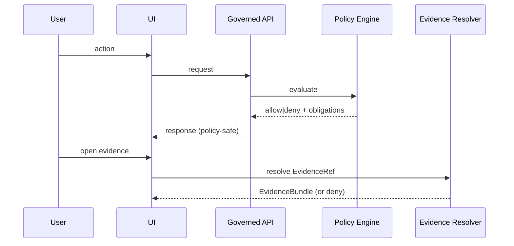
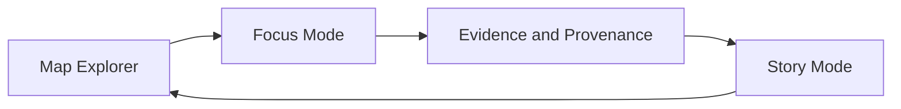

<!-- [KFM_META_BLOCK_V2]
doc_id: kfm://doc/2b17cb51-f92f-4f40-97b0-acde90c2b223
title: UI Interaction Flows
type: standard
version: v1
status: draft
owners: KFM UI/UX
created: 2026-03-01
updated: 2026-03-01
policy_label: public
related:
  - docs/diagrams/src/ui/README.md
  - docs/diagrams/src/ui/components/README.md
  - docs/diagrams/src/ui/states/README.md
  - docs/diagrams/src/ui/trust-surfaces/README.md
tags: [kfm, ui, diagrams, interaction-flows]
notes:
  - This directory is a governed documentation surface: treat flows as testable contracts.
  - Replace placeholder links/paths once repo paths are verified.
[/KFM_META_BLOCK_V2] -->

<a id="top"></a>

# UI Interaction Flows

**Purpose:** Canonical, testable interaction-flow diagrams for KFM’s Map Explorer, Story Mode, Focus Mode, and Admin/Steward UX.


 <!-- TODO: confirm for this repo -->

> **Non-negotiable UX posture**
> 
> These flows are not “screenshots of intent.” They are contracts for governed behavior: policy-visible, evidence-linked, and compatible with the trust membrane.

## Quick navigation

- [Where this fits](#where-this-fits)
- [What lives here](#what-lives-here)
- [Flow registry](#flow-registry)
- [Flow lifecycle](#flow-lifecycle)
- [Flow file template](#flow-file-template)
- [Core interaction loop](#core-interaction-loop)
- [Required trust surfaces](#required-trust-surfaces)
- [Directory tree](#directory-tree)
- [Contribution checklist](#contribution-checklist)
- [Appendix: Patterns](#appendix-patterns)

---

## Where this fits

This directory is part of the **UI diagrams** subtree:

- `docs/diagrams/src/ui/` → “how the UI behaves” diagrams
- `docs/diagrams/src/ui/interaction-flows/` → **user journeys** and **governed interaction sequences** (this directory)

If you’re looking for:

- component inventories → `docs/diagrams/src/ui/components/`
- UI state machines and state models → `docs/diagrams/src/ui/states/`
- evidence drawer, policy badges, provenance panels → `docs/diagrams/src/ui/trust-surfaces/`

---

## What lives here

**Accepted inputs (✅):**

- **Mermaid diagrams** (preferred) capturing:
  - user intent → UI actions → governed API calls → policy outcomes → evidence/provenance views
  - success paths **and** failure/abstention paths
- Short **flow specs** in Markdown:
  - entry points
  - preconditions
  - step-by-step sequence
  - policy posture and redaction obligations
  - evidence drawer / provenance panel touchpoints
  - test hooks (what should be asserted in e2e)

**Exclusions (🚫):**

- Pixel-perfect UI comps (put those in `docs/diagrams/src/ui/wireframes/` or design tooling).
- Backend-only pipelines (put those under pipeline / architecture diagrams).
- Any diagram that **exposes sensitive coordinates, restricted dataset existence, or privileged credentials**.

---

## Flow registry

> **NOTE**
> Keep this table current. It is the index that makes interaction flows discoverable and testable.

| Flow ID | Surface | Outcome | File | Status | Owner | Linked tests |
|---|---|---|---|---|---|---|
| (TODO) | Map Explorer | Add layer → open evidence | `flow--map-explorer--add-layer-and-open-evidence.md` | draft | (TODO) | (TODO) |
| (TODO) | Story Mode | Publish story w/ citation gate | `flow--story-mode--publish-story-with-citation-gate.md` | draft | (TODO) | (TODO) |
| (TODO) | Focus Mode | Ask → cite-or-abstain → export | `flow--focus-mode--ask-and-export-audited-answer.md` | draft | (TODO) | (TODO) |

---

## Flow lifecycle

Interaction flows support the KFM “governance-by-construction” loop.

1. **Draft**: diagram + step table + identified trust surfaces.
2. **Review**: stewardship check for policy-safe behavior and “abstain correctly” paths.
3. **Testable**: e2e assertions identified (what must be true when the user clicks X).
4. **Published**: referenced by UI implementation PRs and by QA gates.

> **TIP**
> Keep flows **PR-sized**. Prefer one flow per user outcome (e.g., “Add layer and inspect evidence”) over a mega-diagram.

---

## Flow file template

Create a new flow file as Markdown (`.md`) with an embedded Mermaid diagram.

**Naming (PROPOSED):**

- `flow--<surface>--<outcome>.md`
- Examples:
  - `flow--map-explorer--add-layer-and-open-evidence.md`
  - `flow--story-mode--publish-story-with-citation-gate.md`
  - `flow--focus-mode--ask-question-and-export-audited-answer.md`

### Minimal flow skeleton

```markdown
<!-- [KFM_META_BLOCK_V2]
doc_id: kfm://doc/<uuid>
title: <short outcome title>
type: standard
version: v1
status: draft
owners: <team>
created: YYYY-MM-DD
updated: YYYY-MM-DD
policy_label: <public|restricted|...>
related:
  - <PR / issue / component>
tags: [kfm, ui, interaction-flow]
[/KFM_META_BLOCK_V2] -->

# <Flow title>

## Goal

## Actors

## Preconditions

## Mermaid diagram



## Steps

| Step | User action | UI behavior | API calls | Trust surface shown | Expected policy result |
|---:|---|---|---|---|---|
| 1 | ... | ... | ... | ... | ... |

## Failure / abstention paths

## Test hooks

## Open questions
```

---

## Core interaction loop

This repository’s canonical interaction loop should remain visible in flow designs:



**Interpretation:** users explore in map/time, ask focused questions, inspect evidence/provenance, and then publish story nodes that replay map state.

---

## Required trust surfaces

Every interaction flow should explicitly show where the user can:

- open an **Evidence Drawer** from the relevant UI surface
- see **dataset version**, **license/rights**, **policy labels**, **freshness**, and **redactions/generalizations applied**
- access **run receipts / lineage** (when allowed)
- see a **policy notice** when something is withheld or generalized

> **WARNING**
> If your flow has no explicit trust surface, it is incomplete. “Trust surfaces are not optional polish.”

---

## Directory tree

> **NOTE**
> This tree is **intentionally conservative** because the full repo tree was not provided in this request. Add entries once the directory contents exist.

```text
docs/diagrams/src/ui/interaction-flows/
├── README.md
├── flow--<surface>--<outcome>.md           # one file per user outcome (preferred)
└── assets/                                 # optional: exported images / thumbnails
    ├── <flow-id>--thumbnail.png
    └── <flow-id>--export.svg
```

---

## Contribution checklist

Use this as a **Definition of Done** for a new interaction flow.

- [ ] Flow has a clear **goal** and **actor(s)** (public user, steward, etc.)
- [ ] Flow identifies **policy posture** for every data touchpoint (allow/deny/generalize)
- [ ] Flow explicitly includes **Evidence Drawer / Provenance** access points
- [ ] Flow includes at least one **failure path** (deny, abstain, unresolvable evidence)
- [ ] Flow includes **API call list** (endpoint + purpose) and expected response shape
- [ ] Flow includes **test hooks** (e2e assertions)
- [ ] Flow is linked to an implementation PR / issue (or marked “design-only”)

Back to top: [↑](#top)

---

## Appendix: Patterns

<details>
<summary><strong>Pattern: Policy-safe errors</strong></summary>

When policy denies access, the UI should:

- avoid leaking restricted dataset existence via distinct error shapes
- present a clear notice such as “Withheld due to policy”
- offer policy-safe alternatives when appropriate (e.g., generalized geometry)

</details>

<details>
<summary><strong>Pattern: Evidence resolution in ≤2 calls</strong></summary>

Design flows so the UI can resolve evidence with bounded calls:

1. fetch policy-safe map/data response from the governed API
2. resolve an EvidenceRef into an EvidenceBundle via the evidence resolver

If the flow requires more than this, call it out explicitly and justify the extra calls.

</details>
