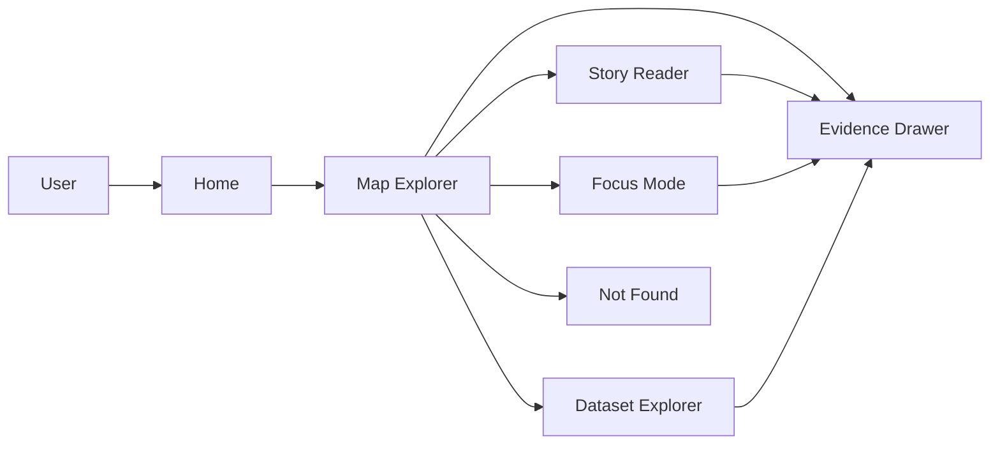
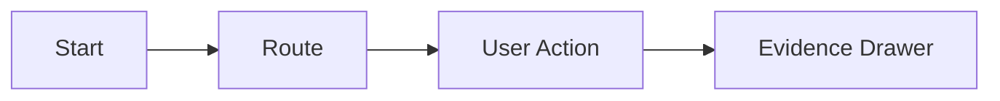

<!-- [KFM_META_BLOCK_V2]
doc_id: kfm://doc/1f4a4a1b-9b38-45e8-bc8e-1b1a1e9b1b5d
title: UI Route Diagrams
type: standard
version: v1
status: draft
owners: TODO:kfm-ui (not confirmed in repo)
created: 2026-03-01
updated: 2026-03-01
policy_label: public
related:
  - ../../../README.md
  - ../../../../../../README.md
tags: [kfm, diagrams, ui, routes]
notes:
  - Directory README for route topology diagrams (sources), not router code.
  - Route list is intentionally “fail-closed” until verified from actual router config.
[/KFM_META_BLOCK_V2] -->

# UI Route Diagrams (Source)

**Purpose:** Maintain the *source-of-truth diagrams* for KFM UI navigation and route-to-evidence flows (Map Explorer, Story Reader, Focus Mode) as **reviewable, versioned artifacts**.

> **Status:** draft • **Owners:** TODO:kfm-ui • **Policy label:** public (verify if any routes expose restricted-only admin surfaces)


<!--
TODO: Replace placeholder badges with real repo badges once known:
- CI workflow badge
- docs build badge
- linkcheck badge
-->

## Quick navigation

- [What lives here](#what-lives-here)
- [Where this fits in the repo](#where-this-fits-in-the-repo)
- [Directory layout](#directory-layout)
- [Route inventory registry](#route-inventory-registry)
- [Diagram conventions](#diagram-conventions)
- [Governance notes for routes](#governance-notes-for-routes)
- [Definition of Done](#definition-of-done)
- [Appendix: templates](#appendix-templates)

---

## What lives here

This directory contains **diagram source files** documenting:

- The UI **route topology** (what pages exist, what is nested, what is guarded)
- Critical **navigation flows** (e.g., Map → Evidence Drawer; Story citation → Evidence Drawer)
- The **policy boundary** expectations for each route (UI must use governed APIs; no direct DB/object storage access)

This directory does **not** contain:
- Router implementation code
- UI components themselves
- Screenshots exported from Figma (unless explicitly checked in as governed assets)

---

## Where this fits in the repo

- **You are here:** `docs/diagrams/src/ui/routes/`
- Intended relationship:
  - `docs/diagrams/src/**` = *editable diagram sources*
  - `docs/diagrams/out/**` (or similar) = *rendered outputs* (if the repo uses a build step)
  - UI runtime lives elsewhere (e.g., `apps/ui/` or `web/` or `src/ui/`) — **verify actual path in repo**.

---

## Directory layout

> NOTE: The exact filenames are **conventions**. Adjust to match what already exists in this folder.

```text
docs/diagrams/src/ui/routes/
├── README.md
├── route_map.mmd                  # Main route topology (Mermaid)
├── flow__map_to_evidence.mmd       # Click feature -> Evidence Drawer (Mermaid)
├── flow__story_citation_to_evidence.mmd
├── flow__focus_to_evidence.mmd
└── registry.routes.csv             # Optional: machine-readable route inventory (if adopted)
```

---

## Route inventory registry

This is the **human-readable registry** for routes. Keep it in sync with:
1) router config (code), and  
2) the diagrams in this directory.

> ⚠️ Until verified from the actual router config, treat the list below as **PLACEHOLDER**.  
> Replace each placeholder with the real route patterns and file links.

| Route (pattern) | Page / Surface | Evidence touchpoint | Policy boundary notes | Diagram |
|---|---|---|---|---|
| `/` | Map Explorer (placeholder) | Feature click opens Evidence Drawer | UI must fetch via governed API; never direct storage | `flow__map_to_evidence.mmd` |
| `/story/:slug` | Story Reader (placeholder) | Citation click opens Evidence Drawer | Publishing gate requires resolvable citations (design intent) | `flow__story_citation_to_evidence.mmd` |
| `/focus` | Focus Mode (placeholder) | Responses must be cite-or-abstain | Must verify citations via evidence resolver | `flow__focus_to_evidence.mmd` |
| `/datasets` | Dataset Explorer (placeholder) | Dataset detail links to evidence | Results policy-filtered by label | `route_map.mmd` |
| `/*` | Not Found | N/A | Policy-safe error behavior (no restricted inference) | `route_map.mmd` |

---

## Diagram conventions

### 1) Mermaid-first (preferred)
Use Mermaid so diffs are meaningful and reviewable.

- File suffix: `.mmd` (or `.md` with a Mermaid block)
- Keep node text short (avoid punctuation that breaks parsing)
- Add a plaintext summary under each diagram for LLM + accessibility robustness

### 2) Keep diagrams “governance-aware”
Every route diagram should annotate:

- **Evidence entry points:** where the Evidence Drawer is opened
- **Policy boundary:** which calls must go through governed APIs
- **Time-awareness entry points:** where time controls affect queries (if applicable)

---

## Canonical route map (starter)

> Replace with the authoritative route topology once verified.



Plaintext summary: User enters Home, navigates to Map Explorer. From Map Explorer, they may open Evidence Drawer, or navigate to Story Reader, Focus Mode, or Dataset Explorer. Evidence Drawer is reachable from Map, Story, Focus, and Dataset surfaces.

---

## Governance notes for routes

### Trust membrane rule (non-negotiable)
- The UI must **never** fetch data directly from object storage or databases.
- All data access must go through the **governed API boundary** and the **evidence resolver** where applicable.

### Evidence Drawer expectations (design intent)
When a map feature (or a story citation) is selected, Evidence Drawer should surface:
- dataset version identifier
- policy badge / policy label
- license / rights attribution
- resolvable evidence references (not “free-form URLs”)

### Sensitive location handling
If a route could surface sensitive locations (archaeology, species, etc.), ensure:
- restricted precise data is not exposed publicly
- public derivatives are generalized and non-reversible
- tile serving is policy enforced (no static bypass)

---

## Definition of Done

When adding/changing a UI route, the PR is “done” when:

- [ ] Router code updated (source-of-truth)
- [ ] Route inventory table updated (this README)
- [ ] Route map diagram updated (`route_map.mmd`)
- [ ] Any affected flow diagrams updated (Map/Story/Focus → Evidence)
- [ ] Evidence interactions are documented (what opens Evidence Drawer, what EvidenceRefs resolve)
- [ ] Policy boundary is respected (no direct storage/DB calls)
- [ ] CI checks related to citations/linkcheck/policy-safe behavior remain green (if configured)

---

## Appendix: templates

<details>
<summary>Mermaid flow template (copy/paste)</summary>



Plaintext summary: Describe what the flow does in one or two sentences.

</details>

---

### Back to top

[Back to top](#ui-route-diagrams-source)
