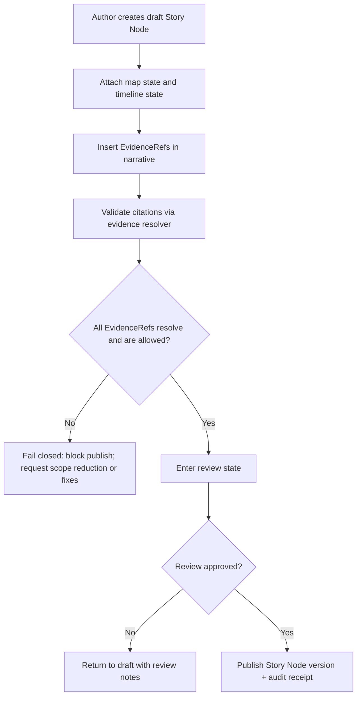
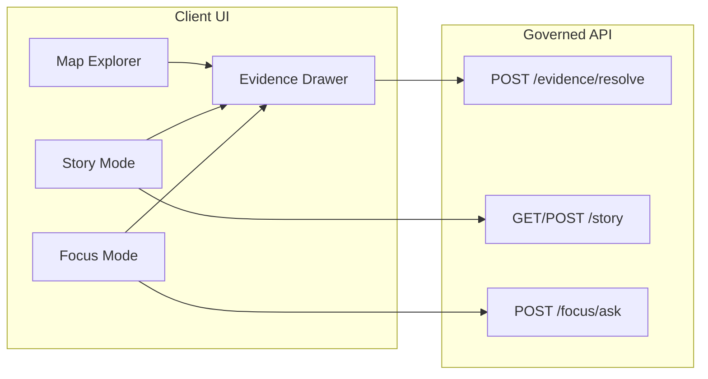

<!-- [KFM_META_BLOCK_V2]
doc_id: kfm://doc/2f4e6e4a-3ac5-4f2a-9f0e-bb0b7fe2aa42
title: Story Nodes UI Diagrams
type: standard
version: v1
status: draft
owners: TBD
created: 2026-03-01
updated: 2026-03-01
policy_label: public
related:
  - kfm://concept/story-nodes
  - kfm://concept/evidence-ref
  - kfm://concept/evidence-bundle
tags: [kfm, diagrams, ui, story-nodes]
notes:
  - Source-of-truth diagrams for Story Node UX flows, gates, and trust surfaces.
  - Keep claims implementation-agnostic unless explicitly confirmed elsewhere.
[/KFM_META_BLOCK_V2] -->

# Story Nodes UI Diagrams
**Purpose:** Source-of-truth, versioned diagrams for the **Story Nodes (v3) UX**—including publish gates, evidence resolution, and shared trust surfaces (Map Explorer / Story Mode / Focus Mode).


> **NOTE**
> This directory documents **intended UX + governance contracts**. If you need to assert what the repo *currently* implements, link to the confirming code/contract and update the “Confirmed in repo” column in the registry table below.

---

## Quick navigation
- [What lives here](#what-lives-here)
- [Directory layout](#directory-layout)
- [Diagram registry](#diagram-registry)
- [Diagram conventions](#diagram-conventions)
- [Review checklist](#review-checklist)
- [Example templates](#example-templates)

---

## What lives here

This folder contains diagrams for **how Story Nodes work in the UI**, specifically:

- How **narrative markdown** + a **map/timeline state sidecar** are assembled into a Story Node
- How **citations** are represented as **EvidenceRefs** and must resolve to **EvidenceBundles**
- Where the **trust membrane** sits (UI never bypasses governed APIs)
- Publishing lifecycle (draft → review → published), including **hard gates**

### In scope
- Mermaid source diagrams (`.mmd` / `.mermaid` / Markdown files containing Mermaid blocks)
- Supporting Markdown notes for diagrams (short, local, diagram-adjacent)
- Optional exported artifacts if your doc toolchain requires them (prefer generated outputs over committed binaries)

### Out of scope
- Actual story content (belongs in the governed story content area, not in `docs/diagrams/`)
- API schemas / OpenAPI contracts (belong under the contracts area)
- Screenshots as the authoritative diagram source (use Mermaid as the source of truth)

[Back to top](#story-nodes-ui-diagrams)

---

## Directory layout

> **PROPOSED layout** (adjust to match the repo once confirmed):

```text
docs/diagrams/src/ui/story-nodes/
├── README.md
├── sn-v3__publish-flow.mmd
├── sn-v3__view-and-navigate.mmd
├── sn-v3__evidence-drawer-contract.mmd
├── sn-v3__focus-to-story-handoff.mmd
└── assets/                        # optional: exported SVG/PNG (prefer generated)
```

---

## Diagram registry

Keep this table updated so reviewers can quickly see what exists, what it represents, and where it is used.

| Diagram ID | Title | Source file | Used by (UI surface) | Status | Confirmed in repo | Notes |
|---|---|---|---|---|---|---|
| SNV3-001 | Publish flow (draft → review → published) | `sn-v3__publish-flow.mmd` | Story Mode | draft | ☐ | Includes citation verification + policy gate |
| SNV3-002 | View + navigate (map state changes per step) | `sn-v3__view-and-navigate.mmd` | Story Mode | draft | ☐ | Focus on map/timeline synchronization |
| SNV3-003 | Evidence drawer contract (shared UI) | `sn-v3__evidence-drawer-contract.mmd` | Map + Story + Focus | draft | ☐ | EvidenceBundle display requirements |
| SNV3-004 | Focus Mode → Story Node handoff | `sn-v3__focus-to-story-handoff.mmd` | Focus + Story | draft | ☐ | How Q&A output becomes publishable narrative |

> **TIP**
> “Confirmed in repo” should link to the evidence: a contract file, a schema, a route handler, or an e2e test that enforces the behavior.

[Back to top](#story-nodes-ui-diagrams)

---

## Diagram conventions

### 1) Truth & governance posture
- Treat anything that affects publishing or user-visible claims as **governed**.
- Diagrams must **show gates explicitly** (e.g., “citation resolves”, “policy allows”, “review state present”).
- Prefer **requirement language** (“must”, “fails closed”) for invariants; label everything else as “proposed”.

### 2) Naming
Use stable, searchable filenames:

- `sn-v3__<topic>.mmd`
- Avoid spaces; use `kebab-case`
- Keep IDs stable (`SNV3-###`) even if filenames change

### 3) Mermaid hygiene
- Keep node labels short (avoid punctuation-heavy text)
- Avoid `|` in node text (it can break rendering in some Mermaid contexts)
- Put detailed notes below the diagram as bullets, not inside the diagram

### 4) Safety & sensitivity
- **Do not** put precise coordinates or “how to find” instructions for vulnerable locations.
- If you must reference sensitive categories (archaeology sites, endangered species, etc.), use coarse geography and clearly mark “restricted”.

---

## Review checklist

Use this checklist in PR review for any diagram change:

- [ ] Diagram identifies the **UI surface(s)** (Map / Story / Focus)
- [ ] Diagram shows the **governed boundary** (UI → governed API; no direct storage/DB access)
- [ ] Any “citation” path is modeled as **EvidenceRef → EvidenceBundle**
- [ ] Publishing flow includes **fail-closed gates** (non-resolvable citations block publish)
- [ ] Diagram captures **map state + timeline state** as first-class Story Node data
- [ ] Policy signals are visible (policy label, obligations/redaction if applicable)
- [ ] No sensitive targeting details (coordinates, site directions, etc.)
- [ ] Registry table updated (new/changed diagram listed)

[Back to top](#story-nodes-ui-diagrams)

---

## Example templates

### Story Node v3 lifecycle (starter diagram)



### Shared Evidence Drawer (trust surface)



---

## How to render diagrams locally (optional)

If your tooling supports Mermaid rendering (GitHub does), you may not need local export.
If you do need exports, prefer generating them in a build step rather than committing binaries.

```bash
# Example only: choose a renderer that matches your stack.
# mermaid-cli (mmdc) can export SVG/PNG from .mmd files.
mmdc -i sn-v3__publish-flow.mmd -o ../../assets/sn-v3__publish-flow.svg
```
