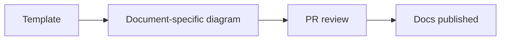
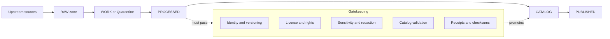
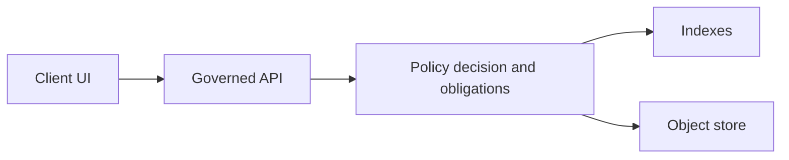

<!-- [KFM_META_BLOCK_V2]
doc_id: kfm://doc/3b1c1d91-12e6-4a3d-9d7c-3a4a0f31b00f
title: Diagram Templates
type: standard
version: v1
status: draft
owners: TBD
created: 2026-03-02
updated: 2026-03-02
policy_label: public
related:
  - docs/diagrams/README.md
  - docs/README.md
  - docs/adr/
  - contracts/
tags: [kfm, diagrams, templates]
notes:
  - This directory contains starter templates only. Place finalized diagrams near the docs they support.
  - Update owners once CODEOWNERS is confirmed.
[/KFM_META_BLOCK_V2] -->

# Diagram templates

**One-line purpose:** Reusable, governed diagram starters for KFM docs so architecture, data flows, and policy boundaries stay consistent across the repo.


> NOTE
> This folder is for *templates*. The diagram that supports a specific design decision should live with the document (ADR/runbook/spec) that makes that decision.

## Navigation

- [What belongs here](#what-belongs-here)
- [Directory layout](#directory-layout)
- [Template catalog](#template-catalog)
- [Conventions](#conventions)
- [How to use a template](#how-to-use-a-template)
- [Governance requirements](#governance-requirements)
- [Mermaid starter templates](#mermaid-starter-templates)
- [Definition of done](#definition-of-done)
- [Troubleshooting](#troubleshooting)

---

## What belongs here

These are **blank** or **minimally-filled** diagram starters that make it easy to create consistent visuals across KFM:

- Architecture diagrams showing **layers**, **trust boundaries**, and **governed interfaces**.
- Pipeline diagrams showing the **truth path** lifecycle zones.
- Catalog/provenance diagrams showing how **DCAT + STAC + PROV** relate.
- UI flow diagrams for Map, Story, and Focus Mode.
- “Patterns” diagrams (e.g., policy enforcement points, evidence resolution).

### Acceptable inputs

You may add templates in these formats:

- `*.mmd` / `*.mermaid` — Mermaid source (preferred when possible)
- `*.drawio` — draw.io source (when Mermaid is too limiting)
- `*.excalidraw` — Excalidraw source (whiteboard-style diagrams)
- `*.svg` — exported vectors **only when paired with the editable source**

### Exclusions

Do **not** put these in `docs/diagrams/templates/`:

- Final diagrams that only make sense in one document.
- Screenshots of dashboards or map UIs that cannot be regenerated.
- Diagrams containing sensitive locations, precise coordinates for vulnerable sites, or restricted operational details.
- Large binary exports **without** their editable source.

---

## Directory layout

This README defines a recommended layout. If the repo already uses a different structure, update this section to match reality.

```text
docs/diagrams/templates/                                | # Diagram templates hub (copy/paste starters + reusable snippets; kept policy-safe)
├─ README.md                                            | # You are here: template index, when to use which format, and “no secrets” rules
├─ mermaid/                                             | # Mermaid templates (preferred; lintable, diff-friendly)
├─ drawio/                                              | # Draw.io templates (only when text diagrams are insufficient; keep minimal)
├─ excalidraw/                                          | # Excalidraw templates (hand-drawn style; keep sources small and reviewed)
├─ exports/                                             | # OPTIONAL: rendered outputs used by docs (SVG/PNG; generated when possible)
└─ snippets/                                            | # OPTIONAL: reusable subgraphs, legends, and icon sets (shared building blocks)
```

---

## Template catalog

Add every new template here so people can discover and reuse it.

| Area | Template goal | Source format | Suggested filename | Used by |
|---|---|---:|---|---|
| Architecture | System context and trust boundaries | Mermaid | `mermaid/system-context.mmd` | ADRs, `docs/architecture/*` |
| Data lifecycle | Truth path zones and promotion gates | Mermaid | `mermaid/truth-path.mmd` | Ingest/runbooks |
| Governance | Policy enforcement and obligations | Mermaid | `mermaid/trust-membrane.mmd` | Policy docs |
| Catalog | DCAT + STAC + PROV relationships | Mermaid | `mermaid/catalog-triplet.mmd` | Catalog docs |
| UI flow | Map → Story → Focus Mode | Mermaid | `mermaid/ui-flow.mmd` | UX docs |

> TIP
> Prefer Mermaid when it renders cleanly in GitHub. Use draw.io/Excalidraw when you need richer layout control.

---

## Conventions

### Naming

- Use **kebab-case** filenames.
- Prefer *goal-driven* names (`trust-membrane.mmd`, not `diagram3.mmd`).
- If a template has variants, suffix with a stable discriminator: `*-simple`, `*-detailed`, `*-example`.

### Diagram semantics

- Always show the **policy boundary** when crossing from “untrusted client” → “governed API” → “storage/indexes”.
- For lifecycle diagrams, label the zones explicitly: `RAW`, `WORK`, `PROCESSED`, `CATALOG`, `PUBLISHED`.
- For time-aware diagrams, label time semantics when relevant (event time, valid time, transaction time).

### Source and export pairing

If you add a rendered export:

- Keep the editable source next to it.
- Put exports under `exports/` and follow this pairing rule:
  - `mermaid/foo.mmd` → `exports/foo.svg`
  - `drawio/bar.drawio` → `exports/bar.svg`

---

## How to use a template

1. Copy the closest template into the document’s local diagram folder (recommended) or into `docs/diagrams/` if it’s truly shared.
2. Edit it for the specific decision being documented.
3. Export to SVG (preferred) or PNG.
4. Embed it in the doc with a short caption and a link to the source diagram.

### GitHub-friendly Mermaid

When possible, embed Mermaid directly in the document so it stays diffable:



---

## Governance requirements

KFM diagrams are not “just pictures.” They are part of the governed design surface.

### Required boundaries

Your diagrams should make these boundaries explicit:

- **Truth path lifecycle** boundaries (what can be promoted and why)
- **Trust membrane** boundaries (clients do not directly access storage)
- **Policy-as-code** enforcement points (where obligations/redactions apply)

### Safety and sensitivity

- If the subject matter involves vulnerable sites, protected habitats, or culturally restricted knowledge, **do not** include precise coordinates.
- Prefer coarse geography, aggregation, or generalized geometry, and add a note: “Exact location redacted per policy.”

---

## Mermaid starter templates

These are starter diagrams you can paste into a new doc and adapt.

### Truth path lifecycle



### Governed query path



---

## Definition of done

A template PR is done when:

- [ ] Template has a clear goal and is added to the [Template catalog](#template-catalog)
- [ ] Filename follows conventions
- [ ] Mermaid diagrams render in GitHub (or provide a paired SVG export)
- [ ] No sensitive details are embedded
- [ ] Template includes labels for boundaries that matter (trust membrane, lifecycle zones)

---

## Troubleshooting

- **Mermaid renders differently locally vs GitHub:** simplify layout, shorten node labels, and avoid overly-nested subgraphs.
- **Text overlaps in SVG exports:** prefer SVG exports from a deterministic toolchain and keep labels short.
- **Diagram is too complex:** split into two diagrams: a context diagram and a detail diagram.

---

<a id="back-to-top"></a>
**Back to top:** [Diagram templates](#diagram-templates)
