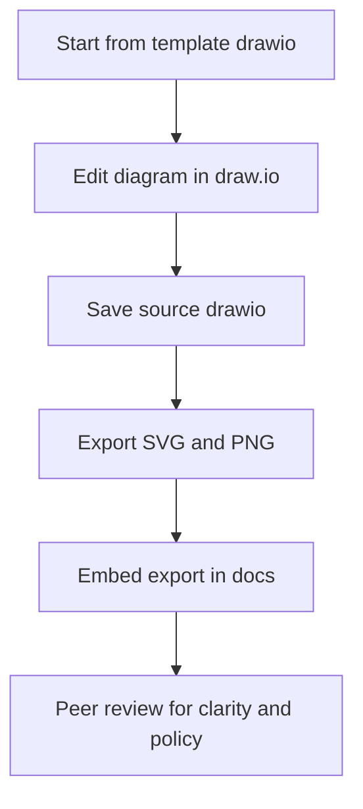

<!-- [KFM_META_BLOCK_V2]
doc_id: kfm://doc/6d4fbf45-9675-4ce5-9414-5d5461171cf5
title: Draw.io diagram templates
type: standard
version: v1
status: draft
owners: TBD
created: 2026-03-02
updated: 2026-03-02
policy_label: public
related:
  - docs/diagrams/README.md
  - docs/diagrams/templates/
  - docs/diagrams/exports/
  - contracts/
  - policy/
  - data/
  - apps/
  - packages/
tags: [kfm, diagrams, drawio, templates]
notes:
  - This README is the contract for what belongs in docs/diagrams/templates/drawio.
  - Keep it additive; avoid breaking existing links.
[/KFM_META_BLOCK_V2] -->

# Draw.io diagram templates

**Purpose:** Standard templates + shared assets for creating consistent, governed diagrams (architecture, data flow, catalogs, UI flows) using draw.io/diagrams.net.


**Directory:** `docs/diagrams/templates/drawio/`

## Navigation

- [What belongs here](#what-belongs-here)
- [What must not go here](#what-must-not-go-here)
- [Recommended workflow](#recommended-workflow)
- [Naming conventions](#naming-conventions)
- [Template registry](#template-registry)
- [Quality gates](#quality-gates)
- [Security and sensitivity rules](#security-and-sensitivity-rules)
- [FAQ](#faq)

---

## Where this fits in KFM

KFM documentation treats diagrams as **first-class governed artifacts**: they should be reproducible, reviewable, and traceable to the same evidence/policy posture as code and data.

This directory is specifically for **reusable building blocks** (templates, shared shape libraries, styles) — not for one-off diagrams.

---

## What belongs here

### Allowed file types

- **Template sources (required)**
  - `*.drawio` (preferred)
  - `*.drawio.xml` (acceptable)

- **Shared libraries (optional but encouraged)**
  - `*.drawio` libraries exported from draw.io/diagrams.net (shape libraries)

- **Template documentation**
  - `README.md` (this file)
  - `CHANGELOG.md` (if/when template changes need tracking)

### Allowed content

- Architecture templates (layering, trust membrane, deployment topology)
- Data lifecycle templates (truth path zones, promotion gates)
- Catalog templates (STAC, DCAT, PROV high-level maps)
- UI/UX flow templates (Map, Story Node, Focus Mode)
- Legend/key templates (map symbology notes, policy label legend)

---

## What must not go here

- **Exports of specific diagrams** (put those in `docs/diagrams/` or `docs/diagrams/exports/`, depending on your repo conventions).
- **One-off diagrams tied to a single ADR/story** (they belong next to that doc).
- **Unlicensed third-party icon packs** (ensure rights are compatible before committing).
- **Sensitive targetable details** (exact coordinates, vulnerable-site details, or culturally restricted site markers).

> WARNING: If you are unsure whether a diagram includes sensitive location details, **fail closed**: generalize, redact, or label it for governance review.

---

## Recommended workflow



### 1) Create a diagram from a template

- Open the relevant template in draw.io/diagrams.net.
- **Save as a new file** (do not overwrite the base template unless you are explicitly improving the template).

### 2) Keep sources and exports paired

Rule of thumb:
- If you commit an export (`.svg` / `.png`), **also commit the source** (`.drawio`) somewhere in the repo.

### 3) Export settings (recommended)

- **SVG:** preferred for docs (diff-friendly-ish, crisp text).
- **PNG:** optional for contexts that require raster images.
- Use:
  - Transparent background (when it improves readability in docs)
  - 2× scale (or higher) for PNG when the diagram is dense

### 4) Link diagrams from Markdown

Example:

```md

```

---

## Naming conventions

Keep names boring, searchable, and stable.

### Template files

- `kfm-template-<topic>-v<major>.drawio`

Examples:
- `kfm-template-truth-path-v1.drawio`
- `kfm-template-trust-membrane-v1.drawio`
- `kfm-template-story-node-flow-v1.drawio`

### Library files

- `kfm-library-<domain>-v<major>.drawio`

Examples:
- `kfm-library-icons-v1.drawio`
- `kfm-library-architecture-shapes-v1.drawio`

---

## Template registry

Add every reusable template to this table so people can find it.

| Template | File | Use for | Notes |
|---|---|---|---|
| Truth path | `kfm-template-truth-path-v1.drawio` | RAW→WORK→PROCESSED→CATALOG→PUBLISHED diagrams | TODO: add file |
| Trust membrane | `kfm-template-trust-membrane-v1.drawio` | client→API→policy→stores boundary diagrams | TODO: add file |
| Architecture layering | `kfm-template-layering-v1.drawio` | Domain→Use case→Interface→Infra | TODO: add file |

> TIP: Prefer a small number of canonical templates over many near-duplicates.

---

## Quality gates

Before committing a new/updated template:

- [ ] **Source included:** `.drawio` is present and opens cleanly.
- [ ] **No pixel-text:** text remains selectable (avoid embedding text as bitmaps).
- [ ] **Legibility:** readable at typical doc widths.
- [ ] **Consistency:** matches KFM layering and governed-access patterns.
- [ ] **No sensitive leakage:** no precise vulnerable locations; no operational secrets.
- [ ] **Stable IDs:** avoid volatile auto-generated filenames like `diagram (3).drawio`.

---

## Security and sensitivity rules

Diagrams can accidentally leak sensitive information.

When depicting locations, sites, sensors, or sensitive infrastructure:

- Use **coarse geography** (county/region) instead of coordinates.
- Replace specifics with placeholders (e.g., `Sensitive Site A`).
- If a diagram is needed for internal work, label it appropriately and keep it out of public docs.

---

## FAQ

### Why keep `.drawio` sources?

Because exported images are hard to maintain. Source files keep diagrams editable and allow review of what changed.

### Why templates instead of “just draw it”?

Templates reduce churn and improve comprehension across the codebase: consistent shapes, names, and flows.

### Can we use Mermaid instead?

Yes—Mermaid is excellent for many diagrams. Use draw.io when you need:
- complex layout control
- mixed iconography
- non-trivial annotations

---

<a id="back-to-top"></a>
**Back to top:** [↑](#drawio-diagram-templates)
