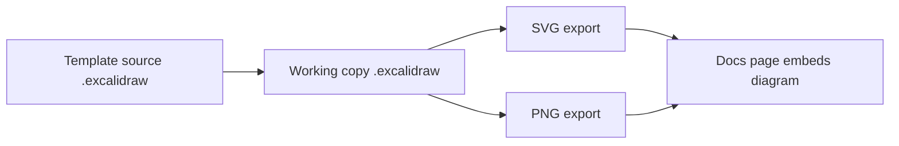

<!-- [KFM_META_BLOCK_V2]
doc_id: kfm://doc/2ab6b86e-b7c5-4013-8a63-6ef6f25ef0f0
title: Excalidraw Diagram Templates
type: standard
version: v1
status: draft
owners: KFM Maintainers
created: 2026-03-02
updated: 2026-03-02
policy_label: public
related:
  - docs/diagrams/
  - docs/templates/
tags: [kfm, diagrams, excalidraw, templates]
notes:
  - This directory contains reusable Excalidraw templates (sources), not final published diagrams.
  - Review for sensitive content before promoting to public docs.
[/KFM_META_BLOCK_V2] -->

# Excalidraw Diagram Templates
Reusable **Excalidraw** templates for consistent KFM diagrams (architecture, data lifecycle, policy boundaries, UI flows).


-lightgrey)

<!-- TODO: Add repo-specific CI badge once workflow name/path is confirmed. -->

## Quick navigation
- [What belongs here](#what-belongs-here)
- [Suggested directory layout](#suggested-directory-layout)
- [How to use a template](#how-to-use-a-template)
- [Template conventions](#template-conventions)
- [Export rules](#export-rules)
- [Governance and safety](#governance-and-safety)
- [Definition of done](#definition-of-done)
- [Troubleshooting](#troubleshooting)

---

## What belongs here
This directory is for **template sources** that help the repo produce diagrams with a consistent “house style.”

### ✅ Acceptable inputs
- `*.excalidraw` template files (Excalidraw scene JSON).
- Optional preview exports for browsing templates in Git:
  - `*.svg` (preferred for crisp rendering)
  - `*.png` (acceptable for quick previews)

### ❌ Exclusions
- **Final diagrams** tied to a specific subsystem, ADR, Story Node, or dataset release.
  - Put those in the appropriate `docs/diagrams/...` location for the diagram’s topic.
- Proprietary / sensitive / restricted content (see [Governance and safety](#governance-and-safety)).
- Secrets, tokens, internal URLs, or anything that would violate policy if published.

> NOTE  
> If you *must* include an external image in a template (rare), you also need a license/rights note and a policy label. Prefer not to embed images inside templates at all.

---

## Suggested directory layout
The exact layout may evolve; keep it simple and discoverable.

```text
docs/diagrams/templates/excalidraw/
  README.md
  TEMPLATE_CATALOG.md              # Optional: index of templates and intended uses
  _previews/                       # Optional: lightweight SVG/PNG previews for browsing
  architecture/                    # Templates for system architecture diagrams
  data-lifecycle/                  # Templates for truth-path/promotion/lineage diagrams
  policy-and-governance/           # Templates for trust membrane + policy enforcement flows
  ui-ux/                           # Templates for Map/Story/Focus flows and components
```

If you add a new folder, document it in this README (or in `TEMPLATE_CATALOG.md`).

---

## How to use a template
1. **Open** a template `*.excalidraw` file in Excalidraw.
2. **Duplicate** it to your working location (do *not* edit the template directly unless you’re improving the template itself).
3. **Edit** the working copy to match the specific diagram you need.
4. **Export** as SVG (preferred) and/or PNG, and store exports next to the Markdown doc that embeds them.
5. **Link back** to the source template in the diagram’s caption or surrounding doc text.



---

## Template conventions

### Naming
Use predictable, grep-friendly names.

**Template files**
- `TEMPLATE__<area>__<intent>__v<major>.excalidraw`

Examples:
- `TEMPLATE__architecture__layered-services__v1.excalidraw`
- `TEMPLATE__data-lifecycle__truth-path__v1.excalidraw`
- `TEMPLATE__ui-ux__story-node-flow__v1.excalidraw`

**Preview files (optional)**
- `TEMPLATE__...__v1.preview.svg`
- `TEMPLATE__...__v1.preview.png`

### Minimal metadata (recommended)
For templates that will be reused widely, add a small sidecar file:

- `TEMPLATE__...__v1.meta.yaml`

Example:

```yaml
template_id: kfm://diagram-template/<slug>
title: "Truth path lifecycle diagram"
version: v1
owner: "KFM Maintainers"
policy_label: public
intended_use:
  - docs/architecture/
  - docs/governance/
notes:
  - "Keep labels generic; avoid naming internal databases or credentials."
```

### Visual style (house defaults)
- Prefer **simple shapes**, consistent spacing, and short labels.
- Use **one primary flow direction** (left-to-right or top-to-bottom).
- Avoid walls of text; put explanation in the surrounding Markdown.
- Keep “policy” and “trust boundary” elements visually distinct (box/border/label).

---

## Export rules
- Prefer **SVG** for diagrams embedded in docs (sharp at any zoom).
- Use **PNG** only when necessary (e.g., compatibility or when SVG renders poorly).
- Keep exports small and legible:
  - Use a consistent canvas size.
  - Remove unused/off-canvas elements.
- If you export both SVG and PNG, keep them adjacent and similarly named.

Recommended: include a short caption near where the diagram is embedded:

- what the diagram represents,
- the template it came from,
- and the policy label (if not obviously public).

---

## Governance and safety
Diagrams are not “just pictures” in KFM—they are part of the governed, evidence-first system.

### Required posture
- Do **not** publish diagrams that imply bypassing policy boundaries (e.g., clients talking directly to storage).
- Diagrams that describe data movement should reflect the truth-path lifecycle (RAW → WORK/QUARANTINE → PROCESSED → CATALOG/TRIPLET → PUBLISHED).

### Sensitive content
Treat diagrams like code and data:
- No secrets (API keys, tokens, credentials).
- No sensitive coordinates/locations if policy requires generalization.
- No restricted vendor contracts or private endpoints unless the doc is explicitly restricted and stored appropriately.

When in doubt: **default-deny** and route for governance review.

---

## Definition of done
A new or updated template is “done” when:
- [ ] A `*.excalidraw` source exists with a stable name and version.
- [ ] The template is listed in `TEMPLATE_CATALOG.md` (if present) or documented in this README.
- [ ] (Optional) A preview SVG/PNG exists under `_previews/` for quick browsing.
- [ ] The template has a policy label (explicit in metadata or clearly implied by placement).
- [ ] No sensitive content is introduced (self-review or steward review where required).

---

## Troubleshooting

### The diff is huge after a small change
- Excalidraw files are JSON and can reorder/rewire IDs.
- Mitigation:
  - Make fewer edits per commit.
  - Avoid large copy/paste operations when possible.
  - Consider exporting an SVG preview to aid reviewers.

### Fonts/layout look different across machines
- Prefer SVG export.
- Keep spacing generous; avoid relying on pixel-perfect alignment.

### I’m not sure where the final diagram should live
Use this rule of thumb:
- Templates: **here**
- Final diagrams: next to the doc that uses them (e.g., architecture docs, governance docs, ADRs, Story Nodes)

---

<details>
<summary>Appendix: Suggested template catalog fields</summary>

If you maintain `TEMPLATE_CATALOG.md`, these columns work well:

- Template (path)
- Intended use (docs paths)
- Owner
- Policy label
- Last updated (date)
- Notes

</details>

---

⬆️ Back to top: [Quick navigation](#quick-navigation)
