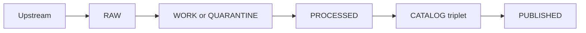
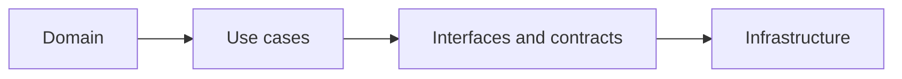

<!-- [KFM_META_BLOCK_V2]
doc_id: kfm://doc/65df0594-2c76-4f2e-81fd-a30c04c0bbc5
title: Mermaid Diagram Templates
type: standard
version: v1
status: draft
owners: TBD
created: 2026-03-02
updated: 2026-03-02
policy_label: public
related:
  - TODO: link to docs/diagrams/README.md (if/when it exists)
tags: [kfm, diagrams, mermaid, templates]
notes:
  - Canonical Mermaid templates for KFM diagrams used across docs, ADRs, and Story Nodes.
  - Keep diagrams compatible with GitHub Mermaid rendering.
[/KFM_META_BLOCK_V2] -->

# Mermaid diagram templates
One place for **governed, reusable Mermaid diagram templates** used throughout KFM docs and Story Nodes.


<!-- TODO: add real CI / linkcheck badges once repo paths are confirmed -->

## Navigation
- [What lives here](#what-lives-here)
- [Directory contract](#directory-contract)
- [Template registry](#template-registry)
- [Mermaid style guide](#mermaid-style-guide)
- [How to use a template](#how-to-use-a-template)
- [Render and validate](#render-and-validate)
- [Contributing](#contributing)
- [Appendix](#appendix)

---

## What lives here
This directory is the **template library** for Mermaid diagrams that appear in:
- architecture docs
- governance docs (truth path, promotion contract, trust membrane)
- pipeline docs (ingest → validate → promote → publish)
- Story Nodes (narratives that need consistent visual language)

The intent is to keep diagrams:
- **consistent** (same shapes, labels, directionality),
- **reviewable** (diff-friendly text),
- **portable** (works in GitHub Markdown rendering),
- **governable** (supports evidence-first + policy labeling).

<a id="directory-contract"></a>
## Directory contract
**Where it fits in the repo**
- `docs/diagrams/templates/mermaid/` is the home for Mermaid *source templates* (`.mmd` or `.md` snippets).

**Acceptable inputs**
- Mermaid source files meant to be **copied or embedded** into Markdown docs.
- Supporting assets that improve reuse (e.g., small helper snippets, naming guidelines).
- A registry entry in this README for each template you add.

**Exclusions**
- Large exported artifacts (PNG/SVG/PDF renders). Put those in an `exports/` or `docs/diagrams/exports/` directory (if/when it exists).
- One-off diagrams that are only useful to a single doc. Those belong next to the doc that owns them.
- Sensitive or targeting content (e.g., precise coordinates of vulnerable sites). If a diagram must reference sensitive places, **generalize** and add a redaction note.

**Expected layout (proposed)**
```text
docs/diagrams/templates/mermaid/
  README.md                        # This file (directory contract + registry)
  templates/                       # Reusable diagram sources (Mermaid)
    kfm-truth-path-v1.mmd          # Lifecycle zones flow (Upstream→...→Published)
    kfm-promotion-contract-v1.mmd  # Promotion gates overview
    kfm-trust-membrane-v1.mmd      # Policy boundary + governed APIs
    kfm-layering-model-v1.mmd      # Domain→Use cases→Interfaces→Infrastructure
    kfm-evidence-resolver-v1.mmd   # EvidenceRef → EvidenceBundle sequence
  snippets/                        # Small copy/paste helpers for docs
    mermaid-init-defaults.md       # Recommended Mermaid init block
```
> NOTE: The filenames above are *proposed* conventions. Adjust once the repository has a confirmed diagram inventory.

---

## Template registry
Use this table as the **single index** of templates in this directory. Add a row for every new template.

| Template ID (proposed) | File (relative) | Diagram type | Primary use | Status |
|---|---|---|---|---|
| `kfm://diagram/truth-path@v1` | `templates/kfm-truth-path-v1.mmd` | flowchart | Lifecycle zones and promotion flow | planned |
| `kfm://diagram/promotion-contract@v1` | `templates/kfm-promotion-contract-v1.mmd` | flowchart | Gates A–G overview | planned |
| `kfm://diagram/trust-membrane@v1` | `templates/kfm-trust-membrane-v1.mmd` | flowchart | Policy boundary + governed APIs | planned |
| `kfm://diagram/layering@v1` | `templates/kfm-layering-model-v1.mmd` | flowchart | Domain → Use cases → Interfaces → Infra | planned |
| `kfm://diagram/evidence-resolver@v1` | `templates/kfm-evidence-resolver-v1.mmd` | sequence | EvidenceRef → EvidenceBundle with obligations | planned |

> If you are bootstrapping this folder: start by creating the 5 “planned” templates above, then flip `planned → active`.

---

## Mermaid style guide
These are house rules to keep diagrams readable, diffable, and compatible.

### Compatibility and readability
- Prefer `flowchart LR` or `flowchart TD` for architecture and lifecycle diagrams.
- Keep node text short; move detail into surrounding prose.
- **Do not use** the `|` character in node text (it renders poorly and breaks some tooling).
- Use stable node IDs (`raw_zone`, `work_zone`, `pep_api`) so diffs stay clean.

### Labels and naming
- Node IDs: `snake_case`
- File names: `kebab-case`
- Diagram titles: use Markdown headings **outside** Mermaid blocks.

### Governance-friendly diagram patterns
When a diagram implies a claim about the system (data flow, boundaries, policy enforcement), ensure the surrounding doc:
- states whether it is **Confirmed / Proposed / Unknown**
- links to evidence (design doc, ADR, code path, policy)
- avoids implying clients bypass the governed API boundary.

### Template header (recommended)
Put a small comment header at the top of each `.mmd` template so reviewers can understand intent and status:

```mermaid
%% template_id: kfm://diagram/<slug>@v1
%% title: Short human title
%% status: draft | active | deprecated
%% owners: TBD
%% updated: 2026-03-02
%% assumptions:
%%   - This diagram is conceptual (Proposed) unless linked to a specific ADR / implementation.
```

### Default init snippet (optional)
If you need consistent rendering defaults, use an init block. Keep it conservative so it works on GitHub:

```mermaid
%%{init: {"flowchart": {"curve": "linear"}}}%%
```

---

## How to use a template
Most docs will embed Mermaid directly.

### Inline embed (preferred)
Copy the template content into your doc:

```markdown

```

### Reference-only usage
GitHub Markdown doesn’t (reliably) “include” external Mermaid files. If your doc toolchain supports includes, keep the include macro **adjacent** to a fallback copy.

Example pattern (pseudo):
```markdown
<!-- include: docs/diagrams/templates/mermaid/templates/kfm-truth-path-v1.mmd -->
<!-- fallback: copy the Mermaid block below if include is not supported -->
```

---

## Render and validate
### Quick manual checks
- View the Markdown on GitHub to confirm it renders.
- Ensure nodes and arrows match the intent of the surrounding text.

### Optional local rendering
If you want deterministic renders for review (optional):
```bash
# Install Mermaid CLI (one common option)
npm i -g @mermaid-js/mermaid-cli

# Render a template to SVG
mmdc -i templates/kfm-truth-path-v1.mmd -o /tmp/kfm-truth-path.svg
```

> NOTE: CI integration for rendering/linting is **not confirmed** in the repo. Add it only when there’s a clear promotion gate for docs artifacts.

---

## Contributing
### Add a new template
1. Create `templates/<name>-v1.mmd`
2. Keep it small and reusable.
3. Add a row to the [Template registry](#template-registry).
4. In your PR description, include:
   - what docs will use it (links)
   - whether it is Confirmed or Proposed
   - any policy/sensitivity considerations

### Update an existing template
- Prefer additive changes (new nodes, clearer labels) over renaming node IDs.
- If you must change node IDs, treat it like a breaking change: bump the template version.

---

## Appendix
### Starter templates
#### Truth path template (starter)


#### Layering model template (starter)


---

[Back to top](#mermaid-diagram-templates)
