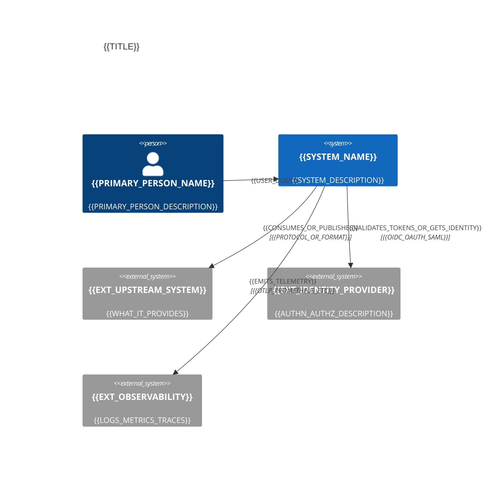
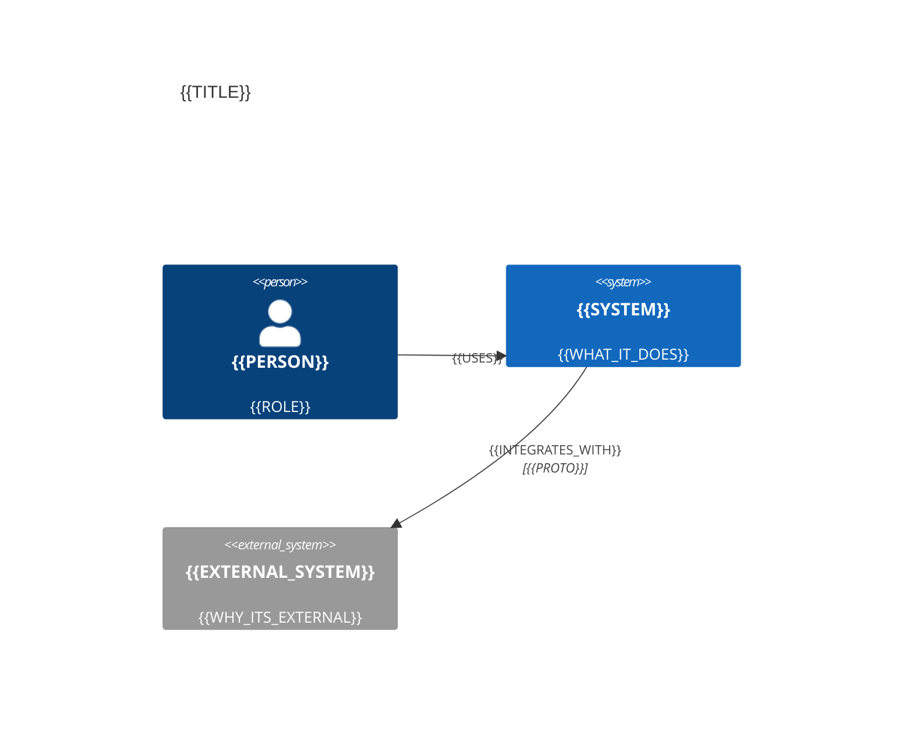
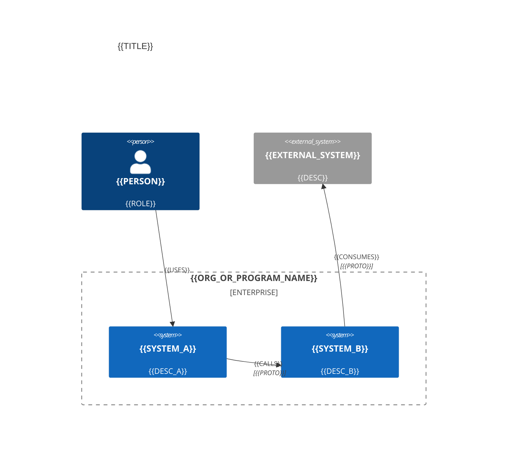

<!-- [KFM_META_BLOCK_V2]
doc_id: kfm://doc/c40181cc-432b-41d1-a5fd-3f54104c9ccf
title: Mermaid C4 Context Diagram Template
type: standard
version: v1
status: draft
owners: TODO
created: 2026-03-02
updated: 2026-03-02
policy_label: public
related:
  - docs/diagrams/README.md
  - docs/diagrams/templates/mermaid/
tags: [kfm, diagram, mermaid, c4]
notes:
  - Template for C4 context diagrams using Mermaid's C4 syntax.
  - Replace all placeholders wrapped in {{double_curly_braces}}.
[/KFM_META_BLOCK_V2] -->

# Mermaid C4 Context Diagram Template

**Purpose:** A copy/paste template for creating **C4 System Context** diagrams in Mermaid.  
**Use when:** You want to show **people + the system-of-interest + external systems** and the **major relationships** between them.

---

## Quick links

- [Usage](#usage)
- [Template](#template)
- [KFM conventions](#kfm-conventions)
- [Checklist](#checklist)
- [Appendix: snippet library](#appendix-snippet-library)

---

## Usage

1. Copy this file to a new diagram doc (recommended):
   - `docs/diagrams/{{area}}/{{diagram_slug}}.md`
2. Replace placeholders like `{{SYSTEM_NAME}}`.
3. Render Mermaid in your Markdown viewer (GitHub, MkDocs, VS Code extension, etc.).

> TIP: Keep context diagrams **small**: ~5–15 elements is usually enough.

---

## Template

Paste the diagram block below into your doc and replace placeholders.

---

## KFM conventions

These are **project conventions** for KFM diagrams. If your diagram is not for KFM, you can ignore this section.

### Naming and IDs

- Mermaid element IDs should be `snake_case` (e.g., `kfm_api`, `usgs_nwis`).
- Display names should be **human-readable** and stable.
- Prefer one system-of-interest per context diagram.

### Relationships

- Use relationship labels that are **verbs**: “Queries”, “Publishes”, “Validates”, “Streams”.
- If the relationship crosses a governance boundary, call it out (e.g., “Policy-enforced query”).

### Trust membrane hint

If your diagram touches access control or governance, prefer showing **clients calling a governed API**
instead of direct storage access (that is, keep “storage” behind the policy boundary).  

> NOTE: In KFM, this is part of the “trust membrane” posture: UI/clients do not access storage directly;
> access should go through governed APIs and policy enforcement. (See KFM governance/design guide.)  

---

## Checklist

Use this quick checklist before merging a diagram doc:

- [ ] Title describes **what** and **which boundary** (“System Context for …”).
- [ ] Every external dependency is clearly labeled as **external** (`System_Ext`).
- [ ] Each relationship is directional and uses a short verb phrase.
- [ ] No sensitive details are exposed (e.g., internal hostnames, credentials, or precise coordinates for vulnerable sites).
- [ ] If governance is relevant, the policy boundary is not bypassed in the picture.

---

## Appendix: snippet library

### Minimal (smallest useful context diagram)

### Optional: use an enterprise boundary

Use this when you want to show a *platform* boundary that contains multiple systems, while still staying
at “context” granularity.

---

### Notes on Mermaid compatibility

Mermaid C4 support depends on your renderer/version.
If your renderer does not support `C4Context`, you have two options:

1. Switch to a renderer that supports Mermaid C4 (recommended).
2. Fall back to a standard Mermaid flowchart and keep the same semantics (people, system, externals).
