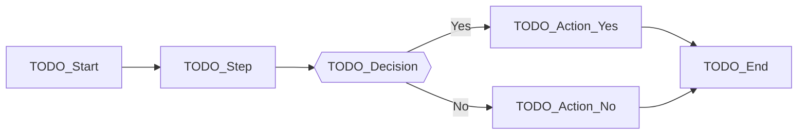
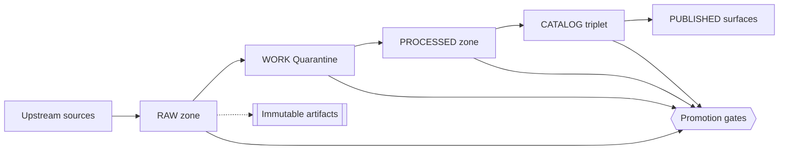
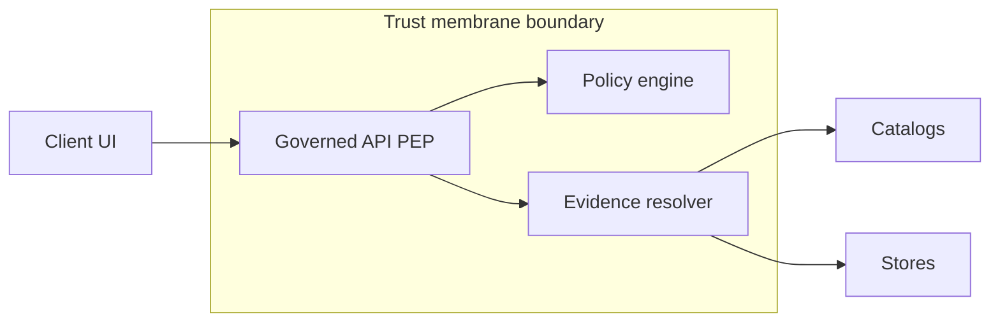

<!-- [KFM_META_BLOCK_V2]
doc_id: kfm://doc/6ee07f07-cd37-4517-9927-08d0013e0d36
title: Mermaid Flowchart Template
type: standard
version: v1
status: draft
owners: KFM Maintainers (TODO)
created: 2026-03-02
updated: 2026-03-02
policy_label: public
related:
  - docs/diagrams/templates/mermaid/
tags: [kfm, diagrams, mermaid, template]
notes:
  - Copy this file, rename it, and replace all TODO markers.
  - Keep diagrams small and reversible. Prefer multiple diagrams over one mega-diagram.
[/KFM_META_BLOCK_V2] -->

# Mermaid Flowchart Template

**Purpose:** A reusable, governed template for Mermaid `flowchart` diagrams in KFM docs.

  

**Owners:** KFM Maintainers (TODO)  
**Last updated:** 2026-03-02

## Navigation

- [How to use this template](#how-to-use-this-template)
- [Diagram quality checklist](#diagram-quality-checklist)
- [Template flowchart scaffold](#template-flowchart-scaffold)
- [KFM reference examples](#kfm-reference-examples)
- [Truth discipline section to copy](#truth-discipline-section-to-copy)
- [Appendix: Mermaid tips](#appendix-mermaid-tips)

---

## How to use this template

1. **Copy** this file to the location where your doc lives (or keep it in-place and copy sections).
2. **Rename** the new file (example: `docs/diagrams/<topic>.flow.md`).
3. **Update metadata**:
   - MetaBlock header `doc_id`, `owners`, `status`, and `policy_label`.
4. **Replace TODO markers** and remove any sections you do not need.
5. **Keep diagrams reviewable**:
   - Prefer 1–3 diagrams per doc.
   - If a diagram gets too dense, split into sub-diagrams.

> [!WARNING]
> If your diagram describes a user-facing claim (a dataset, layer, story, or Focus Mode behavior),
> treat it as a governed artifact: keep it evidence-linked and policy-aware.

---

## Diagram quality checklist

Use this checklist before you consider the diagram “done”:

- [ ] **One purpose per diagram** (data flow, component topology, policy boundary, etc.).
- [ ] **Clear direction** (`LR` for left-to-right or `TD` for top-down).
- [ ] **Stable node IDs** (do not rely on label text as the identifier).
- [ ] **Boundary clarity**:
  - Policy boundary / trust membrane is explicit when relevant.
  - Data lifecycle zone transitions are explicit when relevant.
- [ ] **No sensitive leakage**:
  - Do not include precise coordinates for sensitive sites.
  - Use generalized geography or redacted labels where required.
- [ ] **Readable labels**:
  - Prefer short node labels.
  - Avoid abbreviations unless defined in the doc.
- [ ] **Legend included** if using symbols, colors, or classes.
- [ ] **Matches reality**:
  - If the repo or system behavior is not verified, label it as **PROPOSED** or **UNKNOWN**.

---

## Template flowchart scaffold

Copy and edit the following. Replace `TODO_*` placeholders.

---

## KFM reference examples

These examples are **reference patterns** you can adapt. Keep them aligned with KFM invariants
(truth path + trust membrane) when those concepts are in scope for your diagram.

### Example 1: Truth path lifecycle

### Example 2: Trust membrane and policy boundary

---

## Truth discipline section to copy

Use these tags and keep them explicit in the text around the diagram:

- **CONFIRMED:** supported by evidence (cite it).
- **PROPOSED:** an implementation option (include rationale + tradeoffs).
- **UNKNOWN:** needs verification (include minimum verification steps).

### Minimum verification steps

When you label something as **UNKNOWN**, add a tiny checklist like:

- [ ] Locate the relevant module / contract / policy file
- [ ] Confirm the behavior in tests or CI logs
- [ ] Link to the evidence artifact (path, schema, receipt, or doc section)

---

## Appendix Mermaid tips

### Keep Mermaid diff-friendly

- Prefer many small edits over rewriting a whole diagram.
- Add `%%` comments to explain tricky intent.
- Avoid long edge labels; move explanation into surrounding text if needed.

### Rendering notes

Mermaid renders on GitHub when the code fence is labeled `mermaid`. If your target viewer does not
render Mermaid, include a fallback image (or link) near the diagram.

<a href="#mermaid-flowchart-template">Back to top</a>
