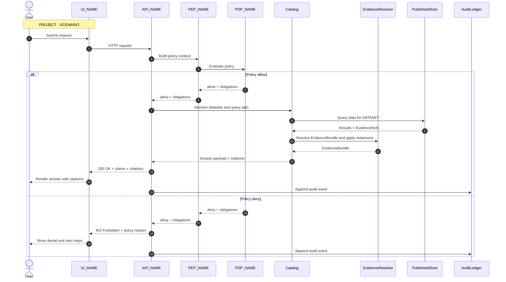
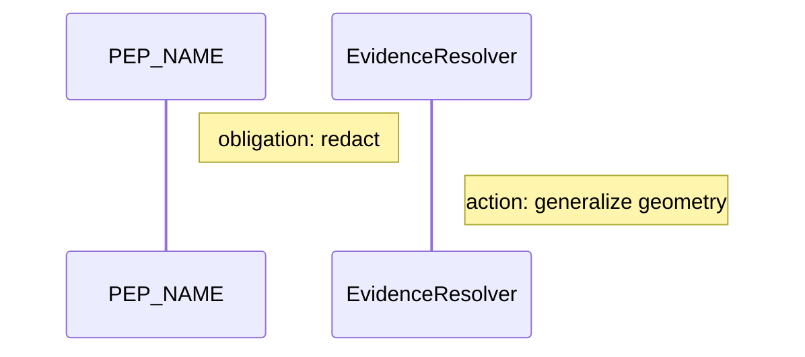
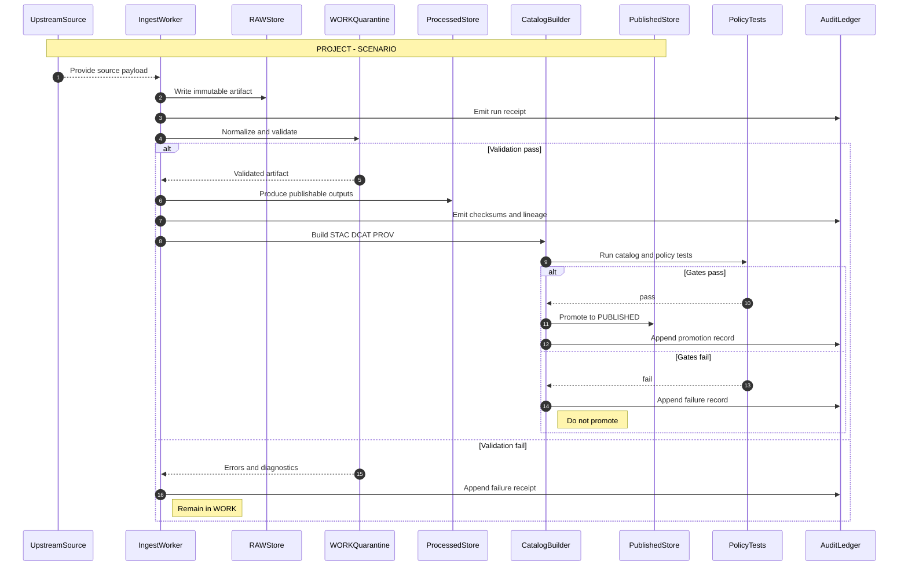

<!-- [KFM_META_BLOCK_V2]
doc_id: kfm://doc/<uuid>
title: Mermaid Sequence Diagram Template
type: standard
version: v1
status: draft
owners: <team or names>
created: YYYY-MM-DD
updated: YYYY-MM-DD
policy_label: public
related:
  - docs/diagrams/README.md
  - docs/architecture/README.md
  - contracts/openapi/
  - policy/
  - data/
tags: [kfm, diagram, mermaid, sequence]
notes:
  - Copy this file, replace <uuid> and dates, then edit the diagram blocks.
[/KFM_META_BLOCK_V2] -->

# Mermaid sequence diagram template

Status: **draft template**  
Owners: **<team or names>**

Use this template to document **end-to-end interactions** across KFM layers (UI → governed APIs → policy boundary → data/cat/provenance → storage/indexing), and to make **gates, evidence, and audit** explicit.

## Navigation

- [Template rules](#template-rules)
- [Placeholders](#placeholders)
- [Template A: Governed runtime request](#template-a-governed-runtime-request)
- [Template B: Ingest and promotion flow](#template-b-ingest-and-promotion-flow)
- [Checklist](#checklist)

## Template rules

- **Sequence diagrams show responsibility boundaries.** Use them when you need to prove that clients do not bypass governed APIs, and that policy + evidence are enforced.
- **Make policy decisions observable.** Include the policy boundary actor and show allow/deny and obligations.
- **Make the truth path visible.** If the diagram involves data movement, show the zone transitions (RAW → WORK → PROCESSED → CATALOG → PUBLISHED).
- **Attach evidence, not vibes.** When the flow produces a user-facing claim, show where citations are resolved and returned.
- **Prefer short participant names.** Avoid punctuation-heavy labels.

## Placeholders

Replace these tokens when you copy the template:

- `PROJECT`: system or feature name
- `SCENARIO`: short scenario description
- `UI_NAME`: the UI surface, e.g. Map UI, Story UI, Focus Mode
- `API_NAME`: the governed API service
- `PEP_NAME`: policy enforcement point name
- `PDP_NAME`: policy decision point name
- `DATASET`: dataset or layer identifier
- `EVIDENCE_KIND`: citation type, e.g. doc, dataset, run_receipt

Tip: keep placeholders as plain words so Mermaid does not break.

---

## Template A: Governed runtime request

Use when you need to document the **trust membrane**: client requests go through the governed API, policy is evaluated, obligations are applied, and evidence is returned.

### Notes to customize

- If the request is **time-aware**, add a note showing which time concept is used (event time, valid time, transaction time).
- If the request triggers **rebuildable** operations (tiles, indexes), add optional steps after `Catalog`.
- If the answer is **redacted/generalized**, make the obligation explicit:

---

## Template B: Ingest and promotion flow

Use when you need to document **data movement** across zones and the **promotion contract**.

### Notes to customize

- Add explicit gates as needed:
  - license check
  - sensitivity classification
  - schema validation
  - link integrity
- If there is a human approval step, include it as an `actor` and place it **before** promotion.

---

## Checklist

Before you commit a new sequence diagram derived from this template:

- [ ] Every client access goes through a governed API (no direct storage access shown).
- [ ] Policy evaluation is shown with an allow/deny branch.
- [ ] Obligations are either applied (redaction/generalization) or explicitly marked as not applicable.
- [ ] Evidence resolution is shown when user-facing claims are returned.
- [ ] Data movement (if any) shows the zone transitions and where promotion can fail closed.
- [ ] Audit events are included for success and failure.
