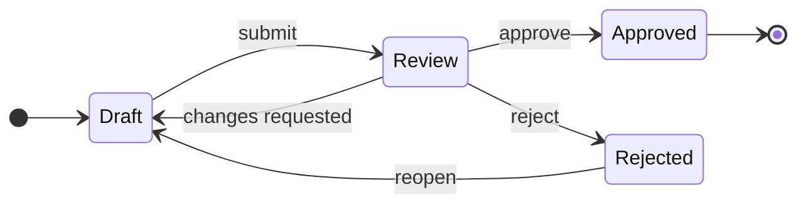
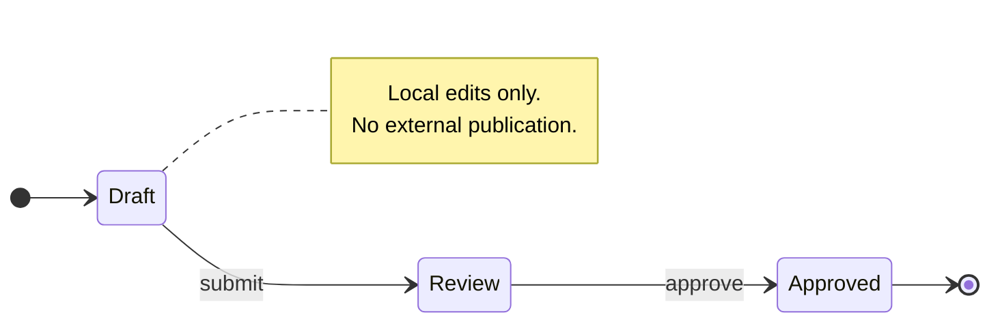
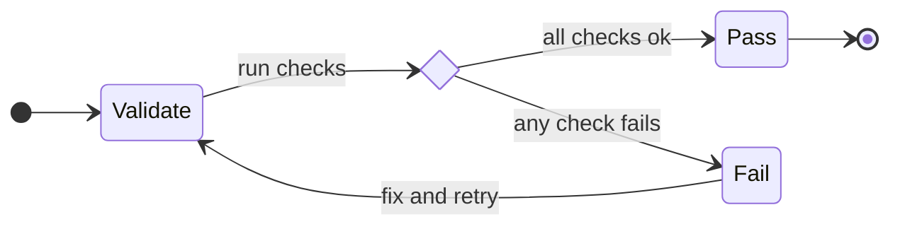
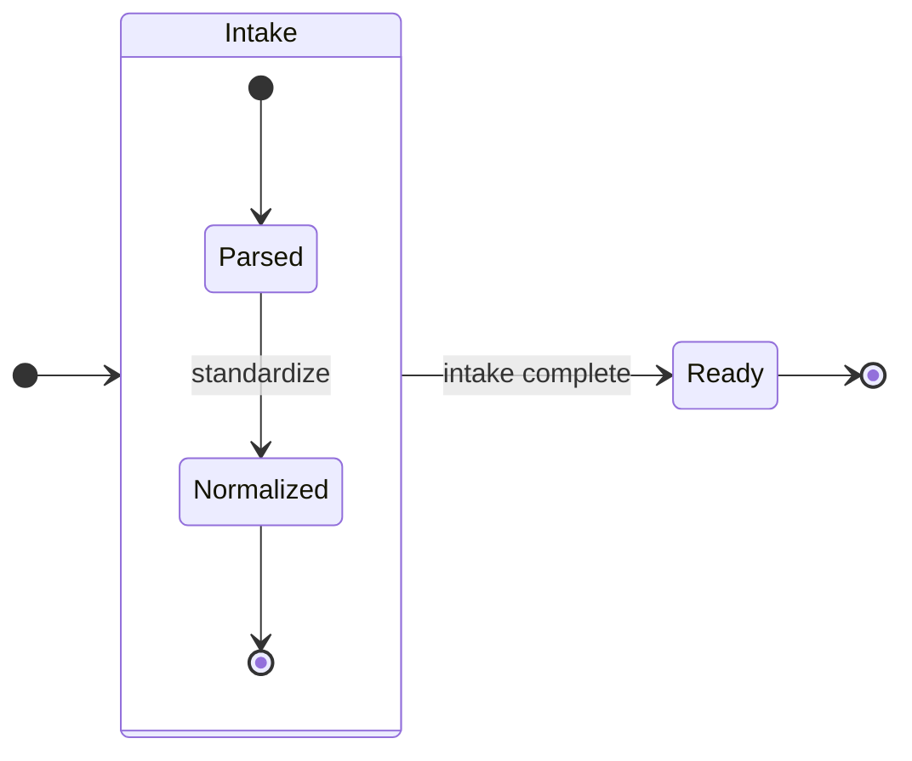
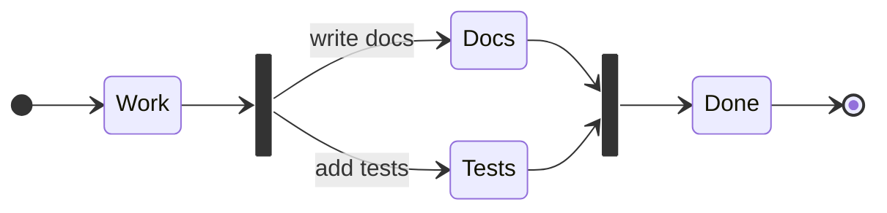
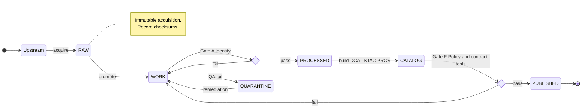
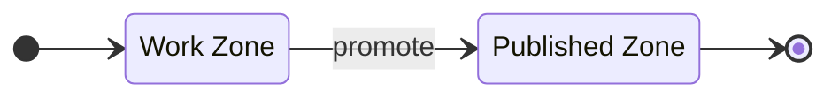

<!-- [KFM_META_BLOCK_V2]
doc_id: kfm://doc/8fca1c53-0e1a-4a0c-8e1f-4b3d5c1b89f9
title: Mermaid State Machine Template
type: standard
version: v1
status: draft
owners: TODO
created: 2026-03-02
updated: 2026-03-02
policy_label: public
related:
  - docs/diagrams/README.md
  - docs/diagrams/templates/mermaid/README.md
  - kfm://doc/TODO
tags: [kfm, diagrams, mermaid, template, state-machine]
notes:
  - Template for Mermaid stateDiagram-v2 diagrams used across KFM docs.
  - Keep diagram labels short. Put detail in surrounding prose.
[/KFM_META_BLOCK_V2] -->

# Mermaid State Machine Template

> **Purpose:** A copy-paste starter for authoring clear, reviewable **state machine** diagrams using Mermaid `stateDiagram-v2`.

## Navigation

- [When to use this template](#when-to-use-this-template)
- [Template placeholders](#template-placeholders)
- [Diagram template](#diagram-template)
- [Patterns you can reuse](#patterns-you-can-reuse)
- [Example KFM promotion truth path](#example-kfm-promotion-truth-path)
- [Quality checklist](#quality-checklist)

---

## When to use this template

Use a **state machine diagram** when you need to show:

- A lifecycle with **discrete states** and **explicit transitions**
- What causes a transition (event, condition, gate)
- Where the process can **fail**, **retry**, or **stop**
- Which states are **terminal** vs **intermediate**

Do **not** use a state machine when you really need:

- A dataflow or architecture view → use a **flowchart** template instead
- A timeline of events → use a **sequence** or **timeline** diagram
- System topology → use a **C4** or deployment diagram

> NOTE
> State machines are best when the question is: “**What state are we in, and what can happen next?**”

[Back to top](#mermaid-state-machine-template)

---

## Template placeholders

Replace the values in this table (or delete the table if you don’t need it).

| Placeholder | Meaning | Example |
|---|---|---|
| `TITLE` | Diagram title used in surrounding prose | `Dataset promotion lifecycle` |
| `OWNER` | Owning team or module | `packages/ingest` |
| `UPDATED_YYYY_MM_DD` | Last reviewed date | `2026-03-02` |
| `STATE_*` | Your domain states | `RAW`, `WORK`, `PUBLISHED` |
| `event` labels | Transition triggers | `promote`, `reject`, `retry` |
| `Gate X` labels | Governance/CI gates | `Gate A: Identity` |

> TIP
> Keep **state names** short (1–3 words). Put detail in transition labels or notes.

[Back to top](#mermaid-state-machine-template)

---

## Diagram template

Copy this block and edit states and transition labels.

### Optional notes

You can attach short notes to clarify intent without bloating labels.

[Back to top](#mermaid-state-machine-template)

---

## Patterns you can reuse

### Choice state

Use choice states to make a decision explicit.

### Composite state

Use composite states when a “state” contains its own mini-lifecycle.

### Parallel work

Use fork and join to show parallel tasks that must both complete.

> WARNING
> If your diagram needs many parallel branches, you may be modeling a **workflow engine**, not a state machine.

[Back to top](#mermaid-state-machine-template)

---

## Example KFM promotion truth path

This example mirrors the **truth path** idea and the minimum promotion gates. Adjust names to match the current contracts you’re documenting.

> NOTE
> The exact gate names and states should match the authoritative KFM governance docs.

[Back to top](#mermaid-state-machine-template)

---

## Quality checklist

Before you merge a new state machine diagram, ensure:

- [ ] Every transition has a **clear trigger** (event, condition, or gate)
- [ ] Terminal states are obvious (use `[*]` where appropriate)
- [ ] States use a consistent tense and casing (e.g., nouns like `RAW`, `WORK`)
- [ ] “Failure” states are explicit and show **how to recover** (retry, rollback, quarantine)
- [ ] Labels are short enough to render well on typical screen widths
- [ ] No sensitive details are included in labels or notes

### Diagram hygiene

- Prefer `direction LR` for wide lifecycles.
- Keep state IDs simple: `CamelCase` or `ALL_CAPS`.
- Avoid long punctuation-heavy labels.

[Back to top](#mermaid-state-machine-template)

---

## Appendix

### Mermaid quick reference

- Prefer Mermaid `stateDiagram-v2`.
- Use `state "Human name" as ID` when you need display text separate from an identifier.

