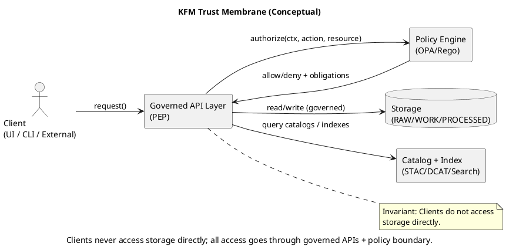
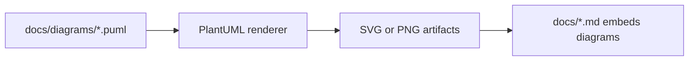

<!-- [KFM_META_BLOCK_V2]
doc_id: kfm://doc/1f0b4c74-9e38-4f5c-9c1f-6d4f0e1c9a2a
title: PlantUML Templates
type: standard
version: v1
status: draft
owners: kfm-core
created: 2026-03-02
updated: 2026-03-02
policy_label: public
related:
  - docs/diagrams/README.md
  - docs/diagrams/templates/plantuml/
tags: [kfm, diagrams, plantuml, templates]
notes:
  - This README defines the folder contract and proposed conventions for PlantUML diagram templates used across KFM docs.
[/KFM_META_BLOCK_V2] -->

# PlantUML Templates
Reusable **PlantUML** templates + includes for **consistent, governed architecture diagrams** across KFM.


> **Goal:** Make diagrams easy to author, hard to drift, and safe to publish (no secrets, no sensitive coordinates, evidence-first).

---

## Quick navigation
- [What lives here](#what-lives-here)
- [How to use templates](#how-to-use-templates)
- [How to render diagrams](#how-to-render-diagrams)
- [Conventions](#conventions)
- [Template catalog](#template-catalog)
- [Example diagram](#example-diagram)
- [Definition of done](#definition-of-done)
- [Repository-specific TODOs](#repository-specific-todos)

---

## What lives here

This directory is intended to hold **shared PlantUML assets** (includes, skinparams, and skeleton templates) used by `.puml` diagrams elsewhere under `docs/diagrams/`.

### Directory contract
| Path | Purpose | Acceptable inputs |
|---|---|---|
| `docs/diagrams/templates/plantuml/README.md` | This guide | Markdown only |
| `docs/diagrams/templates/plantuml/includes/` | Shared `!include` files (skinparams, macros, legend) | `.puml` include fragments |
| `docs/diagrams/templates/plantuml/templates/` | Diagram skeletons (component, sequence, activity, etc.) | `.puml` full templates |
| `docs/diagrams/templates/plantuml/examples/` | Small examples demonstrating usage | `.puml` + rendered output (optional) |

> NOTE: If your repo uses a different layout, update this README to match actual paths. The above is a **proposed** layout.

### Exclusions (what must *not* go here)
- ❌ Secrets, tokens, credentials, internal hostnames, private endpoints
- ❌ Sensitive locations or exact coordinates for vulnerable sites (use coarse geography)
- ❌ One-off project diagrams that don’t generalize (those belong under `docs/diagrams/<topic>/`)

---

## How to use templates

### 1) Create a diagram `.puml`
Place your diagram near the doc that references it, typically under `docs/diagrams/`.

Example: `docs/diagrams/architecture/kfm-trust-membrane.puml`

### 2) Include shared styling/macros
From a `.puml` under `docs/diagrams/**`, include shared files using relative paths.

```plantuml
@startuml
' Example include paths (adjust if your diagram sits deeper)
!include templates/plantuml/includes/kfm_skin.puml
!include templates/plantuml/includes/kfm_legend.puml
!include templates/plantuml/includes/kfm_macros.puml

title KFM Trust Membrane (Conceptual)
caption Source-of-truth: governed APIs + policy boundary
@enduml
```

### 3) Keep the `.puml` as the source of truth
Preferred pattern:
- Commit the **source** `.puml`
- Optionally commit **rendered** `.svg` (best for docs) and/or `.png` (best for wikis)

---

## How to render diagrams

> GitHub renders Mermaid natively; it **does not** render PlantUML natively. You’ll typically render to SVG/PNG and embed the artifact.

### Option A: Local PlantUML (jar)
```bash
# Example (paths may differ)
plantuml -tsvg docs/diagrams/**/*.puml
```

### Option B: Docker (no Java install)
```bash
# Linux/macOS example
docker run --rm -v "$PWD:/workspace" plantuml/plantuml -tsvg /workspace/docs/diagrams/**/*.puml
```

### Option C: CI rendering (recommended)
Add a CI job that:
1) renders `.puml -> .svg`
2) fails if rendering fails
3) (optional) checks that committed SVGs are up to date

---

## Conventions

### Naming
Use stable, grep-friendly names:

**Recommended:**
- `kfm__<area>__<diagram-type>__<topic>.puml`

Examples:
- `kfm__governance__component__trust-membrane.puml`
- `kfm__pipelines__sequence__promotion.puml`

### Diagram types we encourage
- **Component** diagrams: boundaries, responsibilities, trust membrane, API surfaces
- **Sequence** diagrams: ingest → validate → receipt → promote; UI → API → policy
- **Activity** diagrams: promotion gates, incident workflow, QA checks

### Evidence-first annotation
When a diagram makes a claim that should be traceable, add a short note/caption:

- what it describes (“conceptual”, “current”, or “proposed”)
- where to verify (file path, ADR id, contract id)

Example:
```plantuml
note bottom
Status: proposed
Verify: contracts/openapi/... and policy/... (paths TBD)
end note
```

### Safety and governance guardrails
- Treat diagram text as **publishable content**.
- Don’t include:
  - internal IPs, cluster names, or secrets
  - restricted dataset identifiers unless policy allows
  - precise coordinates for sensitive sites
- If the diagram is restricted, mark it clearly in the title/caption and keep it out of public docs exports.

---

## Template catalog

> This is the intended catalog. Create these files (or adjust the list) as the repo evolves.

| Template / Include | Type | Use when | Notes |
|---|---|---|---|
| `includes/kfm_skin.puml` | include | consistent typography/colors | centralize `skinparam` |
| `includes/kfm_macros.puml` | include | re-usable macros/stereotypes | keep small + composable |
| `includes/kfm_legend.puml` | include | standard legend + meaning | reduces diagram ambiguity |
| `templates/template-component.puml` | template | system boundaries | “trust membrane” friendly |
| `templates/template-sequence.puml` | template | end-to-end flows | good for promotion gates |
| `templates/template-activity.puml` | template | decision/gate logic | good for CI/policy gates |

---

## Example diagram

### Trust membrane (conceptual component diagram)


### How these templates fit in the doc toolchain


---

## Definition of done

When you add or change a template/include in this folder:

- [ ] The file is reusable (not a one-off)
- [ ] Paths are relative and documented
- [ ] There is at least one example diagram exercising it
- [ ] Rendering succeeds locally (and in CI if configured)
- [ ] No secrets / sensitive coordinates / restricted content leaks
- [ ] The change is small and reversible (template changes can impact many diagrams)

---

## Repository-specific TODOs

These items require repo verification (update once confirmed):

- [ ] Confirm where `.puml` sources live (expected: `docs/diagrams/**`)
- [ ] Decide whether rendered outputs are committed (`.svg` preferred)
- [ ] Add a CI job to render PlantUML and fail on errors
- [ ] Add a lightweight “diagram lint” checklist (naming, includes, forbidden strings)
- [ ] Confirm policy labels and any restricted-doc handling for diagrams

---

<a id="top"></a>
**Back to top:** [PlantUML Templates](#plantuml-templates)
