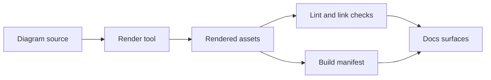

<!-- [KFM_META_BLOCK_V2]
doc_id: kfm://doc/5f9f1b9b-6b33-4c1f-965a-6dbadce37e2a
title: Diagram Tooling
type: standard
version: v1
status: draft
owners: TBD
created: 2026-03-02
updated: 2026-03-02
policy_label: restricted
related:
  - ../README.md
  - ../../architecture/diagrams/
tags: [kfm, diagrams, tools]
notes:
  - Directory README for scripts/configs/templates used to render and validate diagram assets.
[/KFM_META_BLOCK_V2] -->

# Diagram Tooling

**Purpose:** Reproducible scripts, configs, and templates for rendering and validating KFM diagrams.

[](#)
[](#)
[](#)

## Quick links

- [What belongs here](#what-belongs-here)
- [What must not go here](#what-must-not-go-here)
- [Expected layout](#expected-layout)
- [Toolchain](#toolchain)
- [Reproducible workflow](#reproducible-workflow)
- [Adding or changing tools](#adding-or-changing-tools)
- [Definition of Done](#definition-of-done)
- [Minimum verification steps](#minimum-verification-steps)

---

## What belongs here

Put **tooling that supports diagrams** here (not the diagrams themselves):

- **Render helpers**: scripts to turn source diagrams into SVG/PNG/PDF (deterministic outputs).
- **Lint + validation**: format checks, link checks, diagram syntax validation.
- **Templates**: style tokens, icon registries, diagram boilerplates, layout conventions.
- **Receipts/manifests**: lightweight metadata files that record *how* a diagram was rendered (tool version, inputs, outputs).

> TIP: If a diagram is part of a user-facing claim or architecture decision, treat its build steps as a governed artifact: render must be reproducible, inputs traceable, and outputs reviewable.

## What must not go here

- **Source-of-truth diagrams** (keep them in the diagram source directory for this repo).
- **Large rendered assets** (SVG/PNG) unless you intentionally vendor them as templates.
- **Secrets** (tokens, internal endpoints, credentials).
- **Unlicensed fonts / icon packs**.

> WARNING: Avoid embedding sensitive locations, private infrastructure details, or restricted data flows in diagrams that could be published externally. When unsure, generalize and link to internal evidence instead.

---

## Expected layout

This README cannot confirm what currently exists in your working tree.

- **Current inventory:** run `tree -L 3 docs/diagrams/tools` and paste/update this section.
- **Expected (proposed) layout:** use this as a target structure for predictable tooling.

```text
docs/diagrams/tools/
  README.md                      # this file
  bin/                           # executable helpers (scripts, wrappers)
    render-diagrams.*            # renders supported diagram sources
    lint-diagrams.*              # lint/validate diagram sources
    verify-rendered-up-to-date.* # fail if committed renders drift
  configs/
    mermaid.json                 # renderer config (if using Mermaid)
    plantuml.properties          # renderer config (if using PlantUML)
  templates/
    diagram.manifest.yaml        # template: diagram build manifest (inputs/outputs/tool versions)
    styles.md                    # shared style rules for diagrams
  vendor/
    icons/                       # only if license permits; prefer small, curated sets
```

---

## Toolchain

Use **text-first diagrams** when possible so diffs are reviewable and builds are reproducible.

| Diagram type | Source file (examples) | Renderer | Notes |
|---|---|---|---|
| Mermaid | `*.mmd`, Markdown fenced blocks | `mmdc` (Mermaid CLI) or docs-site renderer | Best for architecture + flow diagrams |
| PlantUML | `*.puml` | `plantuml.jar` | Great for UML-ish diagrams |
| Graphviz | `*.dot` | `dot` | Useful for graphs, dependency trees |
| Draw.io | `*.drawio` | draw.io export | Prefer only when text-first is insufficient |

> NOTE: The table above is **guidance**, not a claim about what is already installed or adopted in this repo.

---

## Reproducible workflow

The goal is that diagrams behave like build artifacts:

- sources are versioned
- renders are deterministic
- CI can confirm renders are up-to-date
- changes remain reversible



### Recommended manifest format

Store a small manifest per diagram (or per diagram set) so reviewers can reproduce renders.

```yaml
# templates/diagram.manifest.yaml
schema: kfm.diagram.manifest.v1

diagram_id: example-architecture-flow
owner: TBD
policy_label: restricted

inputs:
  - path: docs/diagrams/src/architecture-flow.mmd
    role: mermaid_source

tooling:
  runner: node
  tool: mermaid-cli
  tool_version: "X.Y.Z"  # pin versions for deterministic output

outputs:
  - path: docs/diagrams/rendered/architecture-flow.svg
    media_type: image/svg+xml

notes:
  - "Keep outputs stable: no timestamps, stable ordering."
```

---

## Adding or changing tools

When you add a new renderer, linter, or template:

1. Keep it **small and explicit** (one job, one purpose).
2. Pin versions (or pin container digests) so builds are reproducible.
3. Add a **verify** mode that fails if generated outputs drift from committed outputs.
4. Update this README and add examples under `templates/`.

### Suggested interfaces

Provide consistent entrypoints so CI and humans run the same commands.

- `bin/render-diagrams` — renders supported diagram sources
- `bin/lint-diagrams` — validates diagram sources and manifests
- `bin/verify-rendered-up-to-date` — ensures committed renders match current toolchain

---

## Definition of Done

A change in `docs/diagrams/tools/` is **done** when:

- [ ] Tooling is documented (usage + expected inputs/outputs)
- [ ] Versions are pinned (or container digest pinned)
- [ ] The change is reproducible on a clean machine (no hidden local state)
- [ ] CI can run `lint` + `render` + `verify` without manual steps
- [ ] No new secrets, unlicensed media, or sensitive coordinates were introduced

---

## Minimum verification steps

Use this checklist to convert **Unknown → Confirmed** for your repo:

1. Capture the actual directory tree: `tree -L 3 docs/diagrams/tools`.
2. Identify source locations that this tooling must support (e.g., `docs/architecture/diagrams/`).
3. Decide whether renders are committed or generated on-demand.
4. Add a CI job that fails on drift (rendered output mismatch).

---

<details>
<summary>Appendix: style rules (starter)</summary>

- Prefer **flowchart** / **sequence** diagrams over screenshots.
- Label nodes with clear nouns/verbs.
- Avoid overly dense diagrams; break into layers.
- Any diagram that explains runtime behavior should identify the policy boundary.

</details>

---

<p align="right"><a href="#diagram-tooling">Back to top</a></p>
